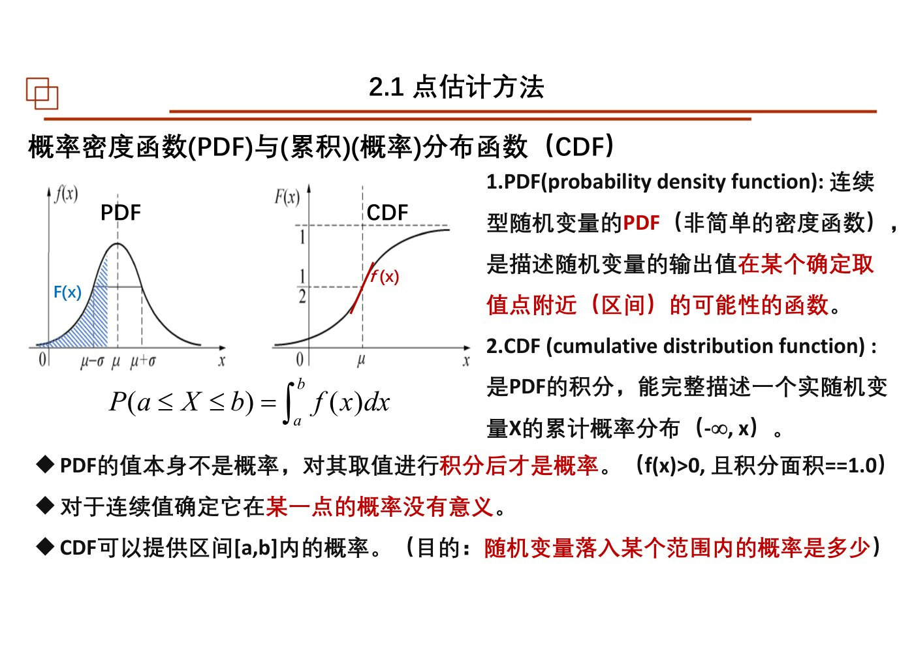
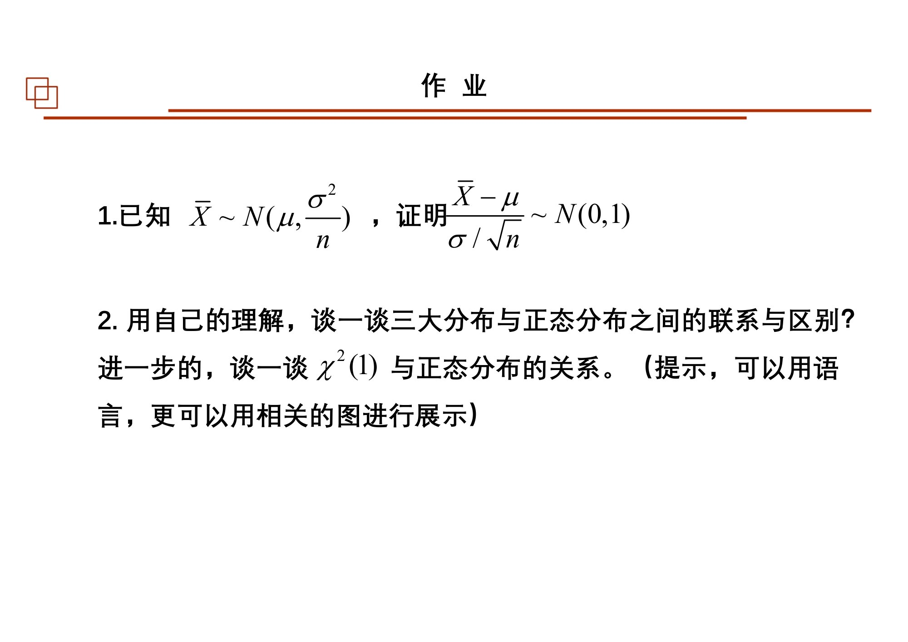
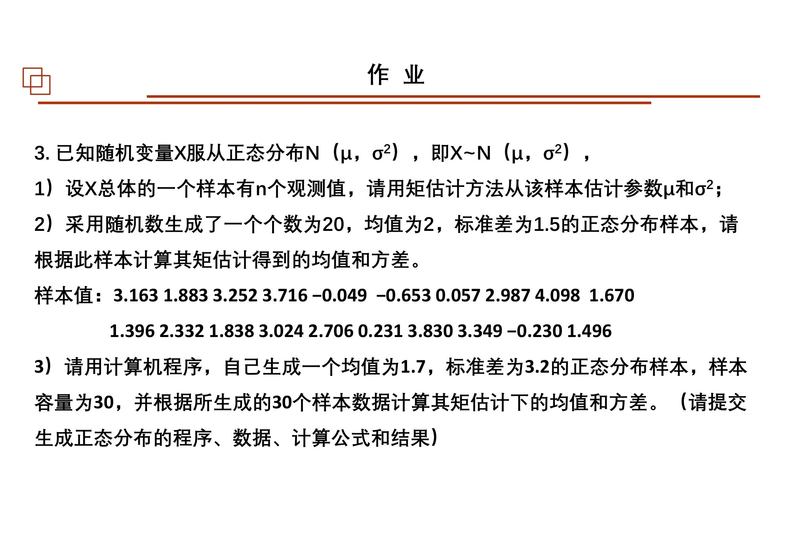
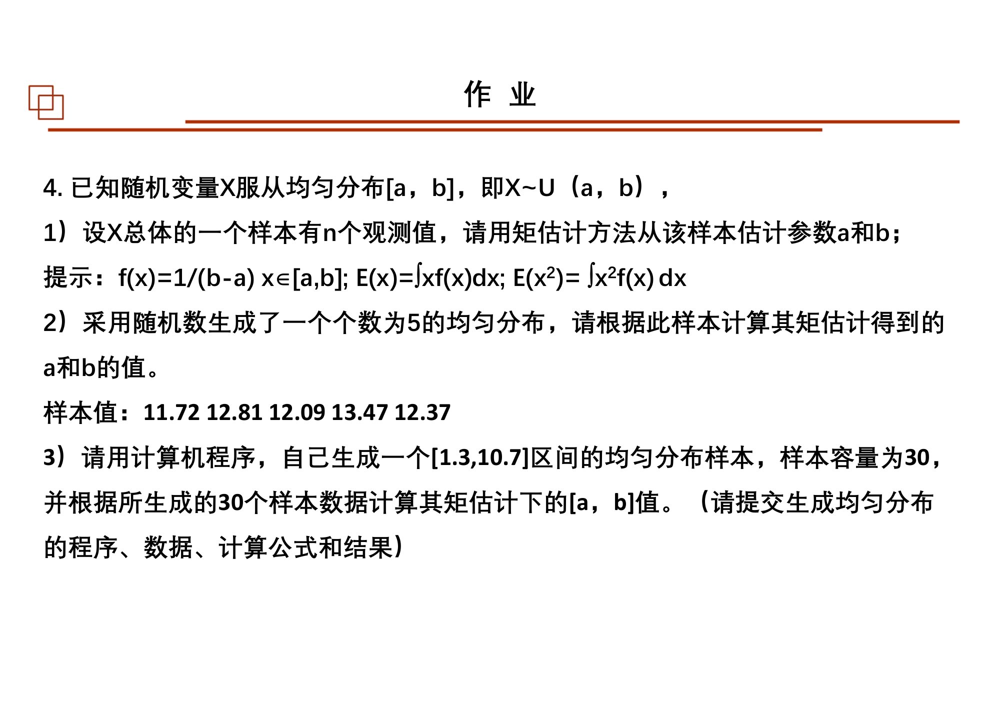
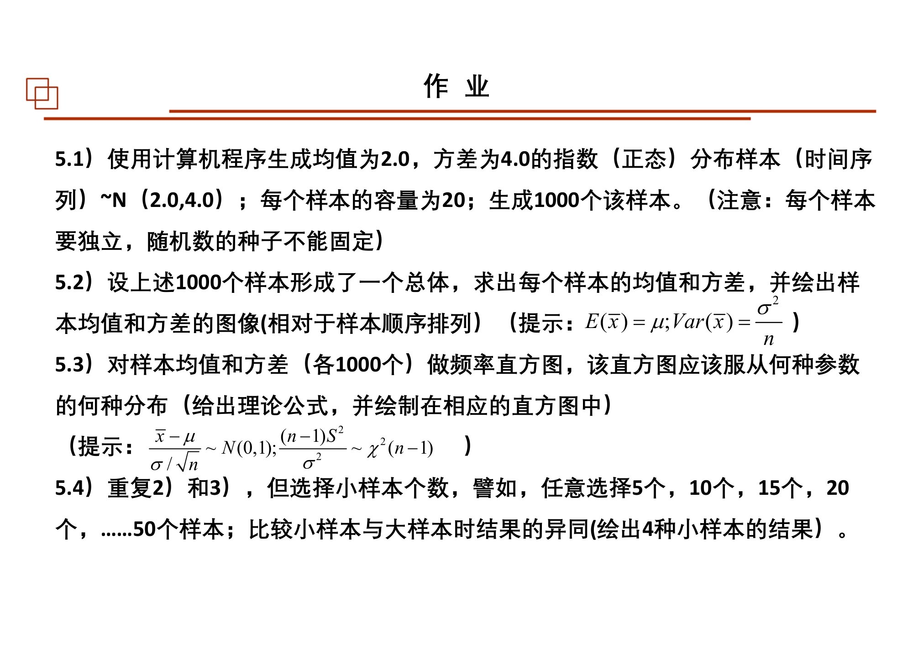

# 第02课｜参数估计：从有限样本到参数与区间

<details open>
<summary><strong>本课目录：从全景到知识点、作业与原页</strong></summary>

- [第一层：本课全景](#sec-01)
- [课时大纲：按原页定位](#sec-02)
- [第二层：知识树](#sec-03)
- [第三层：2.1 点估计方法](#sec-04)
  - [2.1-A PDF与CDF：先读分布，再读参数](#sec-05)
  - [2.1-B 数学期望：概率加权的位置](#sec-06)
  - [2.1-C 矩：按照阶数提取分布信息](#sec-07)
    - [二阶矩与方差：本课第一段应掌握的推导](#sec-08)
    - [偏度和峰度：分布形状不是只有“宽窄”](#sec-09)
    - [图像矩：把同一概念用于像素](#sec-10)
  - [2.1-D 点估计与矩估计](#sec-11)
- [第三层：2.2 极大似然估计](#sec-12)
  - [2.2-A 似然的视角：数据固定，参数变化](#sec-13)
  - [2.2-B 求解步骤与正态实例](#sec-14)
  - [2.2-C 不变性、数值解与经验分布](#sec-15)
- [第三层：2.3 怎样评价估计量](#sec-16)
  - [2.3-A 一致性与无偏性分别问什么](#sec-17)
  - [2.3-B 样本均值与样本方差](#sec-18)
  - [2.3-C 加权组合：先保持无偏，再减少方差](#sec-19)
  - [2.3-D MSE、MVUE与相对有效性](#sec-20)
- [第三层：2.4 区间估计](#sec-21)
  - [2.4-A 从样本分布走到统计量的抽样分布](#sec-22)
  - [2.4-B 置信水平与区间构造](#sec-23)
  - [2.4-C 三大分布与补充推导的位置](#sec-24)
- [补充：正态密度函数的来源](#sec-25)
- [第四层：串联与复习出口](#sec-26)
- [课件表述与待核对事项](#sec-27)
- [课后作业：题目、数据与提交要求](#sec-28)
  - [作业1：样本均值的标准化](#sec-29)
  - [作业2：三大分布与正态分布](#sec-30)
  - [作业3：正态总体的矩估计](#sec-31)
  - [作业4：均匀总体的矩估计](#sec-32)
  - [作业5：重复抽样与抽样分布模拟](#sec-33)
  - [作业原页：完整保留](#sec-34)
- [原页完整性与本课学习记录](#sec-35)

</details>

[总大纲](../00_总大纲.md) · [作业总索引](../01_作业总索引.md) · [完整原页对照](../appendices/L02_原页对照.md) · [原PDF](../sources/L02.pdf) · [上一课](./01_概述与线性变换.md) · [下一课](./03_统计特征与最优化.md)

> **范围：** Chapter 2｜3学时（按课程编排）｜原PDF 84页。
> **来源：** `02 chapter2 参数估计3h-20250926.pdf`。页码均为PDF物理页码。
> **前置联系：** [第01课](./01_概述与线性变换.md)。
> **编排说明：** 原课件章/节编号保留；“第一至第四层”是本笔记的学习导航，不是新增授课章节。


<a id="sec-01"></a>
## 第一层：本课全景

本课是第01课“怎样从观测估计未知量”的正式数学展开。四个主节为：**2.1 点估计 → 2.2 极大似然 → 2.3 估计量性质 → 2.4 区间估计**；最后还补充正态密度函数的来源。你已确认本次课堂讲完点估计、最大似然和区间估计；其余页按课件纳入复习，不据此断言课堂逐项讲过。[原课件P3–7](../appendices/L02_原页对照.md#p003)

先把几个对象分开：$\theta$ 是待估参数；$X_1,\ldots,X_n$ 是抽样前的随机变量；$x_1,\ldots,x_n$ 是已经取得的数值；$\hat\theta=g(X_1,\ldots,X_n)$ 是估计规则；代入当前样本得到的 $g(x_1,\ldots,x_n)$ 是本次估计值。后面谈无偏、方差和置信区间时，讨论的是重复抽样下的规则表现，而非让已知数据重新随机跳动。[原课件P21–23](../appendices/L02_原页对照.md#p021)

<a id="sec-02"></a>
## 课时大纲：按原页定位

| 本课部分 | 原页范围 |
|---|---|
| 统计与参数估计导入 | [原课件P1–6](../appendices/L02_原页对照.md#p001) |
| 2.1 点估计方法、期望与矩 | [原课件P7–27](../appendices/L02_原页对照.md#p007) |
| 2.2 极大似然估计 | [原课件P28–40](../appendices/L02_原页对照.md#p028) |
| 2.3 参数估计的统计性质 | [原课件P41–55](../appendices/L02_原页对照.md#p041) |
| 2.4 参数区间估计 | [原课件P56–69](../appendices/L02_原页对照.md#p056) |
| 正态密度函数来源补充 | [原课件P70–78](../appendices/L02_原页对照.md#p070) |
| 课后作业 | [原课件P79–82](../appendices/L02_原页对照.md#p079) |
| 参考书目与结束页 | [原课件P83–84](../appendices/L02_原页对照.md#p083) |

<a id="sec-03"></a>
## 第二层：知识树

- 2.1 点估计方法
  - PDF、CDF、区间概率、连续与离散
  - 数学期望：加权平均、积分、重心、线性性质
  - 矩
    - 零阶、一阶、二阶、三阶、四阶
    - 原点矩、中心矩、标准化矩、联合矩
    - 方差、标准差、偏度、峰度/超额峰度
    - 图像矩、面积、质心
  - 总体、样本、参数、统计量、估计量与估计值
  - 矩估计：建立矩方程、解参数；正态实例
- 2.2 极大似然估计
  - 联合分布、似然、参数空间
  - 独立样本乘积、对数似然
  - 极值求解与边界/全局检查
  - 正态均值与方差的MLE
  - 不变性；MLE与无偏性的区别
  - Newton–Raphson；经验CDF与K-S检验预告
- 2.3 参数估计的统计性质
  - 一致性、无偏性、偏差、估计方差
  - 样本均值、样本方差与$n-1$
  - 加权组合；仿射组合与凸组合
  - MSE及其偏差—方差分解
  - MVUE与相对有效性
- 2.4 参数区间估计
  - 抽样分布与标准误
  - 正态总体与中心极限定理
  - 置信水平、显著水平、单边/双边
  - 区间构造、临界值、正态/$t$/自由度
  - $\chi^2,t,F$与正态的联系（作业延伸）
- 补充：正态密度来源
  - 二维投镖假设；独立性、方向无关
  - 指数项、归一化积分、方差尺度、均值平移

<a id="sec-04"></a>
## 第三层：2.1 点估计方法

<a id="sec-05"></a>
### 2.1-A PDF与CDF：先读分布，再读参数

**PDF描述密度，CDF描述累计概率。** 在课件的连续分布情形：

$$
F(x)=P(X\le x)=\int_{-\infty}^{x}f(t)\,dt,
\qquad P(a<X\le b)=F(b)-F(a).
$$

密度必须非负，总面积为1。密度曲线上一个高度 $f(x)$ 不是“取到那个精确值的概率”；区间下的面积才是区间概率。先看积分上下限，再看被积函数，这样CDF不是一张需要另记的新表，而是PDF的累积。[原课件P8](../appendices/L02_原页对照.md#p008)



*PDF与CDF的原页对照：曲线高度与曲线下面积对应不同对象。 · [原PDF第8页](../sources/L02.pdf#page=8)*

<a id="sec-06"></a>
### 2.1-B 数学期望：概率加权的位置

离散与连续形式分别为：

$$
E(X)=\sum_i x_i p_i,\qquad E(X)=\int_{-\infty}^{\infty}x f(x)\,dx.
$$

课件成绩例中，70、80、90分的人数为1、4、15。它既可按人数加权，也可先除以20转换成频率再加权；两种写法给同一平均成绩。质点重心例把“概率权重”类比成“质量权重”，帮助理解为什么期望是分布的一个位置特征。[原课件P9–11](../appendices/L02_原页对照.md#p009)

课件使用的线性性质为：

$$
E(c)=c,\quad E(aX+b)=aE(X)+b,\quad
E(X+Y)=E(X)+E(Y).
$$

最后一条不要求独立；$E(XY)=E(X)E(Y)$ 则在课件给出的独立条件下使用。后面无偏证明正是把这些性质应用到估计量。[原课件P15](../appendices/L02_原页对照.md#p015)

<a id="sec-07"></a>
### 2.1-C 矩：按照阶数提取分布信息

先区分三种表达，而不是只背“二阶是方差、三阶是偏度”：

$$
m'_k=E(X^k),\qquad
\mu_k=E[(X-\mu)^k],\qquad
\gamma_k=E\left[\left(\frac{X-\mu}{\sigma}\right)^k\right].
$$

它们依次是原点矩、中心矩、标准化中心矩。样本原点矩以 $n^{-1}\sum_i x_i^k$ 计算。联合矩则考察 $E(X^kY^l)$ 或相应的中心化形式。课件第13页的简略对照表要与第14—19页的具体定义一起读。[原课件P12–19](../appendices/L02_原页对照.md#p012)

| 阶数 | 本课连接的概念 | 学习时应保留的区别 |
|---|---|---|
| 0 | 总概率、总质量 | 概率分布的总量归一为1 |
| 1 | 数学期望、均值、质心 | 一阶原点矩为均值；一阶中心矩为0 |
| 2 | 方差与离散程度 | 方差是二阶**中心**矩，不是一般的$E(X^2)$ |
| 3 | 偏度 | 偏度采用标准化的三阶中心矩 |
| 4 | 峰度、尾部 | 课件用减3的超额峰度约定 |

<a id="sec-08"></a>
#### 二阶矩与方差：本课第一段应掌握的推导

$$
\begin{aligned}
\operatorname{Var}(X)
&=E[(X-\mu)^2]\\
&=E(X^2-2\mu X+\mu^2)\\
&=E(X^2)-2\mu E(X)+\mu^2\\
&=E(X^2)-[E(X)]^2.
\end{aligned}
$$

这里 $\mu=E(X)$ 是一个常数，可移出期望。若均值为0，原点二阶矩才与方差相等；标准差为 $\sigma=\sqrt{\operatorname{Var}(X)}$。因此标准化 $Z=(X-\mu)/\sigma$ 后，$E(Z)=0$、$\operatorname{Var}(Z)=1$。课件以正态变量展示这一计算。[原课件P15–17](../appendices/L02_原页对照.md#p015)

<a id="sec-09"></a>
#### 偏度和峰度：分布形状不是只有“宽窄”

$$
\operatorname{Skew}(X)=\frac{E[(X-\mu)^3]}{\sigma^3},\qquad
\operatorname{ExcessKurt}(X)=\frac{E[(X-\mu)^4]}{\sigma^4}-3.
$$

课件用左右尾比较偏态，用相对正态分布的尾部形态介绍峰度。必须记住它在第18页的提醒：偏度为零不一定意味着分布对称。类似地，这些有限个统计量不能完整证明一个分布正态。[原课件P18–19](../appendices/L02_原页对照.md#p018)

<a id="sec-10"></a>
#### 图像矩：把同一概念用于像素

对像素值 $V(i,j)$，课件给出：

$$
M_{00}=\sum_{i,j}V(i,j),\quad
M_{10}=\sum_{i,j}iV(i,j),\quad
M_{01}=\sum_{i,j}jV(i,j).
$$

质心为 $(M_{10}/M_{00},M_{01}/M_{00})$；二值前景像素为1时，$M_{00}$ 与面积计数对应。本例解释“矩”的用途，不是再引入一套与概率矩毫无联系的术语。[原课件P20](../appendices/L02_原页对照.md#p020)

<a id="sec-11"></a>
### 2.1-D 点估计与矩估计

点估计是用样本函数给出参数空间中的一个点。它可以同时估多个参数，不限于一个数字。课件先给出正态、均匀、泊松等总体与待估参数，再说明估计量和估计值的区别。[原课件P21–23](../appendices/L02_原页对照.md#p021)

矩估计按三步走：**写含参数的总体矩 → 写对应样本矩 → 两者匹配后解方程**。待估两个参数时，通常需要两条有用的矩关系，而不是重复使用同一条。[原课件P24–27](../appendices/L02_原页对照.md#p024)

课件的正态分布例：

$$
E(X)=\mu,\quad E(X^2)=\mu^2+\sigma^2;
\qquad M_1=\bar X,\quad M_2=\frac1n\sum_iX_i^2.
$$

令 $\mu=M_1$、$\mu^2+\sigma^2=M_2$，得到：

$$
\hat\mu=\bar X,\qquad
\hat\sigma^2_{\mathrm{MM}}=M_2-M_1^2
=\frac1n\sum_i(X_i-\bar X)^2.
$$

这里分母是$n$。不要因为后面见到无偏样本方差分母$n-1$，就把当前矩估计结果悄悄改掉；它们是不同估计规则。[原课件P25–26](../appendices/L02_原页对照.md#p025)

<a id="sec-12"></a>
## 第三层：2.2 极大似然估计

<a id="sec-13"></a>
### 2.2-A 似然的视角：数据固定，参数变化

课件摸球例：箱内共3个球，不放回摸出2个红球，比较“3红”和“2红1绿”两种组成。对当前观测，前一种组成给出的概率更大。MLE把这类比较推广成参数空间上的优化。它并不直接计算“参数本身发生的概率”，后者将在Bayes中另行建模。[原课件P28–32](../appendices/L02_原页对照.md#p028)

一般用联合概率/密度定义：

$$
L(\theta;\mathbf x)=f(x_1,\ldots,x_n;\theta).
$$

独立样本时才能写成乘积 $\prod_i f(x_i;\theta)$。取自然对数不改变最大值所在的参数：

$$
\ell(\theta)=\log L(\theta)=\sum_i\log f(x_i;\theta),
\qquad \hat\theta_{\mathrm{MLE}}=\arg\max_{\theta\in\Theta}\ell(\theta).
$$

<a id="sec-14"></a>
### 2.2-B 求解步骤与正态实例

课件流程：建似然、取对数、求导、求候选解、检查最大值。导数为零只是适用于内部可微极值的候选条件，还要关注边界和参数限制，不能见到一个驻点就宣布得到全局MLE。[原课件P33–34](../appendices/L02_原页对照.md#p033)

沿课件独立正态样本的模型：

$$
\ell(\mu,\sigma^2)=-\frac n2\log(2\pi)-\frac n2\log\sigma^2
-\frac{1}{2\sigma^2}\sum_i(x_i-\mu)^2.
$$

先对$\mu$求导：

$$
\frac{\partial\ell}{\partial\mu}=\frac1{\sigma^2}\sum_i(x_i-\mu)=0
\quad\Rightarrow\quad \hat\mu=\bar x.
$$

再以$v=\sigma^2$为待估量：

$$
\frac{\partial\ell}{\partial v}=-\frac n{2v}+\frac1{2v^2}\sum_i(x_i-\mu)^2=0,
\quad\Rightarrow\quad \hat v=\frac1n\sum_i(x_i-\bar x)^2.
$$

课件特别提醒“对$\sigma^2$求导”。正态例中MLE和矩估计得到相同表达，并不意味着两种原则普遍等价。[原课件P35–38](../appendices/L02_原页对照.md#p035)

<a id="sec-15"></a>
### 2.2-C 不变性、数值解与经验分布

课件的不变性说：由$\hat\theta_{\mathrm{MLE}}$可得到$g(\theta)$的MLE $g(\hat\theta_{\mathrm{MLE}})$。这是**MLE不变性**，不是“无偏性对任何函数都保留”。[原课件P37](../appendices/L02_原页对照.md#p037)

没有闭式解时，课件介绍Newton–Raphson。若要解$g(\theta)=0$，在当前值线性近似：

$$
\theta_{k+1}=\theta_k-\frac{g(\theta_k)}{g'(\theta_k)}.
$$

用$g=\ell'$便得到极值搜索中的更新。初值、导数是否接近零、是否收敛仍需检查；数值方法是求解工具，不是另一种统计估计准则。[原课件P39](../appendices/L02_原页对照.md#p039)

第40页的经验CDF为：

$$
F_n(x)=\frac1n\sum_{i=1}^{n}\mathbf1\{X_i\le x\}.
$$

它可用于描述样本分布并参与分布检验。课件还把它与建立MLE的分布模型联系起来，但没有给出“仅凭经验CDF构成任意参数似然”的通用步骤，此处不补造该步骤。[原课件P40](../appendices/L02_原页对照.md#p040)

<a id="sec-16"></a>
## 第三层：2.3 怎样评价估计量

<a id="sec-17"></a>
### 2.3-A 一致性与无偏性分别问什么

一致性关注随$n$增大，估计量是否依概率靠近真实参数：

$$
P(|\hat\theta_n-\theta|>\epsilon)\to0\quad(n\to\infty).
$$

无偏性关注重复抽样的平均：

$$
\operatorname{Bias}(\hat\theta)=E(\hat\theta)-\theta,
\qquad E(\hat\theta)=\theta.
$$

一个谈样本量变化时的极限，一个谈给定样本量下的期望；不能用“本次算出来很接近真值”证明任意一个性质。课件用重复抽样的样本均值说明无偏的解释。[原课件P41–45](../appendices/L02_原页对照.md#p041)

<a id="sec-18"></a>
### 2.3-B 样本均值与样本方差

在本课独立同分布、有限方差条件下：

$$
E(\bar X)=\mu,\qquad \operatorname{Var}(\bar X)=\frac{\sigma^2}{n}.
$$

证明均值无偏靠期望的线性；方差计算还用到不同观测间协方差为零。二者不要混成一条无条件公式。[原课件P45](../appendices/L02_原页对照.md#p045)

课件对样本方差的推导可以拆为两个台阶：

$$
\sum_i(X_i-\bar X)^2=\sum_iX_i^2-n\bar X^2,
$$

$$
E\left[\sum_i(X_i-\bar X)^2\right]
=n(\sigma^2+\mu^2)-n\left(\frac{\sigma^2}{n}+\mu^2\right)
=(n-1)\sigma^2.
$$

因此无偏方差估计为：

$$
S^2=\frac1{n-1}\sum_i(X_i-\bar X)^2.
$$

这也解释同一组数据为什么会出现$n$和$n-1$两个分母。这里证明的是$S^2$无偏，不能直接推出$S$无偏。[原课件P46–47](../appendices/L02_原页对照.md#p046)

<a id="sec-19"></a>
### 2.3-C 加权组合：先保持无偏，再减少方差

课件设两个独立无偏估计量的方差为$v_1,v_2$，构造：

$$
\hat\theta=a\hat\theta_1+(1-a)\hat\theta_2.
$$

系数和为1保证组合仍无偏；独立时方差为$a^2v_1+(1-a)^2v_2$。对$a$求导得：

$$
a=\frac{v_2}{v_1+v_2}.
$$

方差更小的估计获得更大权重。课件接着以仿射组合与凸组合解释几何意义：权和为1是仿射，另加非负约束是凸组合。独立性若不成立，不能丢掉组合方差中的交叉项。[原课件P48–51](../appendices/L02_原页对照.md#p048)

<a id="sec-20"></a>
### 2.3-D MSE、MVUE与相对有效性

$$
\operatorname{MSE}(\hat\theta)=E[(\hat\theta-\theta)^2]
=\operatorname{Var}(\hat\theta)+\operatorname{Bias}(\hat\theta)^2.
$$

按课件推导，在误差中加减$E(\hat\theta)$并展开，交叉项期望为零，就得到上式。它使“系统偏离”和“抽样波动”能在同一指标内比较。无偏估计类中再选方差最小者，就是本课介绍的MVUE目标。[原课件P52–54](../appendices/L02_原页对照.md#p052)

相对有效性用估计量方差的比值比较。第55页均值与中位数的例子依赖其采用的分布与方差表达，不能读成“任何分布下均值都比中位数好”。下一课的稳健性会提供另一种评价视角。[原课件P55](../appendices/L02_原页对照.md#p055)

<a id="sec-21"></a>
## 第三层：2.4 区间估计

<a id="sec-22"></a>
### 2.4-A 从样本分布走到统计量的抽样分布

一个样本内有$n$个观测；重复取得许多这样的样本，每个样本算一个$\bar X$，这些均值又有自己的分布。它不是原始$X$的分布：均值相同，但方差变成$\sigma^2/n$，均值的标准差称标准误。[原课件P58–60](../appendices/L02_原页对照.md#p058)

正态总体独立抽样时：

$$
\bar X\sim N\left(\mu,\frac{\sigma^2}{n}\right).
$$

课件再介绍中心极限定理，把大样本均值的近似正态扩展到非正态总体。它的$n>30$是课件使用的经验提示，而不是对所有分布都保证正确的门槛；本课并未完整展开适用条件。[原课件P61](../appendices/L02_原页对照.md#p061)

<a id="sec-23"></a>
### 2.4-B 置信水平与区间构造

按课件四步：**先点估计 → 构造有已知分布的统计量 → 选定覆盖水平 → 反解成参数区间**。区间宽度取决于观测波动、样本量、覆盖水平和采用的抽样模型。[原课件P62–67](../appendices/L02_原页对照.md#p062)

总体标准差已知的正态均值例，令：

$$
Z=\frac{\bar X-\mu}{\sigma/\sqrt n}\sim N(0,1).
$$

从$P(-z_{1-\alpha/2}\le Z\le z_{1-\alpha/2})=1-\alpha$反解：

$$
\left[\bar X-z_{1-\alpha/2}\frac{\sigma}{\sqrt n},
\bar X+z_{1-\alpha/2}\frac{\sigma}{\sqrt n}\right].
$$

课件的0.975、1.96和双侧0.05示例正对应这一步。单侧区间用单侧分位点，不再把$\alpha$均分到两端。[原课件P64–67](../appendices/L02_原页对照.md#p064)

总体标准差未知时，课件转入$t$统计量与$n-1$自由度：

$$
T=\frac{\bar X-\mu}{S/\sqrt n}\sim t_{n-1}
$$

（沿用本课正态独立样本条件）。相应地把$z$临界值替换为$t$临界值，并使用$S$。这里是**统计量发生变化导致参考分布变化**，不是把原始数据从正态变成$t$分布。[原课件P68–69](../appendices/L02_原页对照.md#p068)

> 区间阅读约定：$1-\alpha$是这种构造方法在重复抽样中的覆盖水平。不要把它同一批数据的离散比例、误差条或Bayes后验概率混成同一个概念。课件本节用抽样分布建立区间，第04课另讲后验分布。

<a id="sec-24"></a>
### 2.4-C 三大分布与补充推导的位置

课件在区间构造和作业中列出$\chi^2,t,F$；并在作业提示中给出：

$$
\frac{(n-1)S^2}{\sigma^2}\sim\chi^2_{n-1}.
$$

本讲没有把三个分布所有性质全部展开，因此笔记不把“列出名称”扩充成已讲完的一整章分布论。后面的回归检验、方差分析和误差椭圆会继续使用它们。[原课件P65–69](../appendices/L02_原页对照.md#p065) [原课件P79–82](../appendices/L02_原页对照.md#p079)

<a id="sec-25"></a>
## 补充：正态密度函数的来源

第70—78页以投镖为模型，先提出方向无关、两个坐标方向独立、小误差较常见的假设，再把二维径向分布与两个一维密度乘积相连。沿角度求导后得到指数平方型密度；通过总面积为1的积分确定系数，再用方差定义确定尺度，最后引入均值平移。[原课件P70–78](../appendices/L02_原页对照.md#p070)

可按这条推导链阅读：

$$
\text{二维假设}\;\longrightarrow\;
P(x)=A\exp(-kx^2/2)\;\longrightarrow\;
\int P(x)dx=1\;\longrightarrow\;k=1/\sigma^2.
$$

这解释课件为什么追问$e,\pi,\mu,\sigma$从哪里来。它是**在指定假设下构造一种分布**，不是用一个投镖故事证明世界上所有误差都正态。二维置信椭圆这里只是预告，完整计算在第08课。

<a id="sec-26"></a>
## 第四层：串联与复习出口

先用分布描述随机性；用期望与矩提取特征；矩估计匹配这些特征，MLE比较不同参数对当前样本的似然；得到估计规则后，用无偏、一致、方差与MSE评价；最后利用抽样分布构造区间。

**自测（非教师作业）**：能否解释“矩估计方差分母$n$、无偏方差分母$n-1$为何不矛盾”？能否区分“正态数据的标准差”和“样本均值的标准误”？能否从正态对数似然自己求出$\hat\mu$？

<a id="sec-27"></a>
## 课件表述与待核对事项

- 第13页矩的简略名称与第14—19页正式公式有区别；正文采用后者，不把原点二阶矩直接叫方差。
- 第37页对“标准差无偏”的文字与第46页证明对象$S^2$不一致，需区分标准差与方差。
- 第40页经验CDF与MLE建模的连接缺少具体构造，不将其当作通用替代方案。
- 第60页有限总体修正的文字阈值需核对；第61页CLT的适用条件和样本量界线也未完整说明。
- 第79—82页作业同时出现“指数（正态）”与$N(2,4)$，以及“种子不能固定”；题目原样保留，实施前应核实意图，不能用重复重置种子产生完全相同的多个样本。


<a id="sec-28"></a>
## 课后作业：题目、数据与提交要求

<a id="sec-29"></a>
### 作业1：样本均值的标准化

来源：[原课件P79](../appendices/L02_原页对照.md#p079)。已知

$$
\bar X\sim N\left(\mu,\frac{\sigma^2}{n}\right),
$$

证明

$$
\frac{\bar X-\mu}{\sigma/\sqrt n}\sim N(0,1).
$$

<a id="sec-30"></a>
### 作业2：三大分布与正态分布

来源：[原课件P79](../appendices/L02_原页对照.md#p079)。用自己的理解讨论$\chi^2$、$t$、$F$分布与正态分布的联系和区别，进一步讨论$\chi^2(1)$与正态分布的关系。课件允许语言说明，也鼓励用图展示。

<a id="sec-31"></a>
### 作业3：正态总体的矩估计

来源：[原课件P80](../appendices/L02_原页对照.md#p080)。

1. 总体$X\sim N(\mu,\sigma^2)$，样本有$n$个观测，推导$\mu$和$\sigma^2$的矩估计。
2. 对以下20个样本值计算矩估计均值与方差。课件说明生成模型的均值为2，标准差为1.5。

```text
3.163  1.883  3.252  3.716 -0.049 -0.653  0.057  2.987  4.098  1.670
1.396  2.332  1.838  3.024  2.706  0.231  3.830  3.349 -0.230  1.496
```

3. 编程生成均值1.7、标准差3.2、容量30的正态样本，计算矩估计均值和方差。提交程序、生成数据、计算公式和结果。

<a id="sec-32"></a>
### 作业4：均匀总体的矩估计

来源：[原课件P81](../appendices/L02_原页对照.md#p081)。

1. 对$X\sim U(a,b)$推导$a,b$的矩估计。提示从$f(x)=1/(b-a)$及一阶、二阶原点矩入手。
2. 使用以下5个样本估计$a,b$：

```text
11.72 12.81 12.09 13.47 12.37
```

3. 编程从区间$[1.3,10.7]$生成容量30的均匀样本，估计区间端点；提交程序、数据、公式和结果。

<a id="sec-33"></a>
### 作业5：重复抽样与抽样分布模拟

来源：[原课件P82](../appendices/L02_原页对照.md#p082)。

1. 生成**1000组样本，每组20个观测**。课件给定分布符号为$N(2.0,4.0)$，即均值2、方差4。
2. 求每组的均值和方差，分别画出它们随样本组编号的变化。
3. 对1000个均值、1000个方差分别做频率直方图，指出它们对应什么理论分布，并叠加理论曲线。
4. 改用较少的样本组数，例如5、10、15、20直到50组，重复比较，绘出**4种小样本组数**的结果。

课件提示：

$$
E(\bar X)=\mu,\quad\operatorname{Var}(\bar X)=\frac{\sigma^2}{n},\quad
\frac{\bar X-\mu}{\sigma/\sqrt n}\sim N(0,1),\quad
\frac{(n-1)S^2}{\sigma^2}\sim\chi^2(n-1).
$$

**原题待核对：**文字写“指数（正态）分布”，但符号是$N(2.0,4.0)$，不能同时当作两种分布。课件另写“随机数的种子不能固定”，其实际独立性要求应避免每一组重置为同一种子、得到完全重复的样本；保留这一表述供课堂核对。不要把“每组20个观测”与“重复1000组”混淆。

已将题中给出的20个正态样本和5个均匀样本另存为[`L02_normal20.txt`](../data/L02_normal20.txt)、[`L02_uniform5.txt`](../data/L02_uniform5.txt)，未生成模拟答案。

<a id="sec-34"></a>
### 作业原页：完整保留

<details>
<summary>展开第79页作业原图</summary>



*第02课第79页作业原页 · [原PDF第79页](../sources/L02.pdf#page=79)*

</details>

<details>
<summary>展开第80页作业原图</summary>



*第02课第80页作业原页 · [原PDF第80页](../sources/L02.pdf#page=80)*

</details>

<details>
<summary>展开第81页作业原图</summary>



*第02课第81页作业原页 · [原PDF第81页](../sources/L02.pdf#page=81)*

</details>

<details>
<summary>展开第82页作业原图</summary>



*第02课第82页作业原页 · [原PDF第82页](../sources/L02.pdf#page=82)*

</details>


<a id="sec-35"></a>
## 原页完整性与本课学习记录

本课全部84页（含图示、代码、参考文献、空白与结束页）均保留在[原页对照](../appendices/L02_原页对照.md)和[原始PDF](../sources/L02.pdf)中。笔记正文梳理知识及核心推导，不等同于逐字转录所有PPT文字。对照页用于查看更细的图表、完整代码和源内不同表述。

- [ ] 看过全景和课时大纲，能定位本课结构。
- [ ] 顺着知识树读完正文，并标出未理解的小节。
- [ ] 自己重写关键公式，分清符号、维度与假设。
- [ ] 做过课件作业或记录缺少的数据/需要问老师的条件。
- [ ] 不看笔记，用自己的话串起本课知识。
