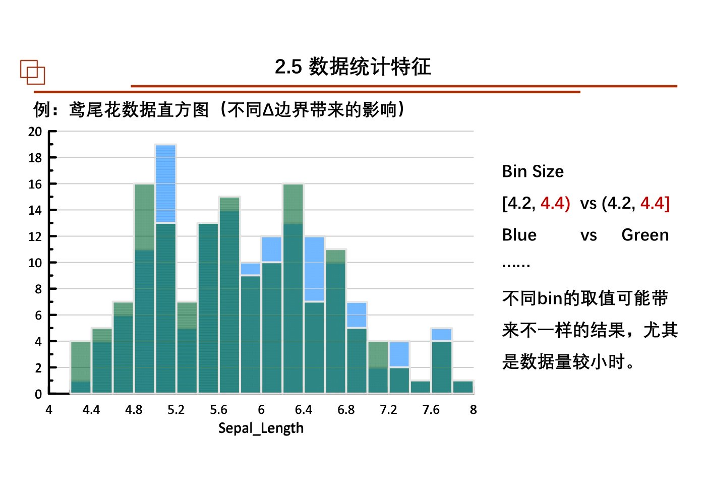
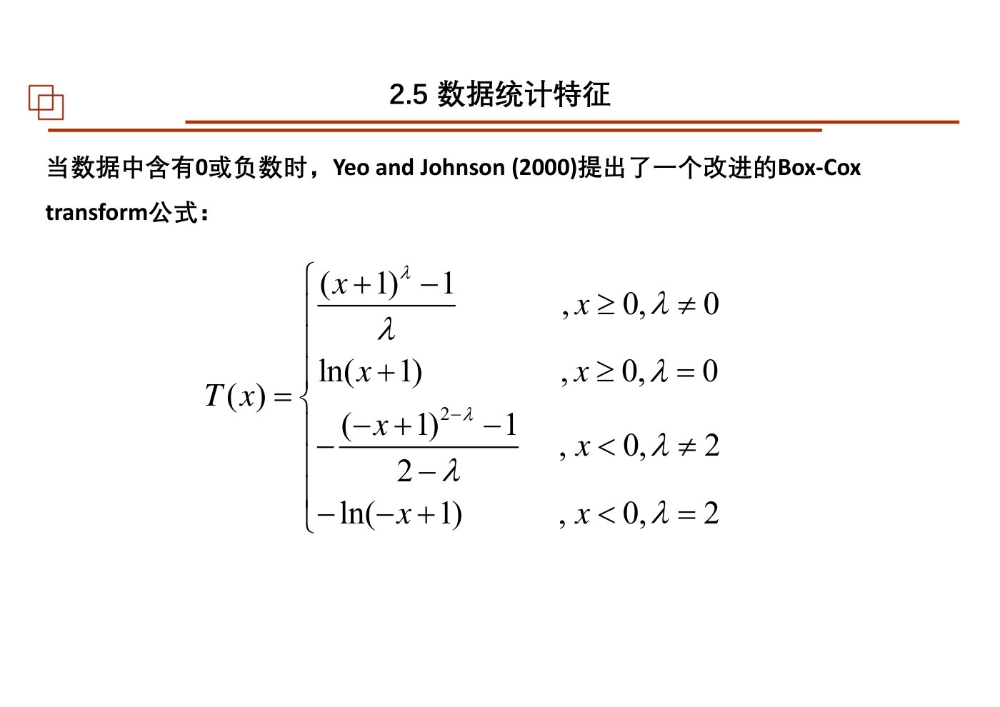
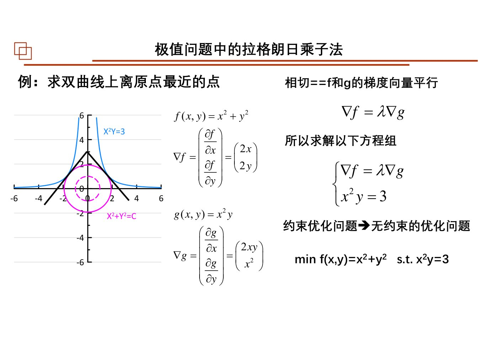
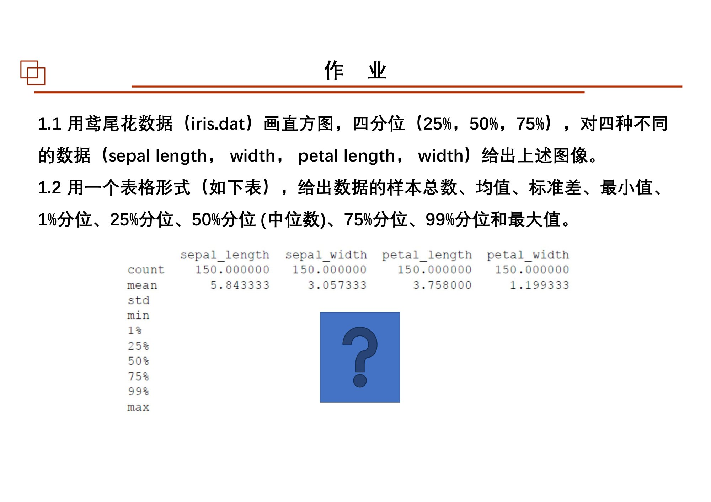
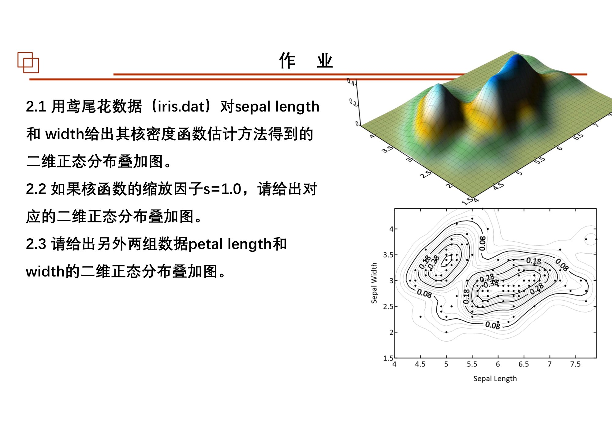
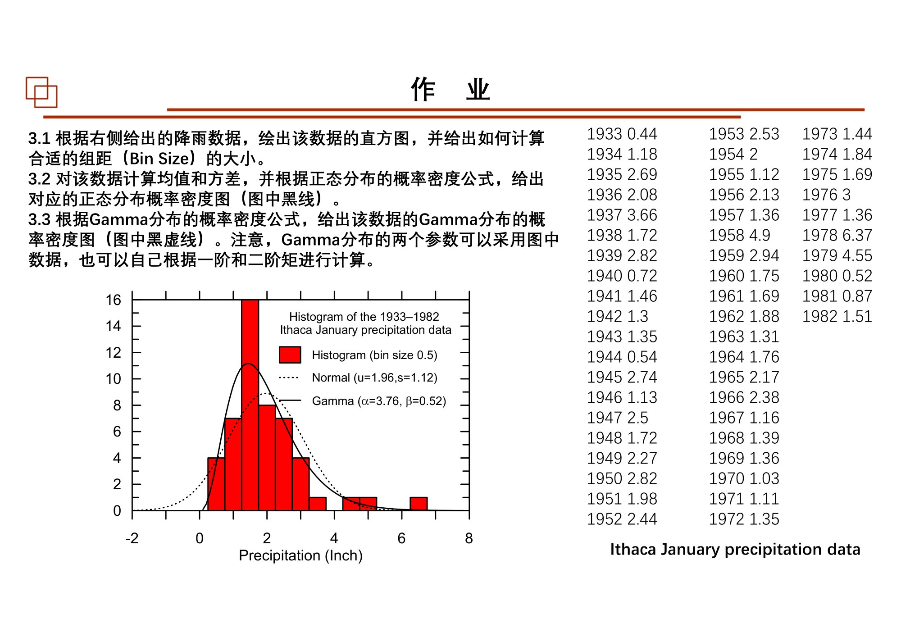
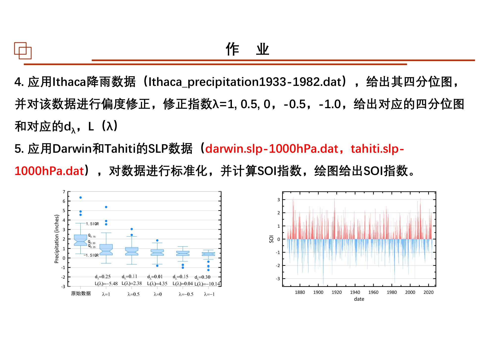

# 第03课｜认识数据：统计特征、分布诊断与最优化准备

<strong>本课目录：从全景到知识点、作业与原页</strong>

- [第一层：本课全景](#sec-01)
- [课时大纲：按原页定位](#sec-02)
- [第二层：知识树](#sec-03)
- [第三层：2.5 数据统计特征](#sec-04)
  - [2.5-A 探索性分析：先认识数据，不急于套分布](#sec-05)
  - [2.5-B 位置、散布与形状：三组指标一起看](#sec-06)
    - [位置指标](#sec-07)
    - [分位数、箱线图与离散程度](#sec-08)
    - [对称性指标](#sec-09)
  - [2.5-C 直方图：先辨认纵轴单位](#sec-10)
  - [2.5-D 密度估计：选分布族，或叠加局部核](#sec-11)
    - [参数密度估计](#sec-12)
    - [核密度估计](#sec-13)
  - [2.5-E Q-Q图：比较分位位置，而不是比较时间趋势](#sec-14)
  - [2.5-F 标准化、归一化与偏态变换不是一回事](#sec-15)
    - [位置尺度变换](#sec-16)
    - [Power、Hinkley、Box–Cox与Yeo–Johnson](#sec-17)
- [第三层：2.6.1 最优化的数学准备](#sec-18)
  - [2.6.1-A 全微分、梯度与方向变化](#sec-19)
  - [2.6.1-B 无约束极值与有约束极值](#sec-20)
  - [2.6.1-C Hessian与二次型：判断局部弯曲](#sec-21)
  - [2.6.1-D 二次型、协方差与多维正态](#sec-22)
- [第四层：怎样把两大块连起来](#sec-23)
- [课件表述与待核对事项](#sec-24)
- [课后作业：题目、数据与提交要求](#sec-25)
  - [作业1：鸢尾花描述统计](#sec-26)
  - [作业2：二维核密度估计](#sec-27)
  - [作业3：降雨数据的直方图与理论分布](#sec-28)
  - [作业4：降雨数据偏态变换](#sec-29)
  - [作业5：标准化与SOI](#sec-30)
  - [作业原页：完整保留](#sec-31)
- [原页完整性与本课学习记录](#sec-32)

[总大纲](../00_总大纲.md) · [作业总索引](../01_作业总索引.md) · [完整原页对照](../appendices/L03_原页对照.md) · [原PDF](../sources/L03.pdf) · [上一课](./02_参数估计.md) · [下一课](./04_最小二乘与Bayes.md)

> **范围：** Chapter 2｜3学时（按课程编排）｜原PDF 98页。
> **来源：** `03 chapter2 数据统计特征和最小二乘估计3h-20251010.pdf`。页码均为PDF物理页码。
> **前置联系：** [第02课](./02_参数估计.md)。
> **编排说明：** 原课件章/节编号保留；“第一至第四层”是本笔记的学习导航，不是新增授课章节。

## 第一层：本课全景

本课有两大块，不能只按文件名理解成“整节都讲最小二乘”。前半为**2.5 数据统计特征**，从位置、散布、偏态走到直方图、核密度、Q-Q图和数据变换；后半从第70页进入**2.6.1 拉格朗日条件极值与一阶导、二阶导**，为下一课求解LS准备数学语言。[原课件P3](../appendices/L03_原页对照.md#p003) [原课件P70](../appendices/L03_原页对照.md#p070)

与第02课的连接：上一课假定一个分布族并估计其参数，这一课先检查手里的样本形态是否支持这样的建模；接着把“求参数”改写成“求目标函数极值”。

## 课时大纲：按原页定位

| 本课部分 | 原页范围 |
|---|---|
| 课程说明与参数估计回顾 | [原课件P1–4](../appendices/L03_原页对照.md#p001) |
| 2.5 探索分析、位置、散布与对称性 | [原课件P5–18](../appendices/L03_原页对照.md#p005) |
| 2.5 直方图、KDE与分布拟合 | [原课件P19–39](../appendices/L03_原页对照.md#p019) |
| 2.5 Q-Q图与分布判别 | [原课件P40–51](../appendices/L03_原页对照.md#p040) |
| 2.5 归一化、标准化与SOI | [原课件P52–58](../appendices/L03_原页对照.md#p052) |
| 2.5 偏态变换与参数选择 | [原课件P59–65](../appendices/L03_原页对照.md#p059) |
| 课后作业 | [原课件P66–69](../appendices/L03_原页对照.md#p066) |
| 2.6.1 梯度、条件极值、Hessian | [原课件P70–91](../appendices/L03_原页对照.md#p070) |
| 2.6.1 二次型、协方差与二维正态补充 | [原课件P92–97](../appendices/L03_原页对照.md#p092) |
| 结束页 | [原课件P98](../appendices/L03_原页对照.md#p098) |

## 第二层：知识树

- 2.5 数据统计特征
  - 探索性分析：有效异常信息与录入错误；稳健性、抗差性
  - 位置：均值、中位数、众数、几何平均、三均值、截尾均值
  - 分散度：方差、标准差、IQR、MAD、截尾方差
  - 对称性：偏度、Yule–Kendall指标
  - 分位数与箱线图：排序、Q1/Q2/Q3、须、异常标记
  - 直方图：频数、概率、概率密度、组距、边界
  - 密度估计
    - 参数估计：Gaussian、Gamma
    - 非参数KDE：核、归一化、带宽、一维与二维
  - 理论分布诊断：Q-Q图、理论分位数、经验累计位置、CDF与PPF
  - 变换：Min–Max、标准化、SOI
  - 偏态变换：Power、Hinkley指标、Box–Cox、Yeo–Johnson
- 2.6.1 最优化准备
  - 偏导、全微分、梯度、点积与方向导数
  - 等值线/等值面与梯度
  - 无约束极值、约束极值、拉格朗日函数
  - 多约束与乘子
  - Hessian、二次型、正定/半正定、泰勒二阶项
  - 一阶与二阶变化、散度/Laplace算子扩展
  - 二阶联合矩、协方差矩阵、二维正态的矩阵表达

## 第三层：2.5 数据统计特征

### 2.5-A 探索性分析：先认识数据，不急于套分布

课件先指出异常数据的两种来源：记录/转录错误，以及真实但少见、可能很重要的现象。它们不应仅凭“离均值很远”就一律删去。随后区分两种评价：**稳健性**关注对模型假设变化是否敏感；**抗差性**关注少量极端观测改变结果的程度。[原课件P4–7](../appendices/L03_原页对照.md#p004)

课件例将 $\{11,12,\ldots,19\}$ 中的19改成91，均值从15变成23。这个例子不是说均值永远不能用，而是提示：在使用中心指标之前，先问它是否符合研究目标、对异常值是否敏感。

### 2.5-B 位置、散布与形状：三组指标一起看

#### 位置指标

课件列出算术平均、中位数、众数、几何平均。均值使用全部数值；中位数依赖排序位置；众数与高频值有关；几何平均采用乘积的$n$次方根，使用时要留意数据适用范围。[原课件P8](../appendices/L03_原页对照.md#p008)

后面补充两个抗差位置指标：

$$
\operatorname{Trimean}=\frac{Q_1+2Q_2+Q_3}{4},
\qquad
\bar x_{\mathrm{trim}}=\frac{1}{n-2k}\sum_{i=k+1}^{n-k}x_{(i)}.
$$

$x_{(i)}$表示排好序的数据。截尾均值需明确两端各删多少，不是先随意选出“不好看”的点再平均。[原课件P13–14](../appendices/L03_原页对照.md#p013)

#### 分位数、箱线图与离散程度

先对数据排序，再定位分位点。$Q_1,Q_2,Q_3$对应25%、50%、75%，其中$Q_2$为中位数，$IQR=Q_3-Q_1$覆盖中间50%数据的跨度。箱线图同时呈现中心、散布与尾部异常。课件提醒须的定义有不同约定，比较不同软件或图时应先检查图例。[原课件P9–12](../appendices/L03_原页对照.md#p009)

离散程度除了方差与标准差，还包括：

$$
\operatorname{MAD}=\operatorname{median}_i|x_i-\operatorname{median}(x)|.
$$

课件进一步给出截尾方差，并讨论IQR或截尾指标舍弃尾部信息后的代价。选择稳健指标不是“无成本地更先进”，而是在信息利用与抗异常之间作选择。[原课件P15–16](../appendices/L03_原页对照.md#p015)

#### 对称性指标

常用偏度来自标准化三阶中心矩；课件另列基于分位数的Yule–Kendall指标：

$$
S_{YK}=\frac{Q_3+Q_1-2Q_2}{Q_3-Q_1}.
$$

它比较中位数两侧四分位间距是否均衡。课件的正偏、负偏看的是拖尾方向；零偏度与“完全正态”不是同义词。[原课件P17–18](../appendices/L03_原页对照.md#p017)

### 2.5-C 直方图：先辨认纵轴单位

同一组分箱数据可以画出三种纵轴：频数$n_j$、频率$p_j=n_j/n$、密度$f_j=p_j/\Delta_j$。概率密度形式满足：

$$
\sum_j f_j\Delta_j=1.
$$

因此不能把理论PDF直接叠加到未经缩放的频数直方图上。等宽频数直方图若要与理论PDF同尺度，课件采用乘以$n\Delta$的方式。[原课件P20–24](../appendices/L03_原页对照.md#p020) [原课件P36–37](../appendices/L03_原页对照.md#p036)

组距太宽会掩盖结构，太窄会呈现大量抽样起伏；分箱起点也会改变小样本图形。课件用Iris数据展示边界改变产生的差异，随后给出基于IQR与样本量的经验组距选择。这些是选择初值的经验法则，不是唯一正确答案。[原课件P22–24](../appendices/L03_原页对照.md#p022)

*同一数据采用不同分箱边界的直方图：图形变化不等于总体发生变化。 · [原PDF第23页](../sources/L03.pdf#page=23)*

### 2.5-D 密度估计：选分布族，或叠加局部核

#### 参数密度估计

先选择Gaussian、Gamma等分布族，再用矩估计或MLE求参数。课件以降雨数据比较正态与Gamma描述，并要求理论曲线与样本直方图采用一致尺度。这里不应把“画出一条平滑曲线”误认为“已经验证分布假设”。[原课件P25](../appendices/L03_原页对照.md#p025) [原课件P36–39](../appendices/L03_原页对照.md#p036)

#### 核密度估计

课件为每个样本点放置一个核，再叠加平均：

$$
\hat f(x)=\frac1{nh}\sum_{i=1}^{n}K\left(\frac{x-x_i}{h}\right).
$$

$K$规定局部形状，$h$规定尺度。课件核函数满足对称、面积为1，并列出Gaussian、cosine等例子。式前的$1/h$负责缩放后保持面积，$1/n$负责把$n$个核平均；两个系数不能漏掉。[原课件P26–29](../appendices/L03_原页对照.md#p026)

带宽小保留更多细节，带宽大更平滑。课件用温度数据比较不同尺度，并提供Silverman类经验选择；它也强调最终带宽仍应结合数据分析。[原课件P30–31](../appendices/L03_原页对照.md#p030)

二维KDE把核放到二维位置上。各点附近的二维Gaussian叠加后形成联合密度面；第33—34页的Iris代码展示读取两列、构建网格、计算密度和输出。这里“一维核的宽度”扩展为多维尺度选择，不要把二维密度值当成一个点的概率。[原课件P32–35](../appendices/L03_原页对照.md#p032)

### 2.5-E Q-Q图：比较分位位置，而不是比较时间趋势

Q-Q图将样本排序值与参考分布的分位数配对。课件的正态Q-Q流程是：排序 → 给每个次序一个累计位置 → 用参考分布逆CDF得到理论分位数 → 作图比较。[原课件P40–46](../appendices/L03_原页对照.md#p040)

课件使用的累计位置示例：

$$
p_i=\frac{i-a}{n+1-2a},\qquad a=0.4,
\qquad q_i=\Phi^{-1}(p_i).
$$

标准化样本后可比较$(q_i,z_{(i)})$与$y=x$；也可保留原数据，用对应的位置尺度恢复参考线。不要把分位数编号$i$、累计概率$p_i$和正态分位值$q_i$混成一列。小样本两端未必到$\pm3$，课件用12个观测说明端点取决于所用累计位置。[原课件P44–49](../appendices/L03_原页对照.md#p044)

Q-Q图是诊断工具，弯曲、尾部偏离等需要结合数据解释。第50页针对“用拟合直线还是理论线”提出批评；本笔记保留课件指定作图方式，不据此否定其他有明确定义的Q-Q实现。[原课件P50–51](../appendices/L03_原页对照.md#p050)

### 2.5-F 标准化、归一化与偏态变换不是一回事

#### 位置尺度变换

$$
z_i=\frac{x_i-x_{\min}}{x_{\max}-x_{\min}}\quad\text{（Min–Max）},
\qquad
z_i=\frac{x_i-\bar x}{s}\quad\text{（标准化）}.
$$

前者用样本极值确定范围，后者去掉位置和尺度。课件强调标准化后的无量纲性；**它并不把任意分布变成正态分布**。因此标准化以后仍需进行分布诊断。[原课件P52–55](../appendices/L03_原页对照.md#p052)

SOI例把Tahiti与Darwin海平面气压做标准化，构造差异并再按相应尺度处理。课件既给文字公式又给Fortran片段；使用资料时应同时核对月份、时间对齐和标准差的计算范围，不从单个公式猜测完整数据预处理。[原课件P56–58](../appendices/L03_原页对照.md#p056)

#### Power、Hinkley、Box–Cox与Yeo–Johnson

课件的幂变换写成：

$$
T_\lambda(x)=
\begin{cases}(x^\lambda-1)/\lambda,&\lambda\ne0,\\
\log x,&\lambda=0.
\end{cases}
$$

它会改变数值间的相对间隔，因而可改变偏态，不只是平移缩放。Hinkley路线比较变换后均值与中位数的差，并用IQR或MAD尺度化；课件代码实际使用差的绝对值进行比较。[原课件P59–60](../appendices/L03_原页对照.md#p059) [原课件P65](../appendices/L03_原页对照.md#p065)

Box–Cox路线通过变换后的方差与原数据对数项构造选择函数：

$$
L(\lambda)=-\frac n2\log s^2(\lambda)+(\lambda-1)\sum_i\log x_i.
$$

寻找使其最大的$\lambda$；涉及$\log x_i$的版本需正值数据。课件接着给出Yeo–Johnson分段变换以处理0或负值，具体分段式见原页。两种参数选择方法的目标不同，不应把“更对称”直接等同于“已正态”。[原课件P61–65](../appendices/L03_原页对照.md#p061)

*Yeo–Johnson完整分段公式，保留原页避免漏掉零值和负值分支。 · [原PDF第62页](../sources/L03.pdf#page=62)*

## 第三层：2.6.1 最优化的数学准备

### 2.6.1-A 全微分、梯度与方向变化

对$f(x_1,\ldots,x_m)$，课件将一阶变化组织为：

$$
df=\sum_j\frac{\partial f}{\partial x_j}dx_j
=\nabla f^{\mathsf T}d\mathbf x.
$$

梯度把各坐标方向的偏导排列成向量。利用点积，沿单位方向$\mathbf u$的变化率为$\nabla f^{\mathsf T}\mathbf u$。固定移动长度时，沿正梯度方向一阶增大最多；沿负梯度方向一阶减小最多；沿等值面的切向一阶变化为零。[原课件P73–77](../appendices/L03_原页对照.md#p073)

课件的等高线与坡度例帮助区分“函数值高低”和“函数变化快慢”：高程高不一定坡度大，等高线密集才反映当地变化快。这里的梯度是以后优化更新所用的梯度，而不只是地形术语。

### 2.6.1-B 无约束极值与有约束极值

光滑内点极值的必要条件为$\nabla f=0$。必要不代表充分，课件用$x^3$在0处导数为零却没有极值说明这一点。[原课件P78](../appendices/L03_原页对照.md#p078)

有约束时，允许移动的方向受限制，不能再要求原目标在所有方向上变化为零。课件以目标等值线与约束曲线相切说明：

$$
\nabla f=\lambda\nabla g,\qquad g(\mathbf x)=0.
$$

多约束整理成拉格朗日函数：

$$
\mathcal L(\mathbf x,\boldsymbol\lambda)
=f(\mathbf x)-\sum_j\lambda_jg_j(\mathbf x).
$$

同时对原变量和乘子求导，解出的只是候选点，还需检验极值类型与可行性。乘子的正负约定随$\mathcal L$写法变化，只要全套一致即可。[原课件P79–83](../appendices/L03_原页对照.md#p079)

*双曲线约束上离原点最近的点：目标、约束、相切与梯度平行的对应。 · [原PDF第81页](../sources/L03.pdf#page=81)*

### 2.6.1-C Hessian与二次型：判断局部弯曲

Hessian收集二阶偏导：

$$
H_{ij}=\frac{\partial^2 f}{\partial x_i\partial x_j}.
$$

课件把它与二次型连接。在同一光滑局部近似中，二阶泰勒表达为：

$$
f(\mathbf x+\Delta\mathbf x)\approx f(\mathbf x)
+\nabla f^{\mathsf T}\Delta\mathbf x
+\tfrac12\Delta\mathbf x^{\mathsf T}H\Delta\mathbf x.
$$

在梯度为零的候选点，二次项决定各方向的局部增减趋势。正定、负定给出相应的严格局部判据；只有半正定或存在零特征值时，可能仍需更高阶信息。约束问题只在允许的切向子空间中判断。[原课件P84–85](../appendices/L03_原页对照.md#p084) [原课件P88](../appendices/L03_原页对照.md#p088)

第86—90页进一步把导数与曲率、散度、Laplace算子联系。它们属于不同对象和不同运算，课件的若干口语化等同需核对；本笔记不把“二阶导=曲率=散度”合并成一条公式。

### 2.6.1-D 二次型、协方差与多维正态

课件最后把前面分开的“矩”和“矩阵”放到一起：

$$
C=E[(\mathbf X-\boldsymbol\mu)(\mathbf X-\boldsymbol\mu)^{\mathsf T}].
$$

二维时，对角元素为两个方差，非对角元素为协方差。多元正态密度写成：

$$
f(\mathbf x)=\frac{1}{(2\pi)^{m/2}|C|^{1/2}}
\exp\left[-\frac12(\mathbf x-\boldsymbol\mu)^{\mathsf T}C^{-1}(\mathbf x-\boldsymbol\mu)\right].
$$

指数中的二次型同时包含尺度与变量之间的联系。此处不要立即展开所有误差椭圆计算，只需看清：Hessian中的二次型和概率密度中的二次型使用同一种矩阵语言；完整误差传播与椭圆在第07—08课。[原课件P92–97](../appendices/L03_原页对照.md#p092)

## 第四层：怎样把两大块连起来

对新样本先做位置、散布、形状检查，再决定是否需要分布建模与数据变换；拟合阶段把参数问题写成目标函数；一阶导提供候选点，二阶结构帮助判断，约束由拉格朗日方法处理。下一课只需把目标函数具体设为残差平方和，便进入LS。

**自测（非教师作业）**：能否解释一张直方图的面积为什么不总是1？能否说清KDE带宽与核函数的分工？能否分别画出“原始数据、标准化数据、幂变换数据”的关系？能否说明梯度为零为什么还不够？

## 课件表述与待核对事项

- 第42—49页把标准化数据范围写成$(-3,3)$，该范围应与课件使用的近似显示范围区分，不能当作正态变量的严格取值边界。
- 第53—55页中英文normalization/standardization混用；正文用中文和具体算式区分，不依据英文单词猜操作。
- 第60页Hinkley文字式与第65页代码对绝对值的处理不同，作业需说明采用的版本。
- 第84页把微分与二阶展开混写；读其Hessian与二次型的用途，二阶泰勒式中$1/2$不能因排版消失而漏掉。
- 第86—90页涉及曲率、Hessian、Laplacian和散度的简化措辞，建议课堂核对具体定义，勿把它们等同。
- 第91页$x+y=1$下$x^2y$的例子应区分局部极值和全局最值，课件标注的“min”与候选值说明需核对。

## 课后作业：题目、数据与提交要求

### 作业1：鸢尾花描述统计

来源：[原课件P66](../appendices/L03_原页对照.md#p066)。输入`iris.dat`。

1. 分别对sepal length、sepal width、petal length、petal width画直方图，标出25%、50%、75%分位数。
2. 制表给出各变量的样本总数、均值、标准差、最小值、1%分位、25%分位、50%分位（中位数）、75%分位、99%分位和最大值。

### 作业2：二维核密度估计

来源：[原课件P67](../appendices/L03_原页对照.md#p067)。

1. 对sepal length和width用核密度估计绘制二维分布叠加图。
2. 核函数缩放因子$s=1.0$时，给出对应图。
3. 对petal length和width重复相应二维核密度图。

### 作业3：降雨数据的直方图与理论分布

来源：[原课件P68](../appendices/L03_原页对照.md#p068)。使用课件所列1933—1982年Ithaca一月降雨数据。

1. 绘直方图，说明合适组距Bin Size如何计算。
2. 计算均值、方差，叠加相应正态分布概率密度曲线。
3. 按Gamma分布密度公式叠加Gamma曲线。两个参数可取图中给定值，也可自己由一阶、二阶矩计算。

图中给出的比较参数为正态$\mu=1.96,s=1.12$，Gamma的$\alpha=3.76,\theta=0.52$；它们是课件展示值，不是必须强行算成同样舍入值。

题页印出的50个数已转录到[`L03_Ithaca_precipitation1933-1982.txt`](../data/L03_Ithaca_precipitation1933-1982.txt)。这是印刷数据转录，不是另行取得的外部原始文件。

### 作业4：降雨数据偏态变换

来源：[原课件P69](../appendices/L03_原页对照.md#p069)。输入名`Ithaca_precipitation1933-1982.dat`。

给出四分位图，对数据做偏度修正，依次取

$$
\lambda=1,\;0.5,\;0,\;-0.5,\;-1.0.
$$

给出各变换后的四分位图以及对应$d_\lambda$、$L(\lambda)$。

### 作业5：标准化与SOI

来源：[原课件P69](../appendices/L03_原页对照.md#p069)。输入`darwin.slp-1000hPa.dat`和`tahiti.slp-1000hPa.dat`。

对Darwin与Tahiti海平面气压数据标准化，计算SOI指数并绘图。具体计算流程参考第56—58页；不能用题页局部展示的几行数据冒充完整时序文件。

**依赖状态：**本次附件中没有独立的`iris.dat`或完整SLP数据文件。资料包只保留题目、源图与题页可见降雨数据，未虚构缺失数据。

### 作业原页：完整保留

展开第66页作业原图

*第03课第66页作业原页 · [原PDF第66页](../sources/L03.pdf#page=66)*

展开第67页作业原图

*第03课第67页作业原页 · [原PDF第67页](../sources/L03.pdf#page=67)*

展开第68页作业原图

*第03课第68页作业原页 · [原PDF第68页](../sources/L03.pdf#page=68)*

展开第69页作业原图

*第03课第69页作业原页 · [原PDF第69页](../sources/L03.pdf#page=69)*

## 原页完整性与本课学习记录

本课全部98页（含图示、代码、参考文献、空白与结束页）均保留在[原页对照](../appendices/L03_原页对照.md)和[原始PDF](../sources/L03.pdf)中。笔记正文梳理知识及核心推导，不等同于逐字转录所有PPT文字。对照页用于查看更细的图表、完整代码和源内不同表述。

- [ ] 看过全景和课时大纲，能定位本课结构。
- [ ] 顺着知识树读完正文，并标出未理解的小节。
- [ ] 自己重写关键公式，分清符号、维度与假设。
- [ ] 做过课件作业或记录缺少的数据/需要问老师的条件。
- [ ] 不看笔记，用自己的话串起本课知识。
