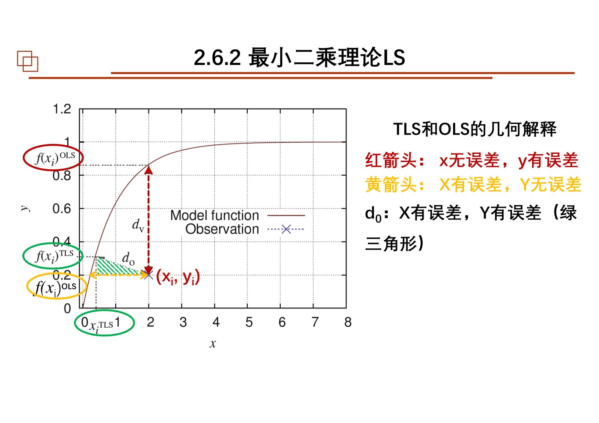
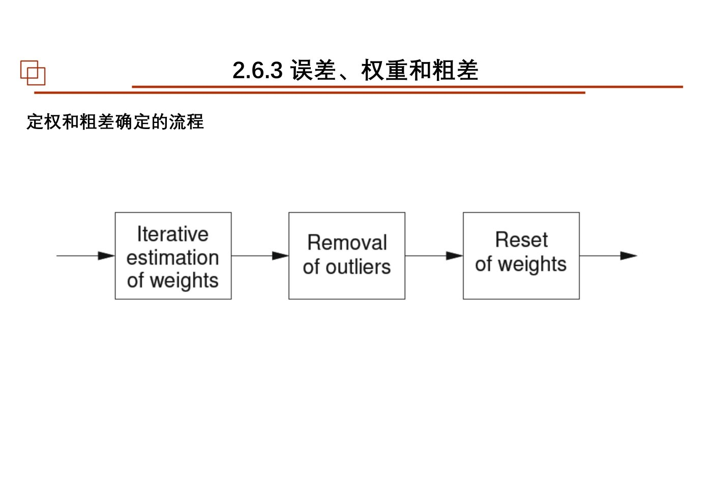
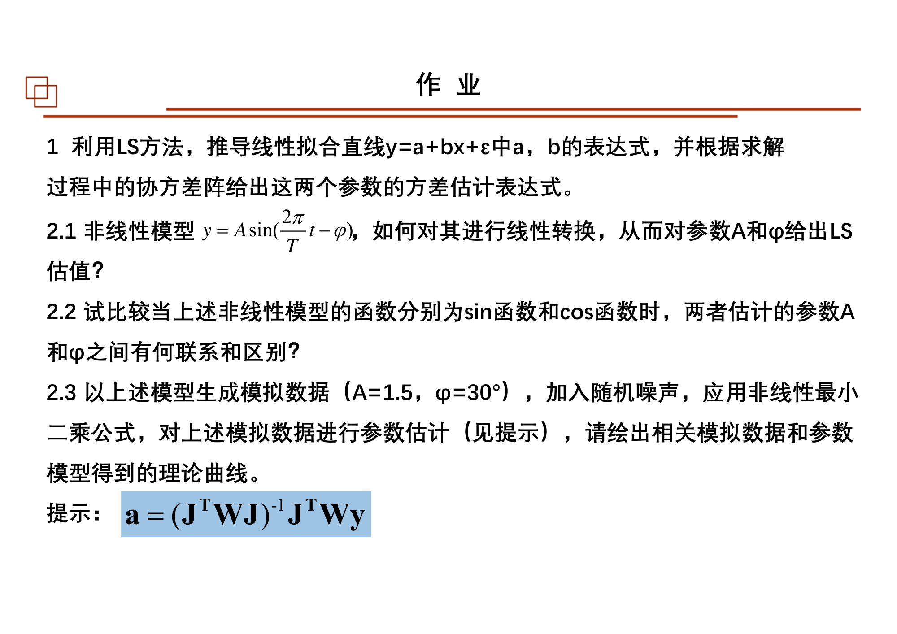
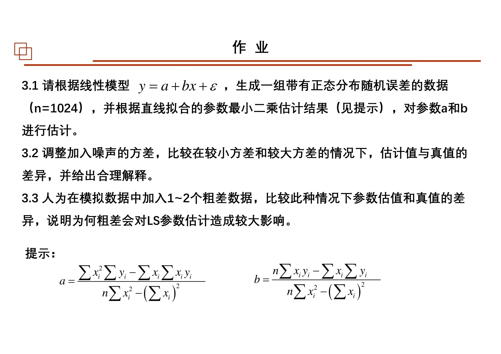
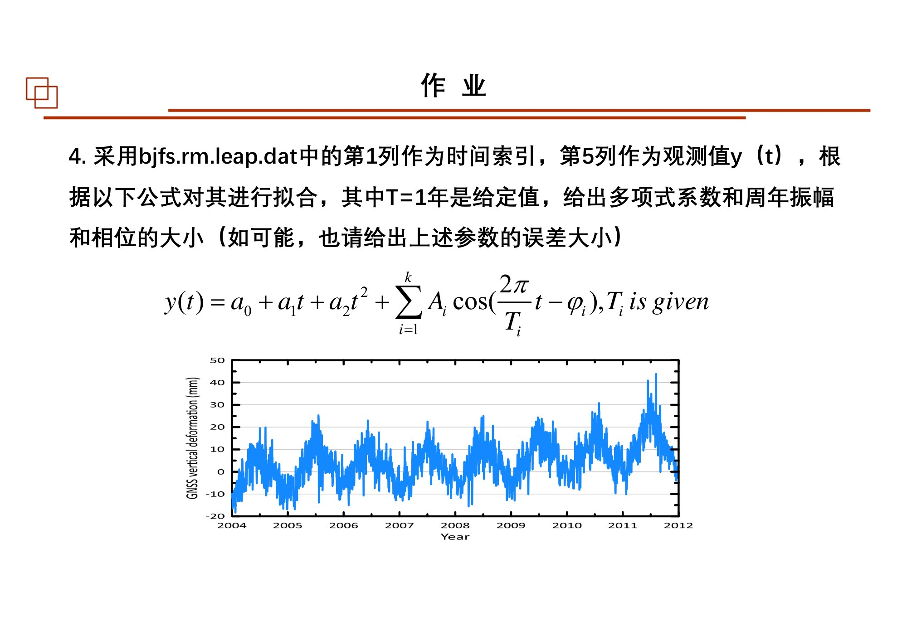

# 第04课｜最小二乘、误差权重、结果评价与Bayes

<strong>本课目录：从全景到知识点、作业与原页</strong>

- [第一层：本课全景](#sec-01)
- [课时大纲：按原页定位](#sec-02)
- [第二层：知识树](#sec-03)
- [第三层：2.6.2 最小二乘理论](#sec-04)
  - [2.6.2-A 先判断“对谁线性”](#sec-05)
  - [2.6.2-B 残差与目标：动的是模型参数，不是观测](#sec-06)
  - [2.6.2-C 一元直线：把最优化过程真正走一遍](#sec-07)
  - [2.6.2-D 矩阵表达：多个参数一起估](#sec-08)
  - [2.6.2-E 非线性LS：在当前参数附近求增量](#sec-09)
  - [2.6.2-F MLE、TLS和约束LS分别扩展了什么](#sec-10)
- [第三层：2.6.3 误差、权重和粗差](#sec-11)
  - [权重应表达什么](#sec-12)
  - [粗差筛查与迭代拟合](#sec-13)
- [第三层：2.6.4 如何判断拟合结果](#sec-14)
  - [准确度、精密度与形式误差](#sec-15)
  - [平方和、自由度与拟合优度](#sec-16)
  - [参数协方差与标准不确定性](#sec-17)
  - [残差检查：小并不等于好](#sec-18)
- [第三层：2.7 Bayes定理与估计思想](#sec-19)
  - [2.7.1 概率基础：联合、条件、边缘](#sec-20)
  - [2.7.1 从似然到后验](#sec-21)
  - [2.7.2 两种推断视角与参数分布](#sec-22)
- [第四层：串联与复习出口](#sec-23)
- [课件表述与待核对事项](#sec-24)
- [课后作业：题目、数据与提交要求](#sec-25)
  - [作业1：一元LS系数与方差](#sec-26)
  - [作业2：正弦/余弦模型的参数估计](#sec-27)
  - [作业3：噪声与粗差对直线拟合的影响](#sec-28)
  - [作业4：真实时序的趋势与周年项拟合](#sec-29)
  - [作业原页：完整保留](#sec-30)
- [原页完整性与本课学习记录](#sec-31)

[总大纲](../00_总大纲.md) · [作业总索引](../01_作业总索引.md) · [完整原页对照](../appendices/L04_原页对照.md) · [原PDF](../sources/L04.pdf) · [上一课](./03_统计特征与最优化.md) · [下一课](./05_线性回归.md)

> **范围：** Chapter 2｜3学时（按课程编排）｜原PDF 93页。
> **来源：** `04 chapter2 最小二乘估计和Bayes定理3h-20251011.pdf`。页码均为PDF物理页码。
> **前置联系：** [第02课](./02_参数估计.md)、[第03课](./03_统计特征与最优化.md)。
> **编排说明：** 原课件章/节编号保留；“第一至第四层”是本笔记的学习导航，不是新增授课章节。

## 第一层：本课全景

本课承接第03课的最优化工具，完成Chapter 2后半：**2.6.2 LS理论 → 2.6.3 误差、权重与粗差 → 2.6.4 精度评定 → 2.7 Bayes**。不是只把$(X^{\mathsf T}X)^{-1}X^{\mathsf T}y$背下来，而是建立“模型—目标—求解—评价—更新认识”的完整流程。[原课件P3–4](../appendices/L04_原页对照.md#p003) [原课件P33](../appendices/L04_原页对照.md#p033) [原课件P51](../appendices/L04_原页对照.md#p051) [原课件P72](../appendices/L04_原页对照.md#p072)

本课先约定：$n$为观测数，$p$为待估参数数；$y$为观测向量；$X$为设计矩阵；$\beta$为参数。课件常用$Y=XA$，其中$A$是参数向量；正文有时换写成$\beta$以避免与其他课的矩阵$A$混淆，二者角色相同。

## 课时大纲：按原页定位

| 本课部分 | 原页范围 |
|---|---|
| 课程说明 | [原课件P1–2](../appendices/L04_原页对照.md#p001) |
| 2.6.2 LS理论、非线性LS、TLS与约束 | [原课件P3–32](../appendices/L04_原页对照.md#p003) |
| 2.6.3 误差、权重与粗差 | [原课件P33–50](../appendices/L04_原页对照.md#p033) |
| 2.6.4 LS结果精度评价 | [原课件P51–68](../appendices/L04_原页对照.md#p051) |
| 课后作业 | [原课件P69–71](../appendices/L04_原页对照.md#p069) |
| 2.7.1 条件概率与Bayes定理 | [原课件P72–82](../appendices/L04_原页对照.md#p072) |
| 2.7.2 Bayes估计思想 | [原课件P83–92](../appendices/L04_原页对照.md#p083) |
| 结束页 | [原课件P93](../appendices/L04_原页对照.md#p093) |

## 第二层：知识树

- 2.6.2 最小二乘理论
  - 超定观测方程与数据拟合
  - 对参数线性/非线性；重参数化；多项式、三角函数、Gaussian模型
  - 残差、目标函数、普通与加权LS
  - 一元推导、多元法方程、矩阵表达
  - 非线性LS：初值、Jacobian、增量、迭代、收敛与局部极值
  - 多输出与共享参数：仿射/坐标变换
  - SVD与求解；MLE与LS的关系
  - TLS、正交距离、PCA联系
  - 带线性约束的LS与拉格朗日乘子
- 2.6.3 误差、权重和粗差
  - 观测误差、模型误差、残差
  - 方差与权重；等权、不等权、分块、滑动窗口、迭代重定权
  - 权重上限与数值保护
  - $3\sigma$、迭代筛查、残差群体判别；小样本影响
- 2.6.4 LS结果精度评定
  - Accuracy、Precision、Formal error
  - 平方和、自由度、拟合优度、方差因子
  - 参数协方差、标准不确定性
  - 残差图与模型不匹配；低残差与过拟合；SNR和数据长度
- 2.7 Bayes
  - 条件/联合/边缘概率；独立性；链式法则；全概率
  - Bayes定理；先验、似然、后验
  - 频率与Bayes两种推断视角
  - 参数分布的解释与先验合理性

## 第三层：2.6.2 最小二乘理论

### 2.6.2-A 先判断“对谁线性”

课件区分观测变量与待估参数。例如$y=a_0+a_1x+a_2x^2$虽然随$x$呈曲线，但对$a_0,a_1,a_2$是线性的，因为采样后$x,x^2$都是设计矩阵中已知的数。相反，参数在指数、分母或与另一个未知参数相乘的位置，通常不能直接当作线性模型。[原课件P5–8](../appendices/L04_原页对照.md#p005)

三角模型是课件的重参数化例：已知$\omega$时，

$$
A\sin(\omega t-\varphi)=c\sin\omega t+d\cos\omega t,
\quad c=A\cos\varphi,\quad d=-A\sin\varphi.
$$

先估$c,d$，再恢复振幅与相位。**已知频率**是这里可线性化的关键；若频率也未知，不应把整个问题照搬为同一个线性方程。角度单位、正负号和象限要成套核对。[原课件P5–8](../appendices/L04_原页对照.md#p005) [原课件P20](../appendices/L04_原页对照.md#p020)

### 2.6.2-B 残差与目标：动的是模型参数，不是观测

$$
r_i(\beta)=y_i-f(x_i;\beta),\qquad
J(\beta)=\sum_i r_i(\beta)^2.
$$

加权形式为$J=r^{\mathsf T}Wr$。等权时，不同观测在准则中同等计入；加权时则通过$W$表达不同精度或相关结构。课件把随机波动和模型偏离都画进残差中，提醒残差不等于已知的真实测量误差。[原课件P9](../appendices/L04_原页对照.md#p009) [原课件P35–36](../appendices/L04_原页对照.md#p035)

### 2.6.2-C 一元直线：把最优化过程真正走一遍

对于$\hat y_i=a+bx_i$：

$$
J(a,b)=\sum_i[y_i-(a+bx_i)]^2.
$$

分别对$a,b$求导，得到法方程：

$$
\sum_i(y_i-a-bx_i)=0,\qquad
\sum_ix_i(y_i-a-bx_i)=0.
$$

第一式给$a=\bar y-b\bar x$；代入第二式，整理成中心化形式：

$$
\hat b=\frac{\sum_i(x_i-\bar x)(y_i-\bar y)}{\sum_i(x_i-\bar x)^2},
\qquad \hat a=\bar y-\hat b\bar x.
$$

这就是课件第10—11页消元过程的主干。若所有$x_i$相同，斜率无法由此辨认，分母为零体现的是信息不足，不是公式算错。[原课件P10–12](../appendices/L04_原页对照.md#p010)

### 2.6.2-D 矩阵表达：多个参数一起估

线性模型写成$y=X\beta+\varepsilon$。平方和展开后对参数求导，得到：

$$
X^{\mathsf T}X\hat\beta=X^{\mathsf T}y.
$$

当设计矩阵列满秩时，课件的闭式表达为：

$$
\hat\beta=(X^{\mathsf T}X)^{-1}X^{\mathsf T}y.
$$

加权形式为：

$$
\hat\beta=(X^{\mathsf T}WX)^{-1}X^{\mathsf T}Wy.
$$

理解矩阵尺寸比记外观更重要：$X$是$n\times p$，参数是$p\times1$，而法方程系数矩阵是$p\times p$。课件第14页讨论求逆困难，第26页又引入SVD；因此应区分“这个逆矩阵公式的条件”和“LS问题能否通过其他分解求解”。[原课件P13–14](../appendices/L04_原页对照.md#p013) [原课件P25–26](../appendices/L04_原页对照.md#p025)

### 2.6.2-E 非线性LS：在当前参数附近求增量

非线性模型不能一次写成固定的$X\beta$时，课件在当前参数$\beta^{(k)}$附近线性近似：

$$
f(\beta^{(k)}+\Delta\beta)\approx f(\beta^{(k)})+J_k\Delta\beta,
\qquad (J_k)_{ij}=\frac{\partial f_i}{\partial\beta_j}.
$$

以当前残差$r_k=y-f(\beta^{(k)})$求增量：

$$
(J_k^{\mathsf T}WJ_k)\Delta\beta=J_k^{\mathsf T}Wr_k,
\qquad\beta^{(k+1)}=\beta^{(k)}+\Delta\beta.
$$

顺序是：选初值、计算模型和残差、计算Jacobian、解增量、更新、检查收敛。模型函数发生变化时，Jacobian也随当前参数变化。课件提醒初值、参数范围、局部极值、尺度和数值稳定性，而非承诺迭代一定找到全局最好解。[原课件P15–19](../appendices/L04_原页对照.md#p015)

对于多个输出共享参数的坐标变换，应将关联观测组成联合方程，而不是总把$x$和$y$分开做两次无关拟合。第21—24页正用仿射与旋转相关参数说明这个问题。[原课件P21–24](../appendices/L04_原页对照.md#p021)

### 2.6.2-F MLE、TLS和约束LS分别扩展了什么

**MLE与LS**：课件把正态误差的对数似然与残差平方和比较。等方差独立正态误差时，最大化对应似然与最小化普通平方和对参数给出同一优化问题；更一般误差模型不能自动照此等同。[原课件P27](../appendices/L04_原页对照.md#p027)

**TLS**：OLS通常把自变量放在已知输入位置，TLS的本课图示则考虑两个方向的观测都不完善，转向正交距离。它与投影误差最小、主方向和PCA发生联系。应保留坐标尺度与误差模型的约定，不能把任何非等精度的双变量误差一律用欧氏垂距处理。[原课件P28–30](../appendices/L04_原页对照.md#p028)

*OLS与TLS距离方向的原图：不同目标函数对应不同的几何问题。 · [原PDF第30页](../sources/L04.pdf#page=30)*

**约束LS**：若参数还需满足$K\beta=b$，第31—32页将限制与平方和联合放入拉格朗日函数。它不是先任意拟合再手工修改参数，而是在求解时同时满足准则与约束。[原课件P31–32](../appendices/L04_原页对照.md#p031)

## 第三层：2.6.3 误差、权重和粗差

### 权重应表达什么

课件把权重与方差信息相连。若观测互不相关且方差已知，常见形式为$w_i\propto1/\sigma_i^2$；若有相关性，完整权矩阵不是只有对角元素。高权重表示同样残差在目标函数中代价更大，而不是“这个点更值得喜欢”。[原课件P34–36](../appendices/L04_原页对照.md#p034)

实际情况常不知道误差方差。课件展示等权初始拟合、按bin或滑动窗口估计波动、残差平方估权、迭代重定权等近似流程。残差趋近零时估计权可能趋向无穷，因此需有尺度下限或权重上限。**这些残差估权步骤是课件的应用性策略，不是已知真误差方差的替代等式。**[原课件P37–39](../appendices/L04_原页对照.md#p037)

### 粗差筛查与迭代拟合

课件列出$3\sigma$、结合重定权的迭代筛查，以及排序残差后比较群体差异的方法。实施时应记录被判断异常的依据、保留或删除的策略、每轮参数变化；不能只输出一条“更直”的线。[原课件P40–42](../appendices/L04_原页对照.md#p040)

第43—50页对等方差、变方差、加入少量粗差、小样本和大样本进行对比。关键结论不是“WLS永远赢”，而是**权是怎样得到的、模型误差有没有混进去、小样本删除信息后会怎样**。课件自己在第50页反思用残差定权未必正确，应与前面实例结论合读。[原课件P43–50](../appendices/L04_原页对照.md#p043)

*课件的定权与粗差识别流程；原图保留了处理顺序。 · [原PDF第42页](../sources/L04.pdf#page=42)*

## 第三层：2.6.4 如何判断拟合结果

### 准确度、精密度与形式误差

课件用靶心和点云区分Accuracy与Precision：聚得紧与靠近真值不是同一件事。LS给出的参数方差或formal error依赖你采用的模型与噪声假设，不能自动覆盖未识别系统偏差。[原课件P52–53](../appendices/L04_原页对照.md#p052)

### 平方和、自由度与拟合优度

若$p$个参数由$n$个独立观测估计，本课常用残差自由度$n-p$。普通LS的残差方差估计沿课件写为：

$$
\hat\sigma_0^2=\frac{r^{\mathsf T}r}{n-p}.
$$

若每点标准差已作为权重，课件进一步比较：

$$
\chi^2=\sum_i\frac{r_i^2}{\sigma_i^2},\qquad
\chi^2_{\mathrm{red}}=\frac{\chi^2}{n-p}.
$$

课件以gfit讨论接近1、过大或过小的情况；解释时必须同时知道权重是否可靠及模型条件。原课件不同“方差/标准差/gfit”符号应按该页定义使用，不把带平方根的量与方差因子混算。[原课件P54–56](../appendices/L04_原页对照.md#p054)

### 参数协方差与标准不确定性

课件用法方程逆矩阵描述参数间的不确定性联系。相对权情形可整理为：

$$
\widehat{\operatorname{Cov}}(\hat\beta)
=\hat\sigma_0^2(X^{\mathsf T}WX)^{-1}.
$$

若$W$已是绝对已知观测协方差的逆，则应相应核对是否还需要独立估计尺度；不要重复乘同一方差。对角元素是参数方差，平方根是参数标准不确定性，非对角元素保留参数之间的联系。[原课件P57](../appendices/L04_原页对照.md#p057)

### 残差检查：小并不等于好

课件第58—66页通过残差曲线、周期数据的多项式拟合、参数误差说明：有规律的残差可能暴露遗漏结构；很低的残差同时伴随很大的参数不确定性，也可能反映模型不合适或过拟合。不能只盯一个平方和指标。[原课件P58–66](../appendices/L04_原页对照.md#p058)

第67—68页综合案例将趋势项与周年信号一起拟合。应把输出拆成三层：模型曲线与观测比较、参数值及其不确定性、残差是否还含结构。此例直接连接本课第4题作业和下一课回归统计检验。[原课件P67–68](../appendices/L04_原页对照.md#p067)

## 第三层：2.7 Bayes定理与估计思想

### 2.7.1 概率基础：联合、条件、边缘

课件从掷骰子和区域土地用途例入手：给定事件$B$会改变用于计算概率的样本空间。相应关系为：

$$
P(A\mid B)=\frac{P(A\cap B)}{P(B)},\qquad
P(A\cap B)=P(A\mid B)P(B).
$$

分割情形的全概率公式：

$$
P(B)=\sum_jP(B\mid A_j)P(A_j).
$$

联合、边缘、条件密度的区别同样适用于连续变量：求边缘要对其他变量积分；条件密度要按给定条件归一化。课件第75—76页以二维图示展示。[原课件P73–76](../appendices/L04_原页对照.md#p073) [原课件P80–82](../appendices/L04_原页对照.md#p080)

### 2.7.1 从似然到后验

$$
p(\theta\mid x)=\frac{p(x\mid\theta)p(\theta)}{p(x)},
\qquad p(x)=\int p(x\mid\theta)p(\theta)d\theta.
$$

$p(\theta)$为先验，$p(x\mid\theta)$作为$\theta$函数是似然，$p(\theta\mid x)$为后验。与MLE相比，这里不只对参数逐个比较当前样本的似然，还明确纳入观察之前的参数信息。[原课件P77–82](../appendices/L04_原页对照.md#p077)

课件的指数趋势例先按经典模型估截距斜率，再提出“已对截距范围有认识”如何处理。先验的内容与合理性需要交代，而不是为了让参数落在想要的范围任意加限制。[原课件P78–79](../appendices/L04_原页对照.md#p078)

### 2.7.2 两种推断视角与参数分布

课件从重复抽样和当前观测两种角度比较频率与Bayes思想；随后用产品合格率等例子讨论“把参数看成随机变量”应如何理解。笔记保留这作为课堂的方法论讨论，不把一种学派的评价标准简单判成另一种学派也必须遵守的规则。[原课件P83–92](../appendices/L04_原页对照.md#p083)

后验综合了先验与本次样本信息。**“更新了认识”不等于对每个样本都保证更窄、更正确**；应继续检查先验来源、似然模型与数据条件。下一次在正则化课出现MAP时，再从后验中选择一个点估计。

## 第四层：串联与复习出口

由模型写残差，由残差写目标，由导数或矩阵分解解参数；权重表达观测信息结构，异常筛查必须留意模型误差；参数算出来后仍需评价精度和残差；Bayes则引入先验，通过后验组织更新后的认识。

**自测（非教师作业）**：多项式为什么可能是线性LS？非线性迭代在每一轮到底更新什么？误差条只很小能否证明真实准确？似然和后验的自变量相同，为何不是同一函数？

## 课件表述与待核对事项

- 第14页把逆矩阵公式的局限表述为LS整体的局限，需与第26页SVD解法一并阅读。
- 第27页把“残差正态”与MLE等价相连时，应核实误差独立性和方差结构；单独看到一张近似正态残差图不够。
- 第38—50页重定权和插值补点是课件展示的处理方案，不应无条件成为所有观测的标准流程。
- 第54—57页gfit、方差因子和标准差因子的记号需配套核对。
- 第76页对条件密度和边缘密度形状的概括不宜脱离二维例子的具体条件。
- 第87页先验/后验方差比较的文字存在疑点，不据此断言每次更新后方差一定按某一方向变化。
- 第69—71页部分模拟参数、时间单位、谐波数没有完整指定，作业部分逐项注明，勿静默补默认值。

## 课后作业：题目、数据与提交要求

### 作业1：一元LS系数与方差

来源：[原课件P69](../appendices/L04_原页对照.md#p069)。用LS推导

$$
y=a+bx+\varepsilon
$$

中$a,b$的表达式，并由求解过程中的协方差矩阵给出两参数的方差估计表达式。

### 作业2：正弦/余弦模型的参数估计

来源：[原课件P69](../appendices/L04_原页对照.md#p069)。课件模型为

$$
y=A\sin\left(\frac{2\pi t}{T}-\varphi\right).
$$

1. 如何转换为线性形式，估计$A,\varphi$？
2. 模型分别采用sin和cos时，估计的$A,\varphi$有何联系与区别？
3. 取$A=1.5,\varphi=30^\circ$生成模拟数据，加入随机噪声，按课件非线性LS公式估计参数，绘出模拟数据与估计参数得到的理论曲线。

题页提示含$(J^{\mathsf T}WJ)^{-1}J^{\mathsf T}Wy$；参数增量与线性参数解的区别应结合正文核对。题目未明确周期、采样网格与噪声大小，做题时应记录自己采用的设置，不把它们写成老师已给条件。

### 作业3：噪声与粗差对直线拟合的影响

来源：[原课件P70](../appendices/L04_原页对照.md#p070)。

1. 按$y=a+bx+\varepsilon$生成$n=1024$个带正态随机误差的观测，用一元LS公式估计$a,b$。
2. 调整噪声方差，比较小方差与大方差下估值和真值的差异并解释。
3. 人为加入1—2个粗差，比较参数估计变化，说明粗差为何对LS影响较大。

原题未固定$a,b$及采样区间。

### 作业4：真实时序的趋势与周年项拟合

来源：[原课件P71](../appendices/L04_原页对照.md#p071)。输入`bjfs.rm.leap.dat`，第1列时间索引，第5列观测$y(t)$。题页公式为

$$
y(t)=a_0+a_1t+a_2t^2+\sum_{i=1}^k A_i\cos\left(\frac{2\pi t}{T_i}-\varphi_i\right).
$$

文字说明周期$T=1$年给定，要求多项式系数、周年振幅和相位；如可能，给出各参数误差。

**待核对：**公式写多个周期项，题目文字重点只给周年周期。未说明的其他$T_i$、$k$不要擅自添加为必做条件。当前未提供该独立数据文件。

### 作业原页：完整保留

展开第69页作业原图

*第04课第69页作业原页 · [原PDF第69页](../sources/L04.pdf#page=69)*

展开第70页作业原图

*第04课第70页作业原页 · [原PDF第70页](../sources/L04.pdf#page=70)*

展开第71页作业原图

*第04课第71页作业原页 · [原PDF第71页](../sources/L04.pdf#page=71)*

## 原页完整性与本课学习记录

本课全部93页（含图示、代码、参考文献、空白与结束页）均保留在[原页对照](../appendices/L04_原页对照.md)和[原始PDF](../sources/L04.pdf)中。笔记正文梳理知识及核心推导，不等同于逐字转录所有PPT文字。对照页用于查看更细的图表、完整代码和源内不同表述。

- [ ] 看过全景和课时大纲，能定位本课结构。
- [ ] 顺着知识树读完正文，并标出未理解的小节。
- [ ] 自己重写关键公式，分清符号、维度与假设。
- [ ] 做过课件作业或记录缺少的数据/需要问老师的条件。
- [ ] 不看笔记，用自己的话串起本课知识。
