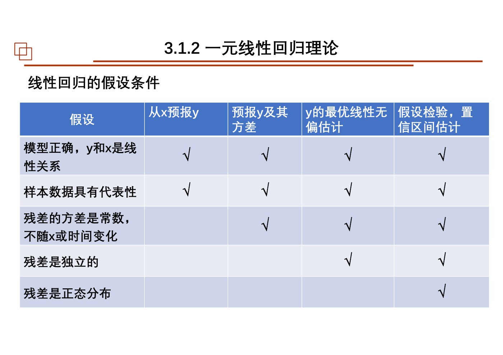
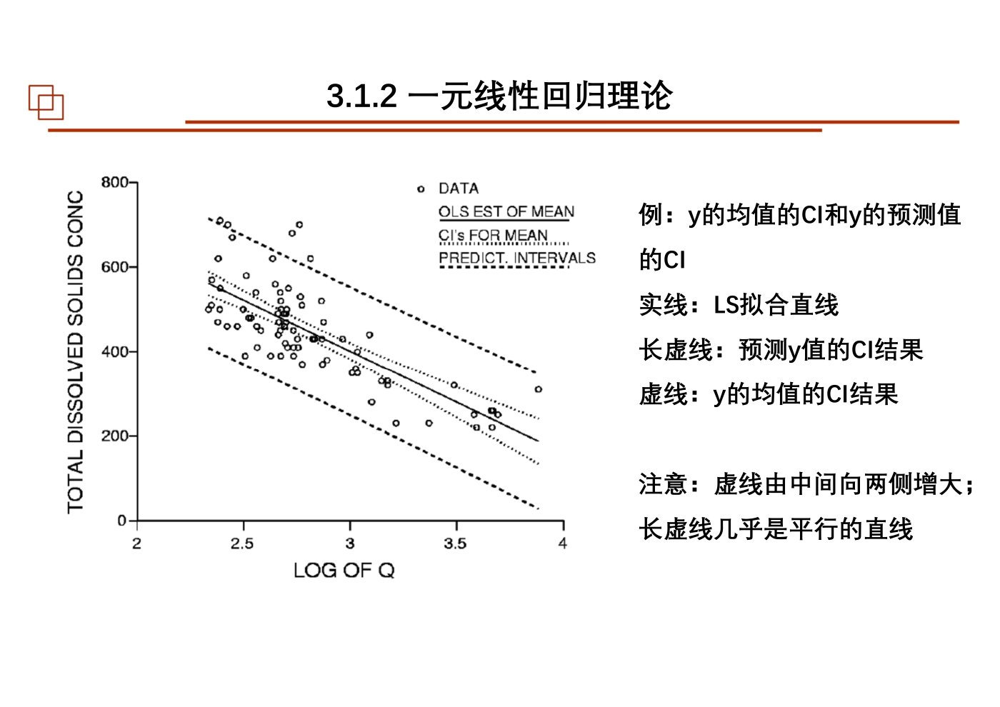
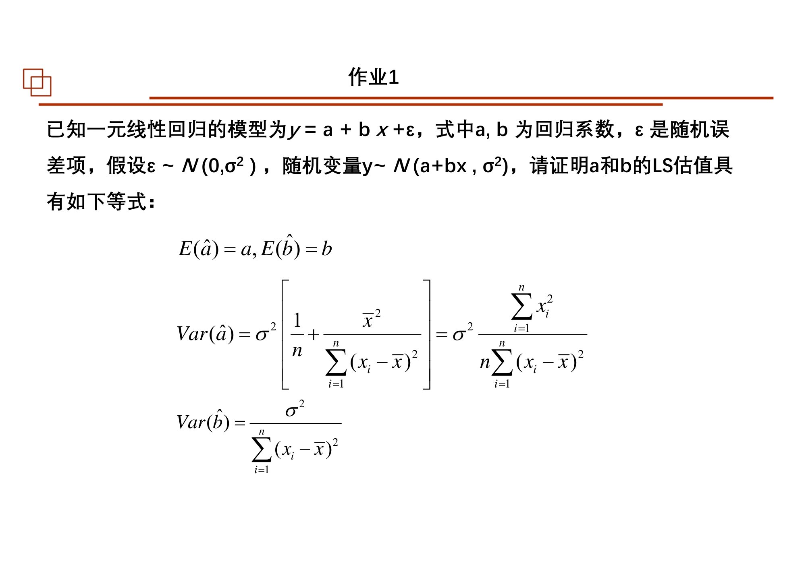
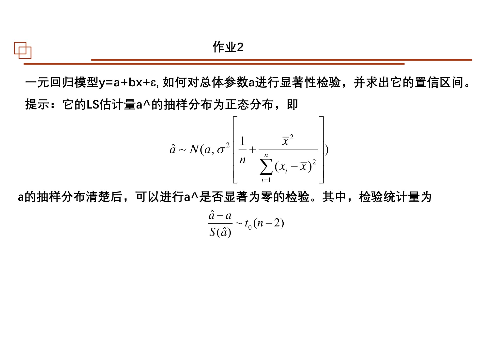
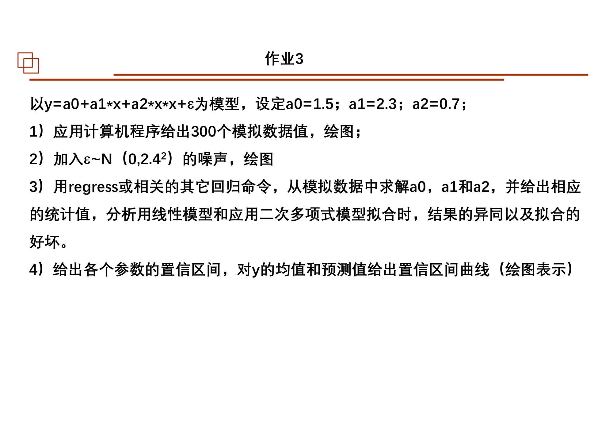

# 第05课｜一元线性回归与多元线性回归

<strong>本课目录：从全景到知识点、作业与原页</strong>

- [第一层：从“拟合参数”走到“统计推断”](#sec-01)
- [课时大纲：按原页定位](#sec-02)
- [第二层：知识树](#sec-03)
- [第三层：样本空间与模型假设](#sec-04)
  - [数据矩阵的两个方向](#sec-05)
  - [固定参数与随机估计量](#sec-06)
- [第三层：一元回归系数的推导](#sec-07)
  - [从目标函数到法方程](#sec-08)
  - [估计量的无偏性与方差](#sec-09)
  - [几个可用来检查程序的性质](#sec-10)
- [第三层：平方和、拟合优度与检验](#sec-11)
  - [总变异如何拆开](#sec-12)
  - [判定系数](#sec-13)
  - [F检验：加上线性项是否有显著改善](#sec-14)
  - [t检验与系数置信区间](#sec-15)
- [第三层：三种区间不要混在一起](#sec-16)
  - [参数区间](#sec-17)
  - [给定解释变量时，平均响应的区间](#sec-18)
  - [单个未来观测的预测区间](#sec-19)
- [第三层：不止一种直线拟合目标](#sec-20)
- [第三层：多元模型与变量选择](#sec-21)
  - [模型、维度和统计性质](#sec-22)
  - [总体F检验与各系数t检验](#sec-23)
  - [逐步回归](#sec-24)
- [第三层：Matlab实践如何阅读](#sec-25)
- [第四层：把本课串成一次分析](#sec-26)
- [课件表述与待核对事项](#sec-27)
- [课后作业：题目、数据与提交要求](#sec-28)
  - [作业1：证明回归系数性质](#sec-29)
  - [作业2：截距的检验与置信区间](#sec-30)
  - [作业3：二次模型模拟、比较与区间](#sec-31)
  - [作业原页：完整保留](#sec-32)
- [原页完整性与本课学习记录](#sec-33)

[总大纲](../00_总大纲.md) · [作业总索引](../01_作业总索引.md) · [完整原页对照](../appendices/L05_原页对照.md) · [原PDF](../sources/L05.pdf) · [上一课](./04_最小二乘与Bayes.md) · [下一课](./06_相关与Fourier.md)

> **范围：** Chapter 3｜3学时（按课程编排）｜原PDF 96页。
> **来源：** `05 chapter3 01一元线性回归与多元线性回归3h-20251015.pdf`。页码均为PDF物理页码。
> **前置联系：** [第02课](./02_参数估计.md)、[第04课](./04_最小二乘与Bayes.md)。
> **编排说明：** 原课件章/节编号保留；“第一至第四层”是本笔记的学习导航，不是新增授课章节。

## 第一层：从“拟合参数”走到“统计推断”

第04课解决怎样使残差平方和最小，本课继续问：**模型能解释多少变化？系数是否显著？给出的预测有多大不确定性？** 课件把内容分为3.1一元回归、3.2多元回归、3.3 Matlab实践。这里不是重新发明LS，而是在LS结果上加上抽样分布、检验与区间。[原课件P3–8](../appendices/L05_原页对照.md#p003)

本课主要模型是含截距的一元模型$y_i=a+bx_i+\varepsilon_i$。理解顺序是：先分清数据、参数与估计量，再推点估计，随后研究方差、平方和分解和检验，最后推广到多元。不要把“算得出拟合直线”直接当作“证明关系真实存在”。

## 课时大纲：按原页定位

| 本课部分 | 原页范围 |
|---|---|
| 课程说明 | [原课件P1–2](../appendices/L05_原页对照.md#p001) |
| 3.1.1 回归概述与样本组织 | [原课件P3–12](../appendices/L05_原页对照.md#p003) |
| 3.1.2 一元回归模型、估计与性质 | [原课件P13–31](../appendices/L05_原页对照.md#p013) |
| 3.1.2 平方和、方差、判定系数 | [原课件P32–41](../appendices/L05_原页对照.md#p032) |
| 3.1.2 F检验、t检验与参数区间 | [原课件P42–57](../appendices/L05_原页对照.md#p042) |
| 3.1.2 均值响应CI与个体PI | [原课件P58–63](../appendices/L05_原页对照.md#p058) |
| 3.1.2 OLS、LOC、LNS比较 | [原课件P64–73](../appendices/L05_原页对照.md#p064) |
| 3.2 多元线性回归与逐步回归 | [原课件P74–84](../appendices/L05_原页对照.md#p074) |
| 3.3 Matlab回归实践 | [原课件P85–91](../appendices/L05_原页对照.md#p085) |
| 课后作业 | [原课件P92–94](../appendices/L05_原页对照.md#p092) |
| 参考文献与结束页 | [原课件P95–96](../appendices/L05_原页对照.md#p095) |

## 第二层：知识树

- 3.1.1 概述与数据组织
  - 回归目的；LS与回归分析
  - 样本矩阵；样本协方差矩阵、相关矩阵
  - 中心化、无量纲化、标准化
- 3.1.2 一元线性回归理论
  - 模型、误差假设、参数与估计量
  - LS准则与LAD比较；法方程；截距与斜率
  - 估计量的线性性、无偏性、方差、最小方差
  - 残差正交、残差和、过重心性质
  - SSE、SSR、SST、自由度、残差方差、判定系数
  - 全模型与选模型；F检验；系数t检验；参数置信区间
  - 均值响应置信区间；个体预测区间；非参数预测区间
  - 回归方向；OLS、LOC、LNS的目标与适用场景
- 3.2 多元线性回归理论
  - 3.2.1 模型、矩阵解、统计性质
  - 总体F检验；单个系数t检验；区间；复判定系数
  - 3.2.2 逐步回归；变量进入和退出
- 3.3 Matlab回归实践
  - regress、polyfit、rstool
  - nlinfit、nlparci、nlpredci、nlintool
  - stepwise；输出系数、残差、区间和统计量

## 第三层：样本空间与模型假设

### 数据矩阵的两个方向

课件以$i$表示第$i$个样本，以$j$表示第$j$个解释变量。矩阵$X$的行对应样本，列对应变量。先中心化，再按列除以各变量标准差，就得到标准化数据；协方差矩阵描述尺度相关的共同变化，相关矩阵进一步无量纲化。[原课件P9–12](../appendices/L05_原页对照.md#p009)

### 固定参数与随机估计量

在本课经典模型下，给定$x_i$，参数$a,b$是待估的固定未知量，$y_i$的随机性来自$\varepsilon_i$；不同样本算出的$\hat a,\hat b$会不同。课件第14页把$a,b$称作随机变量，而随后第20页明确区分总体参数与估值。**笔记用帽号区分它们，以后者为准；这属于源内符号澄清，不把真实参数和估计量混成一件事。**[原课件P14](../appendices/L05_原页对照.md#p014) [原课件P20](../appendices/L05_原页对照.md#p020)

模型写为：

$$
y_i=a+bx_i+\varepsilon_i,\qquad E(\varepsilon_i)=0.
$$

课件逐层列出线性、代表性、同方差、独立性与正态性，区分只做预测、估计方差、最优线性无偏性质和精确统计检验需要的假设。正常作图和求LS并不意味着所有统计推断条件自动成立。[原课件P16–18](../appendices/L05_原页对照.md#p016)

*课件按分析目的列出的回归假设条件 · [原PDF第16页](../sources/L05.pdf#page=16)*

## 第三层：一元回归系数的推导

### 从目标函数到法方程

$$
J(a,b)=\sum_{i=1}^n[y_i-(a+bx_i)]^2.
$$

分别对$a,b$求偏导并令其为零：

$$
\sum_i(y_i-a-bx_i)=0,\qquad
\sum_i x_i(y_i-a-bx_i)=0.
$$

即：

$$
n\hat a+\hat b\sum_i x_i=\sum_i y_i,
\qquad
\hat a\sum_i x_i+\hat b\sum_i x_i^2=\sum_i x_i y_i.
$$

课件用消元得到以下等价形式。定义$S_{xx}=\sum_i(x_i-\bar x)^2$、$S_{xy}=\sum_i(x_i-\bar x)(y_i-\bar y)$，在$S_{xx}>0$时：

$$
\hat b=\frac{S_{xy}}{S_{xx}},\qquad
\hat a=\bar y-\hat b\bar x.
$$

这里$s_x,s_y$若使用同一分母计算，$\hat b=r_{xy}s_y/s_x$；两个变量都标准化后，截距为0，斜率为相关系数。[原课件P19–22](../appendices/L05_原页对照.md#p019)

### 估计量的无偏性与方差

把斜率重写为观测值的线性组合：

$$
\hat b=\sum_i k_i y_i,
\qquad k_i=\frac{x_i-\bar x}{S_{xx}}.
$$

因$\sum_i k_i=0$、$\sum_i k_i x_i=1$，得到$E(\hat b)=b$。在误差独立、同方差$\sigma^2$时：

$$
\operatorname{Var}(\hat b)=\sigma^2\sum_i k_i^2
=\frac{\sigma^2}{S_{xx}},
\qquad
\operatorname{Var}(\hat a)=\sigma^2\left(\frac1n+\frac{\bar x^2}{S_{xx}}\right).
$$

课件还把任意其他线性无偏斜率估计写成相对于$k_i$的改动，通过方差比较说明LS在该类估计中的最小方差性质。范围是“线性无偏估计类”，不是任何可能估计方法。[原课件P23–29](../appendices/L05_原页对照.md#p023)

### 几个可用来检查程序的性质

令$e_i=y_i-\hat y_i$，含截距OLS法方程给出：

$$
\sum_i e_i=0,\quad
\sum_i x_i e_i=0,\quad
\sum_i\hat y_i e_i=0,\quad
\overline{\hat y}=\bar y.
$$

拟合线通过$(\bar x,\bar y)$。这些性质来自所用模型的法方程；不能原封不动套在不含截距的回归或其他损失函数上。[原课件P30–31](../appendices/L05_原页对照.md#p030)

## 第三层：平方和、拟合优度与检验

### 总变异如何拆开

课件用三个平方和组织拟合结果：

$$
\mathrm{SST}=\sum_i(y_i-\bar y)^2,
\quad \mathrm{SSR}=\sum_i(\hat y_i-\bar y)^2,
\quad \mathrm{SSE}=\sum_i(y_i-\hat y_i)^2.
$$

由$y_i-\bar y=(\hat y_i-\bar y)+e_i$展开平方，交叉项依残差正交性为0，因此：

$$
\mathrm{SST}=\mathrm{SSR}+\mathrm{SSE}.
$$

一元含截距模型对应自由度$n-1=1+(n-2)$；误差方差估计为$s^2=\mathrm{SSE}/(n-2)$。这里$n-2$来自拟合了两个参数，不是一般样本方差的$n-1$。[原课件P32–38](../appendices/L05_原页对照.md#p032)

### 判定系数

$$
R^2=\frac{\mathrm{SSR}}{\mathrm{SST}}
=1-\frac{\mathrm{SSE}}{\mathrm{SST}}.
$$

它在本课含截距OLS、训练样本、非零总变异的条件下描述由拟合值解释的变异比例。一元情况下$R^2=r_{xy}^2$。不要把统计上的“解释”误读成因果解释，也不要只看$R^2$而不看残差图。[原课件P39–41](../appendices/L05_原页对照.md#p039)

### F检验：加上线性项是否有显著改善

课件比较全模型$y=a+bx+\varepsilon$与选模型$y=a+\varepsilon$，检验$H_0:b=0$。在本课相应正态误差假设下：

$$
F=\frac{\mathrm{SSR}/1}{\mathrm{SSE}/(n-2)}
\sim F(1,n-2)\quad(H_0\text{成立时}).
$$

超出临界值拒绝$H_0$；未拒绝并不证明$b$精确为0。课件随后特别提醒，显著的线性项也不证明直线就是充分、完整的模型。[原课件P42–48](../appendices/L05_原页对照.md#p042)

### t检验与系数置信区间

用$s$替换未知$\sigma$，得到：

$$
\mathrm{SE}(\hat b)=\frac{s}{\sqrt{S_{xx}}},\qquad
\mathrm{SE}(\hat a)=s\sqrt{\frac1n+\frac{\bar x^2}{S_{xx}}}.
$$

检验$b=b_0$时：

$$
t=\frac{\hat b-b_0}{\mathrm{SE}(\hat b)}\sim t(n-2).
$$

对应双侧区间：

$$
\hat b\pm t_{1-\alpha/2,n-2}\mathrm{SE}(\hat b).
$$

$a$同理。对单个斜率为0的检验，课件指出$F$与$t$等价；用同一数据和同一模型可以检查$F=t^2$。[原课件P49–57](../appendices/L05_原页对照.md#p049)

## 第三层：三种区间不要混在一起

### 参数区间

参数$a,b$的CI回答截距和斜率的不确定性，不是某个新观测的取值范围。课件用重复采样下区间覆盖真值的比例解释置信水平。[原课件P58](../appendices/L05_原页对照.md#p058)

### 给定解释变量时，平均响应的区间

用$x_0$表示实际给定的解释变量值，$\hat y_0=\hat a+\hat b x_0$，对应：

$$
\hat y_0\pm t_{1-\alpha/2,n-2}s
\sqrt{\frac1n+\frac{(x_0-\bar x)^2}{S_{xx}}}.
$$

这是总体条件均值的区间。课件第59页也使用“离均值的距离”版本符号，代公式前要确认$x_0$是原始值还是中心化值。[原课件P59](../appendices/L05_原页对照.md#p059)

### 单个未来观测的预测区间

单个新观测还带有它自己的随机误差，因此根号内多出1：

$$
\hat y_0\pm t_{1-\alpha/2,n-2}s
\sqrt{1+\frac1n+\frac{(x_0-\bar x)^2}{S_{xx}}}.
$$

课件第61页把两种带画在同一张图上：中部窄、远离数据中心变宽，预测区间比均值响应区间更宽。第62—63页还介绍用残差分位数构造非参数预测区间，允许上下宽度不对称。[原课件P60–63](../appendices/L05_原页对照.md#p060)

*同一拟合线的均值响应置信带与个体预测带 · [原PDF第61页](../sources/L05.pdf#page=61)*

## 第三层：不止一种直线拟合目标

课件第64—73页比较方向不同的OLS、LOC和LNS。学习时先问“目标是什么”，不要只比较哪条线看起来更好。[原课件P64–73](../appendices/L05_原页对照.md#p064)

- **OLS：** 指定响应变量，最小化其方向上的残差平方和；交换$x,y$通常不是同一条直线。
- **LOC（Line of Organic Correlation）：** 课件以两方向OLS斜率的几何平均组织，写作$\operatorname{sign}(r)s_y/s_x$，讨论补齐短记录和保持变异性的应用。
- **LNS：** 课件使用的正交距离拟合名称，关注两轴测量都不完美的几何关系，与第04课TLS联系。

课件还讨论缩放与旋转的影响。这里应区分“同一物理拟合关系经过坐标单位转换仍一致”和“数值斜率不变”；后者不应不加条件地使用。第72页汇总表保留在原页对照中。[原课件P69–73](../appendices/L05_原页对照.md#p069)

## 第三层：多元模型与变量选择

### 模型、维度和统计性质

对$m$个解释变量及一个截距，构建设计矩阵$X\in\mathbb R^{n\times(m+1)}$，第1列为1：

$$
Y=X\beta+\varepsilon,\qquad
\hat\beta=(X^{\mathsf T}X)^{-1}X^{\mathsf T}Y.
$$

该逆矩阵表达式要求列满秩。相应误差假设下：

$$
E(\hat\beta)=\beta,\qquad
\operatorname{Cov}(\hat\beta)=\sigma^2(X^{\mathsf T}X)^{-1},
\qquad s^2=\frac{\mathrm{SSE}}{n-m-1}.
$$

本课仍然从模型到点估计，再从点估计到抽样性质，不是多一个自变量就换了一套学问。[原课件P74–79](../appendices/L05_原页对照.md#p074)

### 总体F检验与各系数t检验

总体检验$H_0:\beta_1=\cdots=\beta_m=0$，用：

$$
F=\frac{\mathrm{SSR}/m}{\mathrm{SSE}/(n-m-1)}.
$$

它回答是否至少有一项提供统计上的改善，不回答具体哪项有效。各系数再使用相应标准误进行$t$检验和CI。复判定系数描述整体拟合变异比例，不宜设一个与样本量和任务无关的通用合格阈值。[原课件P80–82](../appendices/L05_原页对照.md#p080)

### 逐步回归

课件把逐步回归作为变量选择简介：从初始子集出发，逐步考虑变量进入或退出，同时兼顾残差、自由度和模型稳定性。变量越多，训练SSE通常越小，但并不自动更合理；这个问题将在第09课继续。[原课件P83–84](../appendices/L05_原页对照.md#p083)

## 第三层：Matlab实践如何阅读

`regress`的课件输出包括系数`b`、系数区间`bint`、残差`r`、残差区间`rint`和`stats`。读程序时先核对$Y$形状、$X$常数列与变量列，再核对统计输出对应上面哪一个概念。[原课件P85–89](../appendices/L05_原页对照.md#p085)

`polyfit`用于多项式拟合；课件另列`rstool`、非线性回归/区间工具及`stepwise`。这些是课件版本的工具入口，并非本资料已在你的运行环境测试过的程序。完整代码页可直接在原页对照中查看。[原课件P90–91](../appendices/L05_原页对照.md#p090)

## 第四层：把本课串成一次分析

**画散点图 → 明确响应方向和模型 → 拟合系数 → 分析残差 → 计算SSE和$R^2$ → 检验整体及系数 → 分清参数CI、均值响应CI、个体PI → 检查模型遗漏与适用范围。**

整理者自检问题（不是老师新增作业）：为什么含截距OLS残差和为0仍不能证明模型合适？为什么$R^2$大与系数CI窄不是同一个条件？为什么预测单个值的带比预测平均值宽？为什么多元F显著后还要看单个系数？

## 课件表述与待核对事项

- 第14—15页参数与估计量、误差与残差存在混用，学习时保留$a,b,\varepsilon$和$\hat a,\hat b,e$的区分。[原课件P14–15](../appendices/L05_原页对照.md#p014)
- 第36页附近平方和与样本方差的文字系数不宜脱离自由度直接套用；本课SSE方差估计的分母是$n-2$。[原课件P33–38](../appendices/L05_原页对照.md#p033)
- 第59页$x_0$有原始坐标与距中心距离两种用法；已在正文显式采用原始坐标。[原课件P59](../appendices/L05_原页对照.md#p059)
- 第70页“单位变化不改变斜率/截距估值”的表述需结合坐标换算理解，不能理解为数值完全不变。[原课件P70](../appendices/L05_原页对照.md#p070)
- 第81页相关系数0.8或0.9的判断是课件经验性表述，不是统一显著性检验规则。第82页自由度排版需与第79—80页$n-m-1$核对。[原课件P79–82](../appendices/L05_原页对照.md#p079)

## 课后作业：题目、数据与提交要求

### 作业1：证明回归系数性质

来源：[原课件P92](../appendices/L05_原页对照.md#p092)。已知$y=a+bx+\varepsilon$且$\varepsilon\sim N(0,\sigma^2)$，证明LS估计的下列性质：

$$
E(\hat a)=a,\qquad E(\hat b)=b,
$$

$$
\operatorname{Var}(\hat b)=\frac{\sigma^2}{\sum_i(x_i-\bar x)^2},
\qquad
\operatorname{Var}(\hat a)=\sigma^2\left[\frac1n+\frac{\bar x^2}{\sum_i(x_i-\bar x)^2}\right].
$$

### 作业2：截距的检验与置信区间

来源：[原课件P93](../appendices/L05_原页对照.md#p093)。对一元模型中的总体参数$a$给出显著性检验，并求其置信区间。课件提示使用截距估计的抽样分布，以及将未知误差标准差替换为样本估计后得到的$t$统计量；自由度为$n-2$。

### 作业3：二次模型模拟、比较与区间

来源：[原课件P94](../appendices/L05_原页对照.md#p094)。模型

$$
y=a_0+a_1x+a_2x^2+\varepsilon,
\qquad a_0=1.5,\quad a_1=2.3,\quad a_2=0.7.
$$

1. 编程生成300个模拟值并绘图。
2. 加入$\varepsilon\sim N(0,2.4^2)$噪声并绘图。
3. 用`regress`或其他回归工具估计$a_0,a_1,a_2$，给出统计值；对比直线模型与二次多项式模型的结果和拟合效果。
4. 给出参数的置信区间，并给出模型均值响应的置信区间与预测区间，绘图说明。

题页未明确$x$的生成范围，需自己说明设置。噪声中的2.4是标准差，$2.4^2$是方差。

### 作业原页：完整保留

展开第92页作业原图

*第05课第92页作业原页 · [原PDF第92页](../sources/L05.pdf#page=92)*

展开第93页作业原图

*第05课第93页作业原页 · [原PDF第93页](../sources/L05.pdf#page=93)*

展开第94页作业原图

*第05课第94页作业原页 · [原PDF第94页](../sources/L05.pdf#page=94)*

## 原页完整性与本课学习记录

本课全部96页（含图示、代码、参考文献、空白与结束页）均保留在[原页对照](../appendices/L05_原页对照.md)和[原始PDF](../sources/L05.pdf)中。笔记正文梳理知识及核心推导，不等同于逐字转录所有PPT文字。对照页用于查看更细的图表、完整代码和源内不同表述。

- [ ] 看过全景和课时大纲，能定位本课结构。
- [ ] 顺着知识树读完正文，并标出未理解的小节。
- [ ] 自己重写关键公式，分清符号、维度与假设。
- [ ] 做过课件作业或记录缺少的数据/需要问老师的条件。
- [ ] 不看笔记，用自己的话串起本课知识。
