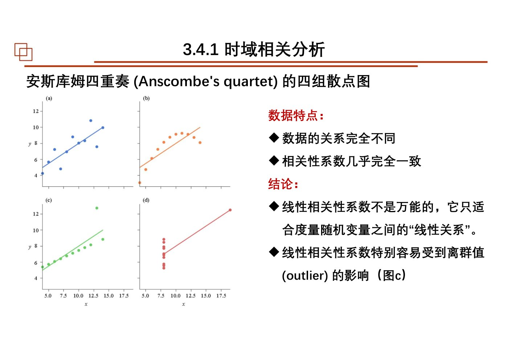
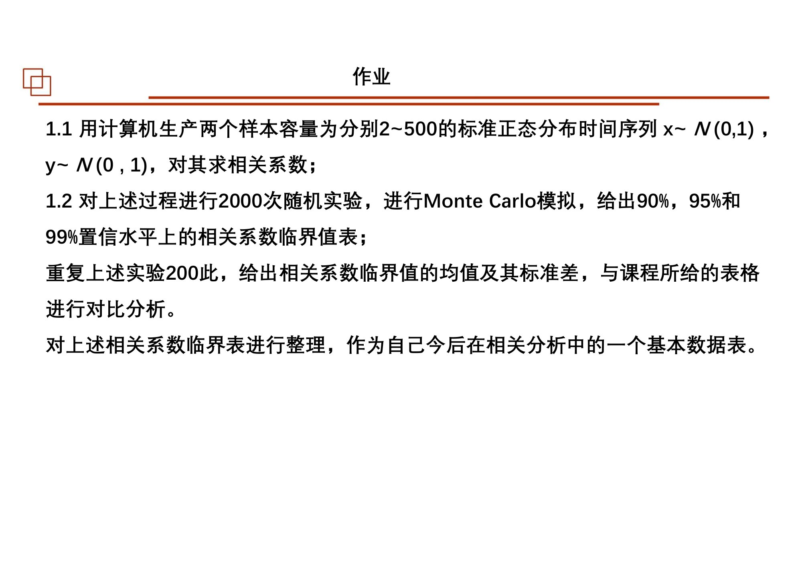
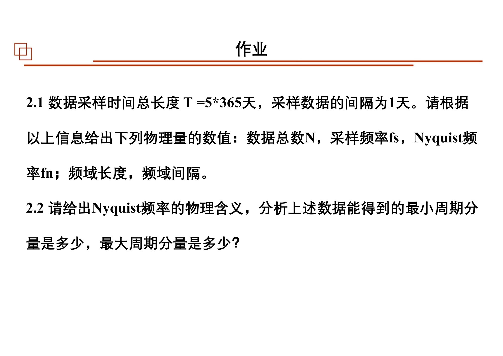
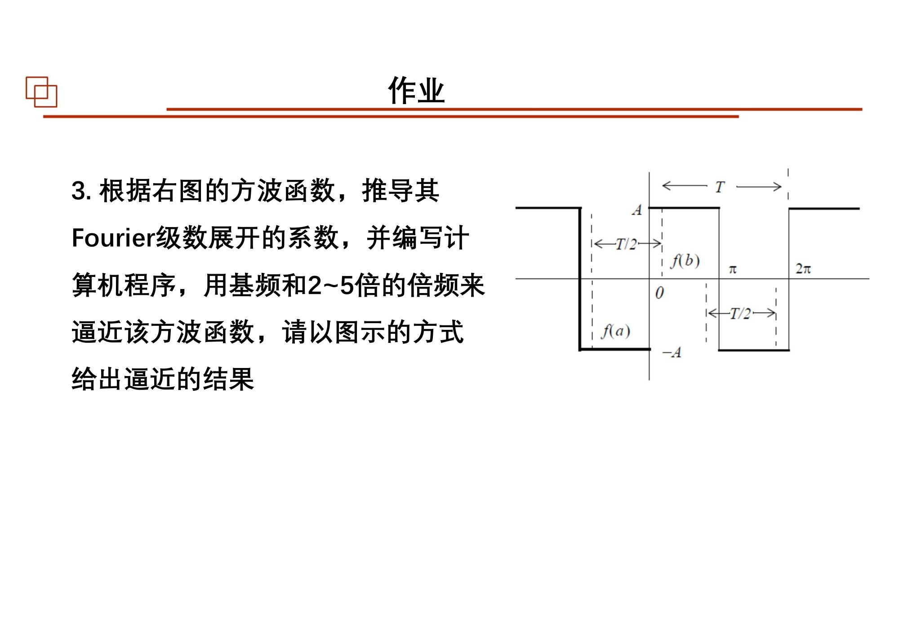
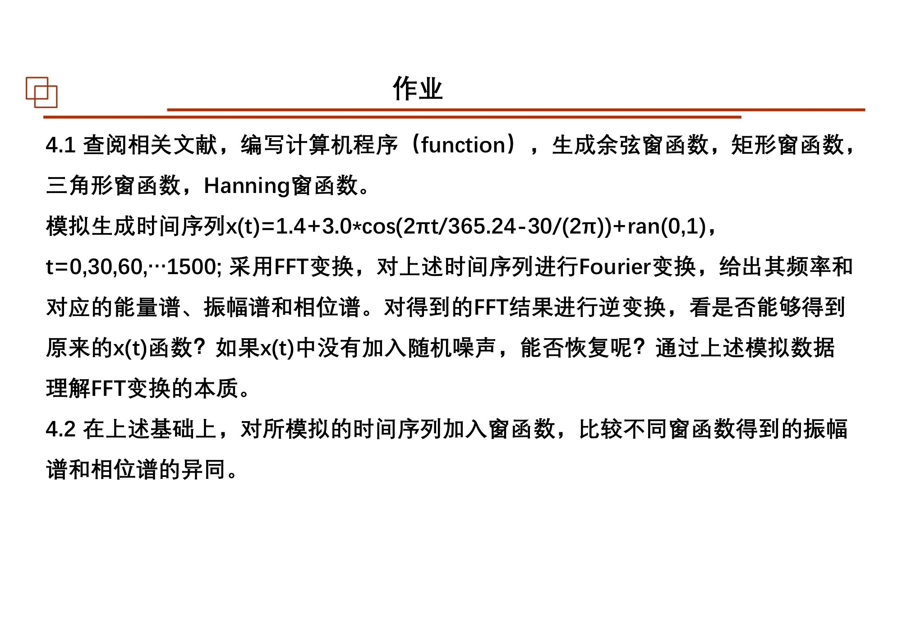

# 第06课｜相关、有效自由度与Fourier分析

<strong>本课目录：从全景到知识点、作业与原页</strong>

- [第一层：本课全景](#sec-01)
- [课时大纲：按原页定位](#sec-02)
- [第二层：知识树](#sec-03)
- [第三层：3.4.1 时域相关分析](#sec-04)
  - [Pearson相关：去掉位置与尺度后的共同变化](#sec-05)
  - [为什么必须同时看散点图](#sec-06)
  - [滞后相关与互相关](#sec-07)
  - [显著性与秩相关](#sec-08)
- [第三层：3.4.2 自由度与有效自由度](#sec-09)
  - [约束使可独立变化的信息减少](#sec-10)
  - [为什么滤波后点数不变，自由度却会下降](#sec-11)
  - [Monte Carlo流程](#sec-12)
- [第三层：3.4.3 Fourier级数](#sec-13)
  - [周期函数作为基函数的组合](#sec-14)
  - [为什么投影积分能够单独取出一个系数](#sec-15)
  - [方波逼近与Gibbs现象](#sec-16)
  - [复指数、振幅和相位](#sec-17)
- [第三层：3.4.4 Fourier变换与离散实现](#sec-18)
  - [从周期级数到连续频率](#sec-19)
  - [离散采样决定了能计算的频率网格](#sec-20)
  - [DFT与FFT：变换是什么，算法怎么快](#sec-21)
  - [振幅、相位、功率与能量](#sec-22)
  - [采样效应与窗：三类问题分开看](#sec-23)
  - [程序与案例的阅读顺序](#sec-24)
- [第四层：本课串联](#sec-25)
- [课件表述与待核对事项](#sec-26)
- [课后作业：题目、数据与提交要求](#sec-27)
  - [作业1：相关系数临界值的Monte Carlo表](#sec-28)
  - [作业2：采样与频率分辨率](#sec-29)
  - [作业3：方波的Fourier级数](#sec-30)
  - [作业4：FFT、逆变换与窗函数](#sec-31)
  - [作业原页：完整保留](#sec-32)
- [原页完整性与本课学习记录](#sec-33)

[总大纲](../00_总大纲.md) · [作业总索引](../01_作业总索引.md) · [完整原页对照](../appendices/L06_原页对照.md) · [原PDF](../sources/L06.pdf) · [上一课](./05_线性回归.md) · [下一课](./07_误差传播与随机噪声.md)

> **范围：** Chapter 3｜3学时（按课程编排）｜原PDF 132页。
> **来源：** `06 chapter3 相关分析和Fourier变换3h-20251017.pdf`。页码均为PDF物理页码。
> **前置联系：** [第02课](./02_参数估计.md)、[第05课](./05_线性回归.md)。
> **编排说明：** 原课件章/节编号保留；“第一至第四层”是本笔记的学习导航，不是新增授课章节。

## 第一层：本课全景

本课从“两个变量怎样共同变化”走到“一个序列包含哪些频率成分”。原课件依次安排**3.4.1 时域相关、3.4.2 有效自由度、3.4.3 Fourier级数、3.4.4 Fourier变换**，后续再讲离散变换、FFT、采样效应与实例。[原课件P3](../appendices/L06_原页对照.md#p003) [原课件P26](../appendices/L06_原页对照.md#p026) [原课件P48](../appendices/L06_原页对照.md#p048) [原课件P83](../appendices/L06_原页对照.md#p083)

阅读时分清三条索引：观测的时间索引$t$；两个序列比较时的滞后$\tau$；频率域的频率$f$。它们不能因为都画在横轴上就互换。

## 课时大纲：按原页定位

| 本课部分 | 原页范围 |
|---|---|
| 课程说明 | [原课件P1–2](../appendices/L06_原页对照.md#p001) |
| 3.4.1 时域相关分析 | [原课件P3–25](../appendices/L06_原页对照.md#p003) |
| 3.4.2 自由度与Monte Carlo | [原课件P26–47](../appendices/L06_原页对照.md#p026) |
| 3.4.3 Fourier级数与复数表示 | [原课件P48–82](../appendices/L06_原页对照.md#p048) |
| 3.4.4 Fourier变换、DFT/FFT与程序 | [原课件P83–110](../appendices/L06_原页对照.md#p083) |
| 3.4.4 采样、谱泄漏、窗与频率尺度 | [原课件P111–127](../appendices/L06_原页对照.md#p111) |
| 课后作业 | [原课件P128–131](../appendices/L06_原页对照.md#p128) |
| 结束页 | [原课件P132](../appendices/L06_原页对照.md#p132) |

## 第二层：知识树

- 3.4.1 时域相关分析
  - Pearson相关：协方差、标准化、中心化向量夹角
  - 点积、投影、相关与相似度
  - Anscombe四重奏、离群点与非线性关系
  - 滞后相关、互相关、自相关、时滞正负约定
  - 相关显著性$t$统计量
  - Kendall秩相关、协调/不协调对；Spearman预告
  - 相关不等于因果
- 3.4.2 有效自由度
  - 约束与独立信息数；$n-1$、$n-2$
  - 滤波、加窗、相关观测与EDOF
  - Monte Carlo模拟相关临界值、滤波后自由度
- 3.4.3 Fourier级数
  - 周期、基频、谐波、三角正交基
  - 系数积分、奇偶性、方波逼近、Gibbs现象
  - 欧拉公式、复指数系数、正负频率与双侧谱
  - 周期趋长与连续频域；脉冲函数
- 3.4.4 Fourier变换与离散计算
  - 正/逆变换；幅值、相位、能量
  - 采样间隔、频率、总时长、Nyquist、频率网格
  - 矩形、三角、余弦、Hanning/Hamming等窗
  - DFT与FFT；计算复杂度
  - 混叠、泄漏、栅栏效应、补零
  - 正反变换、Matlab/FFT程序与周期分析实例

## 第三层：3.4.1 时域相关分析

### Pearson相关：去掉位置与尺度后的共同变化

课件定义：

$$
r_{xy}=\frac{\sum_i(x_i-\bar x)(y_i-\bar y)}
{\sqrt{\sum_i(x_i-\bar x)^2\sum_i(y_i-\bar y)^2}}
=\frac{\operatorname{Cov}(x,y)}{s_xs_y}.
$$

分子体现两者是否共同偏大或偏小，分母消除尺度。令$\mathbf u=\mathbf x-\bar x\mathbf1$、$\mathbf v=\mathbf y-\bar y\mathbf1$，便有$r=\mathbf u^{\mathsf T}\mathbf v/(\|u\|\|v\|)$，即中心化向量的夹角余弦。**不能漏掉中心化就把任何余弦相似度都称为Pearson相关。**[原课件P4–8](../appendices/L06_原页对照.md#p004)

投影又是另一对象：$\operatorname{proj}_{v}u=(u^{\mathsf T}v/\|v\|^2)v$，既有长度又有方向；相关系数则只是一个无量纲标量。课件把两者放在一起，是为说明它们共同使用点积，而不是说二者输出相同。

### 为什么必须同时看散点图

课件的Anscombe四重奏展示关系形态不同却具有近似相同摘要统计量的数据。它继续比较弯曲关系、极端点主导的相关、Pearson与秩相关。这说明$r\approx0$只排除明显线性关联，不能据此认定没有任何关系；$r$较大也不能单凭统计数值建立因果。[原课件P9–10](../appendices/L06_原页对照.md#p009) [原课件P24–25](../appendices/L06_原页对照.md#p024)

*Anscombe四重奏：相关系数或回归摘要不能替代原始图形检查。 · [原PDF第10页](../sources/L06.pdf#page=10)*

### 滞后相关与互相关

比较$x(t)$与$y(t+\tau)$，会得到随$\tau$变化的一条相关曲线。峰值所在滞后表示按当前约定的最佳对齐，而不是自动证明“先变化者导致后变化者”。课件提醒交换两个输入将改变滞后正负；其数学页与代码注释对“谁超前谁”的说法需依所用函数核对。[原课件P11](../appendices/L06_原页对照.md#p011) [原课件P14–16](../appendices/L06_原页对照.md#p014)

课件Matlab例先去均值，再用`xcorr(...,'coeff')`获得归一化互相关与峰值。复现时应记录采样间隔：输出滞后若以样本数计，还需乘间隔才是时间。长度不同补零的实现，也不能直接理解为新增了真实观测。

### 显著性与秩相关

本课给Pearson相关的$t$统计量：

$$
t_r=r\sqrt{\frac{n-2}{1-r^2}}.
$$

它的参考分布需要相应模型条件；时间序列有自相关时，直接把总点数$n$当独立信息量可能不适合，下一节EDOF就是回应这个问题。[原课件P12–13](../appendices/L06_原页对照.md#p012)

Kendall例把成对观测按$x$排序，再计$y$的协调对$P$、不协调对$M$。课件无并列秩的简化式：

$$
\tau=\frac{P-M}{n(n-1)/2}.
$$

它依赖次序而非数值间距，能描述单调关系。并列秩等更一般情形在本段没有完整展开，不把这个简式当作全部版本。Spearman在课件中与秩相关一起提到，但没有给予同样篇幅的推导。[原课件P17–23](../appendices/L06_原页对照.md#p017)

## 第三层：3.4.2 自由度与有效自由度

### 约束使可独立变化的信息减少

课件用三个数平均为10的例子说明：知道前两个数和均值后，第三个数便被确定。样本方差减去用样本估计的均值，因此有$n-1$；一元含截距回归估计两个参数，因此残差常有$n-2$。应数清所施加的独立约束，而不是任何问题一律“减1”。[原课件P29–35](../appendices/L06_原页对照.md#p029)

### 为什么滤波后点数不变，自由度却会下降

移动平均会让邻近输出共享许多原始数据，输出虽仍有很多点，独立信息却减少。课件据此讨论相关显著性门槛、滤波和加窗后的有效自由度。EDOF是与处理过程和统计目标相关的量，并不总能直接等于数组长度减几个参数。[原课件P36–47](../appendices/L06_原页对照.md#p036)

### Monte Carlo流程

课件先产生互相独立的标准正态序列，在零相关的模拟背景下重复计算$r$，从经验分布构造临界值；再对模拟序列施加同样滤波，重复计算，比较滤波后的相关分布。这样检验条件包含了实际采用的处理过程。[原课件P39–45](../appendices/L06_原页对照.md#p039)

复习这部分要区别：**序列长度$n$、模拟次数、显著/置信水平、对临界值再次重复估计的次数**。课件课堂示例和课后作业使用不同重复次数，应按各自题目保存。双侧检验使用有符号$r$的两尾或$|r|$分位值，需明确约定，不能直接把一个分位号同时称作两种检验。

## 第三层：3.4.3 Fourier级数

### 周期函数作为基函数的组合

周期为$T$，基频$f_0=1/T$、角频率$\omega_0=2\pi/T$。采用本段常用的$a_0/2$记号：

$$
f(t)=\frac{a_0}{2}+\sum_{k=1}^{\infty}
[a_k\cos(k\omega_0t)+b_k\sin(k\omega_0t)].
$$

第$k$项是基频的$k$倍谐波。原始曲线和系数组是同一个对象的不同表示，而“只保留少数项”才是近似、压缩或滤波选择。[原课件P48–59](../appendices/L06_原页对照.md#p048)

### 为什么投影积分能够单独取出一个系数

同周期不同谐波的正弦、余弦在完整周期内正交。将展开式乘以目标基函数后积分，其他正交项消失，得到：

$$
a_k=\frac2T\int_{t_0}^{t_0+T}f(t)\cos(k\omega_0t)dt,
\quad b_k=\frac2T\int_{t_0}^{t_0+T}f(t)\sin(k\omega_0t)dt.
$$

常数项同样由积分平均得到。课件以奇函数、偶函数和对称性减少要算的系数，再用方波逼近展示逐项叠加。这里的积分是函数空间中的投影，对应第01课“基与内积”。[原课件P53–66](../appendices/L06_原页对照.md#p053)

### 方波逼近与Gibbs现象

保留有限谐波后，平滑区域的近似逐渐改善，但跳变处附近有振荡与超调。这不是简单的计算机舍入错误，而与用有限个连续基函数逼近跳跃有关。课件方波练习要求看不同保留谐波时的整体与局部效果。[原课件P59–67](../appendices/L06_原页对照.md#p059)

### 复指数、振幅和相位

利用欧拉公式，三角级数改写为：

$$
f(t)=\sum_{k=-\infty}^{\infty}c_ke^{ik\omega_0t}.
$$

实信号的正负频率系数之间有共轭关系；负频率是这一表示的一部分，不能因为时间向前走就删除其数学意义。三角系数的两维信息，也可改写为一个振幅和一个相位，使用哪一个正负号取决于采用$\cos(\omega t-\varphi)$还是其他约定。[原课件P68–82](../appendices/L06_原页对照.md#p068)

## 第三层：3.4.4 Fourier变换与离散实现

### 从周期级数到连续频率

本课将周期扩展的频率线谱过渡到Fourier变换。采用频率$f$而非角频率时，一组自洽写法为：

$$
X(f)=\int_{-\infty}^{\infty}x(t)e^{-i2\pi ft}dt,
\qquad x(t)=\int_{-\infty}^{\infty}X(f)e^{i2\pi ft}df.
$$

课件不同段落也使用角频率和不同归一化因子；正文这组只用于阅读连接，实际抄写作业公式时要把正逆变换约定成套保留。[原课件P79–88](../appendices/L06_原页对照.md#p079)

### 离散采样决定了能计算的频率网格

对于等间隔$\Delta t$、$N$个样本：

$$
f_s=1/\Delta t,\qquad f_N=f_s/2,\qquad
\Delta f=\frac{f_s}{N},\qquad f_k=\frac{k f_s}{N}.
$$

课件围绕总时长、采样间隔、Nyquist、频域间距展开。需要区分“首尾采样时刻的差$(N-1)\Delta t$”和“DFT周期长度$N\Delta t$”；课件有的地方用$N-1$，有的地方用$N$，笔记在待核对处保留这一差别，不默认为相同。[原课件P89–108](../appendices/L06_原页对照.md#p089) [原课件P119–121](../appendices/L06_原页对照.md#p119)

### DFT与FFT：变换是什么，算法怎么快

一组常用DFT约定为：

$$
X_k=\sum_{n=0}^{N-1}x_ne^{-i2\pi kn/N},\qquad
x_n=\frac1N\sum_{k=0}^{N-1}X_ke^{i2\pi kn/N}.
$$

DFT定义变换，FFT是快速计算该离散变换的算法。课件比较直接计算与快速算法的计算量，不应理解为FFT得到另一种物理频谱。对同一个离散序列，正逆变换应使用一致长度、因子和符号。[原课件P109–121](../appendices/L06_原页对照.md#p109)

### 振幅、相位、功率与能量

复数系数同时包含实部和虚部。其模与相位分别提供强度和相位信息，但“系数模”“振幅谱”“模平方”“功率谱密度”还可能相差$N$、采样频率、窗归一化及单/双侧系数。课件也用正弦信号方差与振幅平方的关系帮助辨认不同谱量。[原课件P93–108](../appendices/L06_原页对照.md#p093)

学习时对每张谱图写四项：横轴单位、纵轴单位、归一化、单侧还是双侧。第07课将继续专门讨论PSD和周期图，不把这几个名词全部统称“能量”。

### 采样效应与窗：三类问题分开看

**混叠**与采样频率有关，不同连续频率可能产生相同离散观测；**谱泄漏**与有限长度/截断后的谱扩散有关；**栅栏效应**与只在离散频率格点读取谱有关。三者不同，不能都用“补零”解决。[原课件P109–121](../appendices/L06_原页对照.md#p109)

课件展示矩形、余弦、三角、Hanning等窗，比较主瓣和旁瓣。加窗使时间边缘更平缓，但改变了参与变换的序列，也会影响振幅标定和频率分辨表现。补零增加频率采样点，不能凭空延长真实观测信息。[原课件P89–101](../appendices/L06_原页对照.md#p089)

### 程序与案例的阅读顺序

课件第122—127页包括周期分量与FFT程序示例。先辨认生成信号的常数项、周期项和噪声，再看采样网格，最后看计算频谱及逆变换；不要从一长段程序中间猜$x$是观测值还是频率索引。具体外部脚本与数据见全套“数据依赖表”，未随本次PPT上传的文件不视为已取得。[原课件P122–127](../appendices/L06_原页对照.md#p122)

## 第四层：本课串联

相关是向量共同变化的概括，滞后相关增加对齐维度；其显著性取决于独立信息量，因此出现有效自由度；Fourier把时间变化分解到正交频率基；离散采样与算法约定决定实际谱的网格和尺度。下一课用卷积和相干谱把时域与频域进一步接起来。

**自测（非教师作业）**：相关系数高能否不看散点图？滤波后数组长度相同为何仍影响检验？Fourier级数和FFT各属于哪一层？补零是否等于增加一年的观测？

## 课件表述与待核对事项

- 第13、22页对$p$值的文字解释需谨慎：“未拒绝”不能直接当作已证明相关恰为零；Kendall检验也不是专门检验一条直线。
- 第11页与第15页代码的时滞正负说明需结合调用顺序统一。
- 第40、44页Monte Carlo临界值的分位位置与双/单侧检验须明确，不混用$\alpha$的含义。
- 第92页时间域相乘对应何种频域运算的表述，应与第07课卷积定理合读。
- 第102页附近与第120页附近频率网格的$N$、$N-1$用法存在差别，需核查采样端点约定。
- 第131页作业相位写为$30/(2\pi)$，并非直接写$30^\circ$；原题保留此式，不擅自改成角度转弧度公式。

## 课后作业：题目、数据与提交要求

### 作业1：相关系数临界值的Monte Carlo表

来源：[原课件P128](../appendices/L06_原页对照.md#p128)。

1. 对容量从2到500的两个标准正态时间序列$x,y$求相关系数。
2. 对上述过程进行2000次随机实验，给出90%、95%、99%置信水平上的相关系数临界值表。
3. 将上述实验重复200次，计算临界值的均值与标准差，与课堂表格比较。
4. 整理为以后相关分析可使用的基本数据表。

**原题需明确的约定：**显著性是单侧还是双侧、临界值依据$r$还是$|r|$需要记录；$n=2$是退化边界，不能直接套含$n-2$自由度的普通$t$检验。题目本身没有要求给模拟序列滤波。

### 作业2：采样与频率分辨率

来源：[原课件P129](../appendices/L06_原页对照.md#p129)。数据时间总长度$T=5\times365$天，间隔1天。

1. 给出数据总数$N$、采样频率$f_s$、Nyquist频率$f_n$、频域长度、频域间隔。
2. 解释Nyquist频率的物理意义，给出可得到的最短与最长周期分量。

题目没有写端点是否同时纳入，$N$的计数应明确采样约定；零频的常数项也不能当作有限周期。

### 作业3：方波的Fourier级数

来源：[原课件P130](../appendices/L06_原页对照.md#p130)。按原页右图的正负幅度$A$、周期$T$方波，推导Fourier系数；编程用基频及2—5倍频逐步逼近，绘图展示。**波形定义以原图为准，不能改为只有0和1的另一种方波。**

### 作业4：FFT、逆变换与窗函数

来源：[原课件P131](../appendices/L06_原页对照.md#p131)。

1. 查阅相关文献，编写余弦窗、矩形窗、三角窗、Hanning窗的函数。
2. 按原题生成

$$
x(t)=1.4+3.0\cos\left(\frac{2\pi t}{365.24}-\frac{30}{2\pi}\right)+\operatorname{ran}(0,1),
\quad t=0,30,60,\ldots,1500.
$$

3. 做FFT，给出频率、能量谱、振幅谱和相位谱；逆变换检查是否恢复原序列。无随机噪声时再比较，讨论FFT本质。
4. 加上不同窗函数，对比振幅谱和相位谱。

**保留原题歧义：**相位写作$30/(2\pi)$，不是通常将$30^\circ$转换为弧度的写法；不要默默改成$\pi/6$。`ran(0,1)`的具体随机分布约定也需记录。

### 作业原页：完整保留

展开第128页作业原图

*第06课第128页作业原页 · [原PDF第128页](../sources/L06.pdf#page=128)*

展开第129页作业原图

*第06课第129页作业原页 · [原PDF第129页](../sources/L06.pdf#page=129)*

展开第130页作业原图

*第06课第130页作业原页 · [原PDF第130页](../sources/L06.pdf#page=130)*

展开第131页作业原图

*第06课第131页作业原页 · [原PDF第131页](../sources/L06.pdf#page=131)*

## 原页完整性与本课学习记录

本课全部132页（含图示、代码、参考文献、空白与结束页）均保留在[原页对照](../appendices/L06_原页对照.md)和[原始PDF](../sources/L06.pdf)中。笔记正文梳理知识及核心推导，不等同于逐字转录所有PPT文字。对照页用于查看更细的图表、完整代码和源内不同表述。

- [ ] 看过全景和课时大纲，能定位本课结构。
- [ ] 顺着知识树读完正文，并标出未理解的小节。
- [ ] 自己重写关键公式，分清符号、维度与假设。
- [ ] 做过课件作业或记录缺少的数据/需要问老师的条件。
- [ ] 不看笔记，用自己的话串起本课知识。
