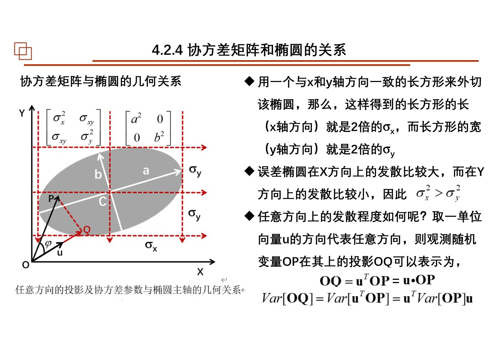
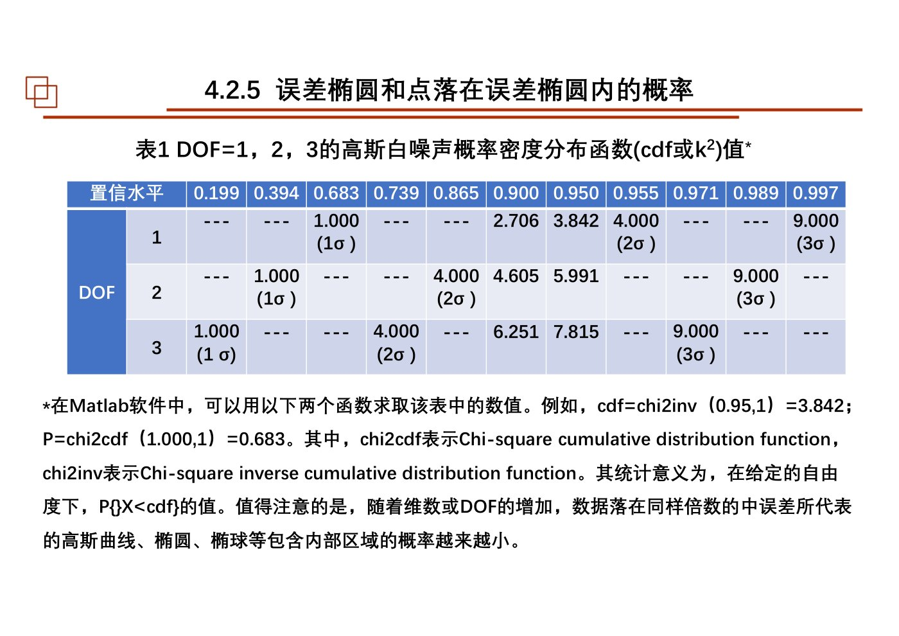
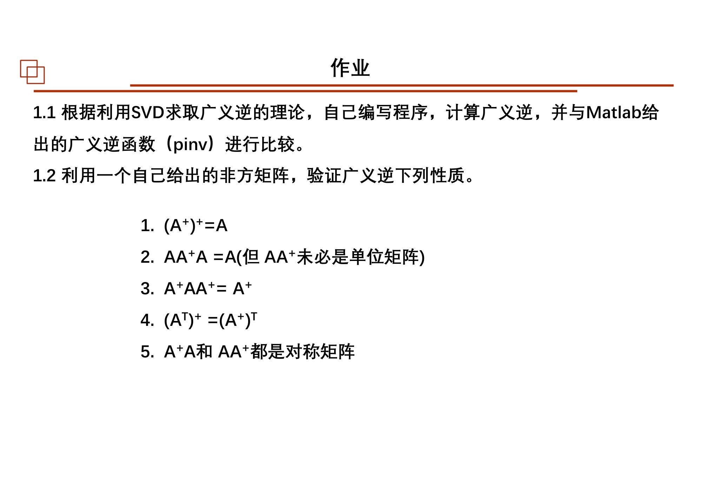
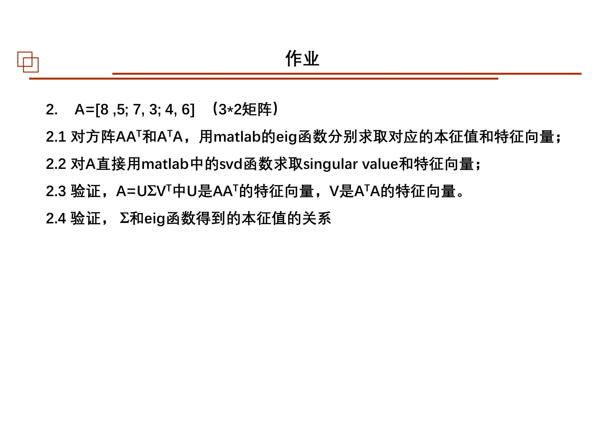
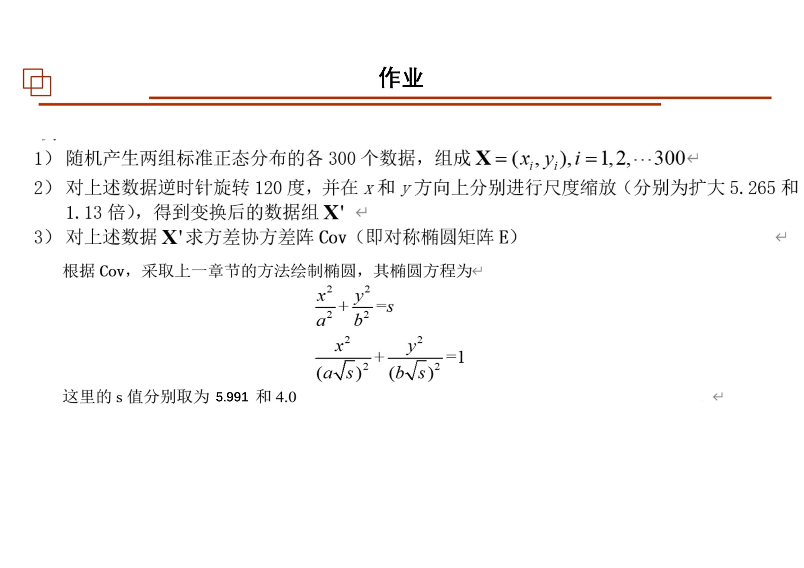

# 第08课｜协方差与误差椭圆：把不确定性画出来

<strong>本课目录：从全景到知识点、作业与原页</strong>

- [第一层：本课全景](#sec-01)
- [课时大纲：按原页定位](#sec-02)
- [第二层：知识树](#sec-03)
- [第三层：4.2.0 数学入口](#sec-04)
  - [特征方向、对角化与系统解耦](#sec-05)
  - [SVD与广义逆](#sec-06)
- [第三层：4.2.2 椭圆的几种表达](#sec-07)
  - [从轴对齐形式到矩阵二次型](#sec-08)
  - [参数式更适合绘图](#sec-09)
- [第三层：4.2.3 多元正态与协方差](#sec-10)
  - [一维标准化的多维版本](#sec-11)
  - [等密度轮廓为什么是椭圆](#sec-12)
- [第三层：4.2.4 从协方差求主轴](#sec-13)
  - [旋转缩放的分解](#sec-14)
  - [方向方差的极值：同一个结果的另一种证明](#sec-15)
  - [原坐标标准差与主轴长度不是同一对数](#sec-16)
- [第三层：4.2.5 覆盖概率与椭圆尺度](#sec-17)
  - [平方距离、$\chi^2$与二维覆盖率](#sec-18)
  - [画指定概率椭圆的步骤](#sec-19)
- [第三层：4.2.6 模拟、传播与异常识别](#sec-20)
- [第三层：4.2.7 椭圆绘制与拟合的两类问题](#sec-21)
  - [点云内部的二阶形状](#sec-22)
  - [边界点的代数拟合](#sec-23)
  - [边界覆盖越少，拟合可能越不确定](#sec-24)
- [第四层：本课串联](#sec-25)
- [课件表述与待核对事项](#sec-26)
- [课后作业：题目、数据与提交要求](#sec-27)
  - [作业1：SVD广义逆与性质](#sec-28)
  - [作业2：特征分解与SVD之间的联系](#sec-29)
  - [第114页综合题：旋转、缩放、协方差与误差椭圆](#sec-30)
  - [作业原页：完整保留](#sec-31)
- [原页完整性与本课学习记录](#sec-32)

[总大纲](../00_总大纲.md) · [作业总索引](../01_作业总索引.md) · [完整原页对照](../appendices/L08_原页对照.md) · [原PDF](../sources/L08.pdf) · [上一课](./07_误差传播与随机噪声.md) · [下一课](./09_Markov与正则化.md)

> **范围：** Chapter 4（课件内部编号4.2）｜3学时（按课程编排）｜原PDF 115页。
> **来源：** `08 chapter4 02误差椭圆3h-20251024.pdf`。页码均为PDF物理页码。
> **前置联系：** [第01课](./01_概述与线性变换.md)、[第03课](./03_统计特征与最优化.md)、[第07课](./07_误差传播与随机噪声.md)。
> **编排说明：** 原课件章/节编号保留；“第一至第四层”是本笔记的学习导航，不是新增授课章节。

## 第一层：本课全景

本课把“协方差矩阵”转换成“方向、半轴与覆盖概率”。原PPT使用**4.2误差椭圆和协方差**编号，与上一份课件4.2误差传播存在重号；本套以“第08课”定位，不擅自重编老师的章节号。[原课件P3–4](../appendices/L08_原页对照.md#p003) [原课件P23–26](../appendices/L08_原页对照.md#p023)

两条学习线应最后合流：数学线是矩阵、特征分解、SVD、广义逆；统计几何线是二维正态、协方差、椭圆主轴与概率。另有一条实用分支：**点云的协方差椭圆**和**给定边界点的椭圆拟合**，不能混成同一种数据问题。

## 课时大纲：按原页定位

| 本课部分 | 原页范围 |
|---|---|
| 课程说明 | [原课件P1–2](../appendices/L08_原页对照.md#p001) |
| 4.2.0 矩阵、特征分解、SVD与广义逆 | [原课件P3–22](../appendices/L08_原页对照.md#p003) |
| 4.2.1 引言 | [原课件P23–26](../appendices/L08_原页对照.md#p023) |
| 4.2.2 椭圆方程与参数 | [原课件P27–41](../appendices/L08_原页对照.md#p027) |
| 4.2.3 协方差与多元正态 | [原课件P42–53](../appendices/L08_原页对照.md#p042) |
| 4.2.4 协方差与主轴关系 | [原课件P54–72](../appendices/L08_原页对照.md#p054) |
| 4.2.5 椭圆内概率与置信尺度 | [原课件P73–81](../appendices/L08_原页对照.md#p073) |
| 4.2.6 数据、变换与误差椭圆 | [原课件P82–88](../appendices/L08_原页对照.md#p082) |
| 4.2.7 椭圆画法、矩方法与边界拟合 | [原课件P89–111](../appendices/L08_原页对照.md#p089) |
| 课后作业 | [原课件P112–114](../appendices/L08_原页对照.md#p112) |
| 结束页 | [原课件P115](../appendices/L08_原页对照.md#p115) |

## 第二层：知识树

- 4.2.0 数学补充
  - 矩阵与基的变换；特征向量、对角化、系统解耦
  - SVD、$AA^{\mathsf T}$与$A^{\mathsf T}A$
  - Moore–Penrose广义逆与性质
- 4.2.1 引言：点位误差、误差分布与椭圆
- 4.2.2 椭圆方程
  - 标准式、二次型、旋转平移、一般代数式
  - 对称椭圆矩阵、五个几何自由度
  - 参数方程与代数系数转换
- 4.2.3 协方差和多元正态
  - 方差、协方差与相关
  - 标准正态的缩放、旋转、平移
  - 多元正态密度与等值椭圆
- 4.2.4 主轴与协方差的三种联系
  - 旋转缩放
  - 方向方差与极值
  - 特征值、特征向量与SVD
- 4.2.5 椭圆覆盖概率
  - 标准椭圆、尺度$k$、平方半径与$\chi^2$
  - 二维1σ与95%椭圆；推广到椭球
- 4.2.6 数据生成与线性传播
  - 指定协方差模拟、置信轮廓与异常筛查
- 4.2.7 画椭圆与拟合椭圆
  - 单位圆映射、点云二阶矩
  - 边界点约束LS、广义特征值、数值稳定改进
  - 全边界与局部边界；椭圆、回归、相关、PCA的区别

## 第三层：4.2.0 数学入口

### 特征方向、对角化与系统解耦

矩阵会改变多数向量的方向，而特征向量满足$Av=\lambda v$。课件用两个量耦合的微分方程说明：若存在足够的线性无关特征向量，换到其构成的基后，系统矩阵可变为对角形式，计算因而简化。**可对角化的条件不能省略。**[原课件P5–16](../appendices/L08_原页对照.md#p005)

### SVD与广义逆

对$m\times n$实矩阵：

$$
A=U\Sigma V^{\mathsf T},\qquad
A^+=V\Sigma^+U^{\mathsf T}.
$$

$\Sigma^+$把非零奇异值取倒数并交换矩形尺寸，零奇异值对应位置仍为零。它不是对矩阵每个元素逐个求倒数。课件列出的性质包括：

$$
AA^+A=A,\quad A^+AA^+=A^+,\quad
(AA^+)^{\mathsf T}=AA^+,\quad(A^+A)^{\mathsf T}=A^+A.
$$

$AA^+$不必等于单位矩阵，这正对应作业要求核验的内容。第10课将系统证明SVD存在性与构造。[原课件P17–22](../appendices/L08_原页对照.md#p017)

## 第三层：4.2.2 椭圆的几种表达

### 从轴对齐形式到矩阵二次型

$$
\frac{x^2}{a^2}+\frac{y^2}{b^2}=1
\quad\Longleftrightarrow\quad
\mathbf x^{\mathsf T}
\begin{bmatrix}a^2&0\\0&b^2\end{bmatrix}^{-1}\mathbf x=1.
$$

一般形式写为：

$$
(\mathbf x-\mathbf c)^{\mathsf T}E^{-1}(\mathbf x-\mathbf c)=1.
$$

$\mathbf c$是中心，$E$为适当的对称正定矩阵。课件称它为对称椭圆矩阵；只有在另外赋予统计含义时，才把它与某个协方差对应。一个几何椭圆本身并不自动规定覆盖概率。[原课件P27–35](../appendices/L08_原页对照.md#p027)

### 参数式更适合绘图

令$R(\theta)$为旋转矩阵，则：

$$
\mathbf x(t)=\mathbf c+
R(\theta)\begin{bmatrix}a\cos t\\b\sin t\end{bmatrix},
\qquad 0\le t<2\pi.
$$

它直接给出中心、两个半轴和方向五个几何参数。课件将其展开，与六系数二次方程比较；代数系数整体乘常数不改变曲线，因此存在尺度自由度，不能把六个代数系数误当成六个独立几何参数。[原课件P36–41](../appendices/L08_原页对照.md#p036)

## 第三层：4.2.3 多元正态与协方差

### 一维标准化的多维版本

课件先从标准正态缩放和平移，再推广到旋转：

$$
Z\sim N(0,I),\qquad X=AZ+\mu,
\qquad C_X=AA^{\mathsf T}.
$$

先后次序会改变结果。缩放改变主方向上的离散尺度，旋转改变主轴方向，平移改变中心。对标准Gaussian的球对称性，可利用距离描述等密度轮廓；对一般非Gaussian数据，协方差相同不意味着整个分布相同。[原课件P42–53](../appendices/L08_原页对照.md#p042)

### 等密度轮廓为什么是椭圆

$$
f(x)=\frac1{2\pi|C|^{1/2}}
\exp\left[-\frac12(x-\mu)^{\mathsf T}C^{-1}(x-\mu)\right].
$$

固定密度等价于固定指数中的二次型。于是二维正态的等密度曲线为同心、同方向、相似的椭圆。这里三种对象要分清：二维概率密度面；某一高度的等值曲线；该曲线内部积分得到的概率。[原课件P46–49](../appendices/L08_原页对照.md#p046)

## 第三层：4.2.4 从协方差求主轴

### 旋转缩放的分解

对称协方差矩阵可分解为：

$$
C=V\Lambda V^{\mathsf T},\qquad
\Lambda=\operatorname{diag}(\lambda_1,\lambda_2).
$$

$V$的列是主方向，$\lambda_i$是相应方向的方差；标准椭圆半轴为$\sqrt{\lambda_i}$。这是课件第65页的汇总。第63页个别文字把半轴直接说成特征值，应对照此处平方根关系。[原课件P54–56](../appendices/L08_原页对照.md#p054) [原课件P63–70](../appendices/L08_原页对照.md#p063)

### 方向方差的极值：同一个结果的另一种证明

单位方向$u(\theta)=(\cos\theta,\sin\theta)^{\mathsf T}$上的投影方差：

$$
\sigma^2(\theta)=u(\theta)^{\mathsf T}C u(\theta)
=\sigma_x^2\cos^2\theta+2\sigma_{xy}\sin\theta\cos\theta+
\sigma_y^2\sin^2\theta.
$$

对角度求极值，可得到主方向条件；课件再把最大最小方向方差与特征值表达相互验证。这个推导把上一课误差传播、本课极值与线性代数连在一起。求角度时要处理象限、相同特征值以及长短轴交换，而不只计算一个普通反正切。[原课件P57–65](../appendices/L08_原页对照.md#p057)

### 原坐标标准差与主轴长度不是同一对数

$C$的对角线给原$x,y$轴上的方差，而$\lambda_1,\lambda_2$给主轴方向上的方差。非零协方差时，两组方向通常不同。课件用与原坐标轴平行的外切矩形说明$\sigma_x,\sigma_y$的几何角色，不能把它们直接写成旋转椭圆半长半短轴。[原课件P67–72](../appendices/L08_原页对照.md#p067)

*原坐标方向的标准差与旋转后主轴尺度的几何区别。 · [原PDF第71页](../sources/L08.pdf#page=71)*

## 第三层：4.2.5 覆盖概率与椭圆尺度

### 平方距离、$\chi^2$与二维覆盖率

在本课二维Gaussian模型下：

$$
d^2=(x-\mu)^{\mathsf T}C^{-1}(x-\mu),
\qquad d^2\sim\chi^2_2.
$$

由旋转、缩放把椭圆变成标准正态平面上的圆，再用极坐标积分，课件得到：

$$
P(d^2\le k^2)=1-e^{-k^2/2}.
$$

因此二维$k=1$约覆盖39.4%，不是一维的68.3%；$k=2$约86.5%，$k=3$约98.9%。95%对应$k^2\approx5.991$，半轴要乘$k=\sqrt{5.991}$。[原课件P73–81](../appendices/L08_原页对照.md#p073)

### 画指定概率椭圆的步骤

先确定均值$\mu$与协方差$C$，然后特征分解，选覆盖水平并取得相应$\chi^2$分位值$s$，最后绘制：

$$
x(t)=\mu+V
\begin{bmatrix}\sqrt{s\lambda_1}\cos t\\\sqrt{s\lambda_2}\sin t\end{bmatrix}.
$$

这一步**将统计尺度转为几何半轴**。课件有时用$s$、有时用$k^2$，二者角色相同，但不能把$s$直接当作半轴倍率。推广到三维时参考分布自由度跟维数一起改变。[原课件P79–81](../appendices/L08_原页对照.md#p079) [原课件P87](../appendices/L08_原页对照.md#p087)

*不同维数和覆盖水平的原表：相同“几倍标准差”不具有相同多维覆盖率。 · [原PDF第81页](../sources/L08.pdf#page=81)*

## 第三层：4.2.6 模拟、传播与异常识别

指定目标$C=V\Lambda V^{\mathsf T}$后，用标准Gaussian数据构造：

$$
X=V\Lambda^{1/2}Z+\mu.
$$

它说明如何模拟具有给定二阶结构的Gaussian点云。有限样本的样本协方差不会必然精确等于目标$C$，两者差异本身也是抽样波动。课件表2和相应图对比多种旋转缩放情况。[原课件P82–86](../appendices/L08_原页对照.md#p082)

课件还把等概率椭圆用于初步分布诊断与二维异常筛查。筛查时应明白采用的是一个模型轮廓，而不是“所有轮廓外观测都是错误”；模型本身不合适时，删点无法自动解决问题。[原课件P87–88](../appendices/L08_原页对照.md#p087)

## 第三层：4.2.7 椭圆绘制与拟合的两类问题

### 点云内部的二阶形状

课件先用质心和二阶矩寻找能反映点云形状的椭圆。这里输入是分布在内部的观测，目标是二阶形态；给定概率又需要对应分布假设。第92—95页的因子4与95%所用5.991并列，需区分其不同构造背景，不能把一个二阶形状比例常数天然当作置信水平。[原课件P89–95](../appendices/L08_原页对照.md#p089)

### 边界点的代数拟合

若已知点靠近椭圆边界，课件组织设计矩阵每行为$[x^2,xy,y^2,x,y,1]$，用参数向量表示二次曲线，再施加确保椭圆型的约束，转为广义特征值问题。这是有约束拟合，不同于只计算样本协方差。[原课件P96–99](../appendices/L08_原页对照.md#p096)

课件紧接着指出直接求逆版本数值不稳定，并介绍把设计矩阵拆为二次项和一次项块的改进算法。第104页保留Matlab实现，可按“构建矩阵—消元—求特征向量—恢复系数”的顺序读；原代码所称测试环境不等于本套重新执行过。[原课件P100–104](../appendices/L08_原页对照.md#p100)

### 边界覆盖越少，拟合可能越不确定

课件模拟中心$(250,150)$、半轴300与200、旋转$-65^\circ$的椭圆，并加Gaussian噪声，比较近全边界、约50%与约16%边界点。部分弧段仍可能被很多不同椭圆解释，因此小局部残差不保证全形状正确。[原课件P105–107](../appendices/L08_原页对照.md#p105)

最后的图把二维正态、两条回归线、相关系数和PCA主轴叠在一起。它们共享一个二阶结构，但**条件均值方向与最大方差方向不是同一条线**。这是理解第05课回归与第10课PCA之间区别的重要结尾。[原课件P108–110](../appendices/L08_原页对照.md#p108)

## 第四层：本课串联

协方差在原坐标下记录二阶波动；特征分解找到主方向；特征值平方根提供标准半轴；$\chi^2$分位值提供覆盖尺度；参数式把这些信息变成图；边界拟合则另有自己的目标和约束。

**自测（非教师作业）**：为什么标准二维椭圆不是68.3%？对角元素与特征值各表示哪个方向的方差？$5.991$应该乘在方差尺度还是直接乘在半轴？只给一小段椭圆边界能否保证恢复原椭圆？

## 课件表述与待核对事项

- 第17页把unitary写成“单位矩阵”并固定行列式为1，需与后文及第10课的正交矩阵定义核对。
- 第31页只用行列式正判断正定的简略文字，不能脱离对称性及其他条件。
- 第63页“特征值就是半轴”与第65页“特征值平方根是半轴”不一致，正文依第65页汇总。
- 第79页“除以$k$”的文字与该页椭圆方程的尺度关系不一致，应对照完整原式。
- 第83页“任意数据集可由Gaussian线性变换得到”的范围过宽；正文只保留该节实际构造的Gaussian情形。
- 第92—95页惯性矩形状椭圆的因子4与Gaussian覆盖分位值的解释需区分。
- 第114页作业给“旋转120度并缩放5.265与1.13”，变换先后需写清；正文不代老师选择一个未明确的矩阵顺序。

## 课后作业：题目、数据与提交要求

### 作业1：SVD广义逆与性质

来源：[原课件P112](../appendices/L08_原页对照.md#p112)。

1. 按SVD求广义逆理论自行编程，与Matlab `pinv`比较。
2. 自选一个非方矩阵验证：

$$
(A^+)^+=A,\quad AA^+A=A,\quad A^+AA^+=A^+,
\quad(A^{\mathsf T})^+=(A^+)^{\mathsf T}.
$$

并验证$A^+A$与$AA^+$对称。原题提醒$AA^+$未必为单位矩阵。

### 作业2：特征分解与SVD之间的联系

来源：[原课件P113](../appendices/L08_原页对照.md#p113)。给定

$$
A=\begin{bmatrix}8&5\\7&3\\4&6\end{bmatrix}.
$$

1. 对$AA^{\mathsf T}$和$A^{\mathsf T}A$分别使用`eig`求特征值与特征向量。
2. 对$A$使用`svd`求奇异值及左右奇异向量。
3. 验证$A=U\Sigma V^{\mathsf T}$中$U$与$AA^{\mathsf T}$、$V$与$A^{\mathsf T}A$的特征向量关系。
4. 验证$\Sigma$与特征值之间的关系。

### 第114页综合题：旋转、缩放、协方差与误差椭圆

本题主要为图片，以下依据完整原页转录。来源：[原课件P114](../appendices/L08_原页对照.md#p114)。

1. 随机生成两组标准正态分布数据，每组300个，组成二维数据$X$。
2. 对数据逆时针旋转$120^\circ$，并在$x,y$方向分别缩放**5.265倍和1.13倍**，得到$X'$。
3. 计算$X'$的协方差矩阵Cov（原页也称实对称椭圆矩阵$E$）。
4. 根据Cov，采用上一章节的方法绘制椭圆，其主轴坐标方程为

$$
\frac{x^2}{a^2}+\frac{y^2}{b^2}=s,
\qquad
\frac{x^2}{(a\sqrt s)^2}+\frac{y^2}{(b\sqrt s)^2}=1.
$$

$s$分别取**5.991和4.0**。

**待核对：**旋转与缩放顺序影响协方差；在固定坐标轴缩放和在旋转后的主轴缩放并非相同操作。保留题目原话，执行前说明采用的顺序与轴定义，不替老师默默选一个。

### 作业原页：完整保留

展开第112页作业原图

*第08课第112页作业原页 · [原PDF第112页](../sources/L08.pdf#page=112)*

展开第113页作业原图

*第08课第113页作业原页 · [原PDF第113页](../sources/L08.pdf#page=113)*

展开第114页作业原图

*第08课第114页作业原页 · [原PDF第114页](../sources/L08.pdf#page=114)*

## 原页完整性与本课学习记录

本课全部115页（含图示、代码、参考文献、空白与结束页）均保留在[原页对照](../appendices/L08_原页对照.md)和[原始PDF](../sources/L08.pdf)中。笔记正文梳理知识及核心推导，不等同于逐字转录所有PPT文字。对照页用于查看更细的图表、完整代码和源内不同表述。

- [ ] 看过全景和课时大纲，能定位本课结构。
- [ ] 顺着知识树读完正文，并标出未理解的小节。
- [ ] 自己重写关键公式，分清符号、维度与假设。
- [ ] 做过课件作业或记录缺少的数据/需要问老师的条件。
- [ ] 不看笔记，用自己的话串起本课知识。
