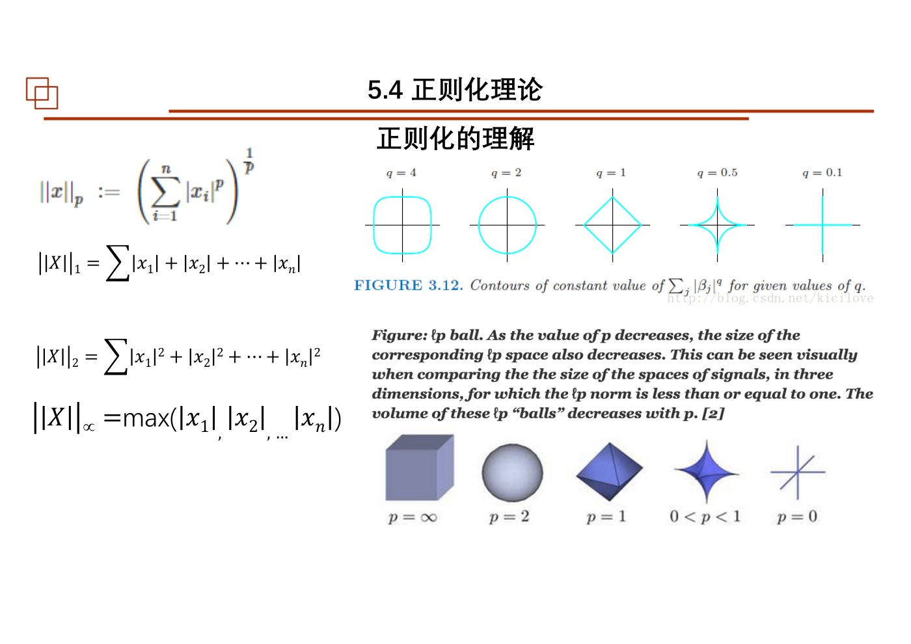
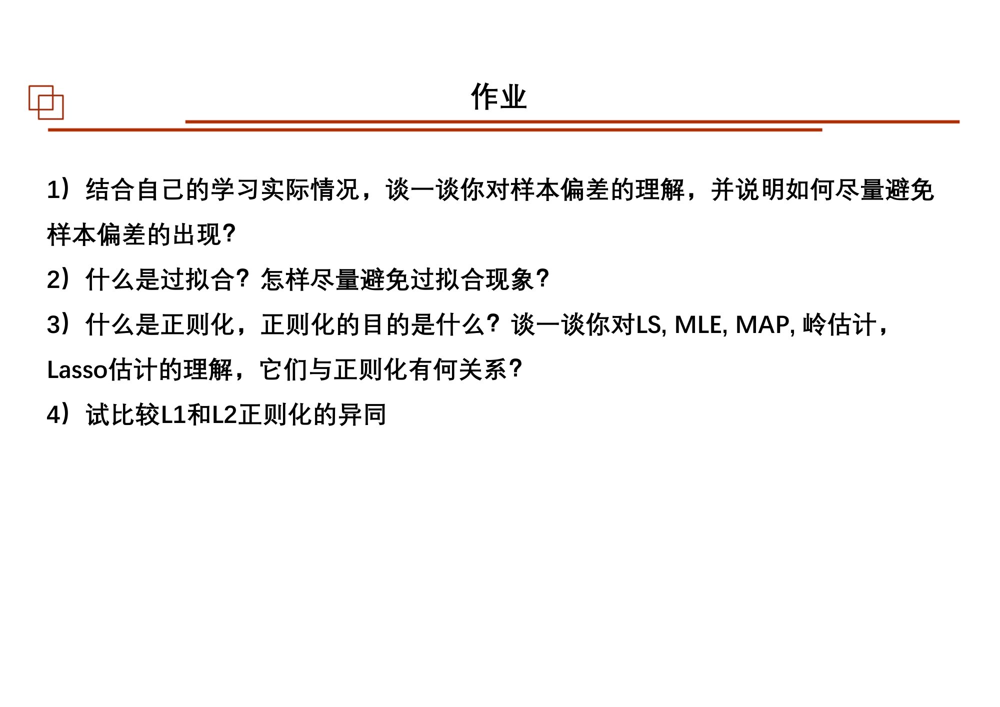

# 第09课｜Markov链、样本偏差、过拟合与正则化

<strong>本课目录：从全景到知识点、作业与原页</strong>

- [第一层：本课全景](#sec-01)
- [课时大纲：按原页定位](#sec-02)
- [第二层：知识树](#sec-03)
- [第三层：前置Markov链](#sec-04)
  - [状态、转移与迭代](#sec-05)
  - [稳定状态为什么是特征向量](#sec-06)
- [第三层：5.1 奥卡姆剃刀](#sec-07)
- [第三层：5.2 样本偏差](#sec-08)
  - [观测多，不等于覆盖全](#sec-09)
  - [数据窥探与预处理边界](#sec-10)
- [第三层：5.3 维数灾难与过拟合](#sec-11)
  - [维数增加后，有限样本为什么变稀](#sec-12)
  - [过拟合与独立评价](#sec-13)
- [第三层：5.4 正则化理论](#sec-14)
  - [从MLE到MAP：把先验写进优化](#sec-15)
  - [损失、经验风险和结构风险](#sec-16)
  - [Ridge：平方损失加平方范数](#sec-17)
  - [LASSO：平方损失加绝对值和](#sec-18)
  - [约束几何、稀疏与平滑](#sec-19)
- [第四层：本课串联](#sec-20)
- [课件表述与待核对事项](#sec-21)
- [课后作业：题目、数据与提交要求](#sec-22)
  - [作业1—4：数据选择与模型约束](#sec-23)
  - [作业原页：完整保留](#sec-24)
- [原页完整性与本课学习记录](#sec-25)

[总大纲](../00_总大纲.md) · [作业总索引](../01_作业总索引.md) · [完整原页对照](../appendices/L09_原页对照.md) · [原PDF](../sources/L09.pdf) · [上一课](./08_协方差与误差椭圆.md) · [下一课](./10_SVD与EOF.md)

> **范围：** Chapter 6的Markov入口 + Chapter 5｜3学时（按课程编排）｜原PDF 105页。
> **来源：** `09 chapter5 样本偏差正则化马尔科夫链20251029.pdf`。页码均为PDF物理页码。
> **前置联系：** [第02课](./02_参数估计.md)、[第04课](./04_最小二乘与Bayes.md)、[第05课](./05_线性回归.md)。
> **编排说明：** 原课件章/节编号保留；“第一至第四层”是本笔记的学习导航，不是新增授课章节。

## 第一层：本课全景

原文件把**Markov链放在最前面**，之后才进入Chapter 5：**5.1 奥卡姆剃刀 → 5.2 样本偏差 → 5.3 维数灾难 → 5.4 正则化**。因此本课不是只有“正则化公式”，而是先学状态随时间转移，再检查数据与模型为什么会误导我们。[原课件P2–17](../appendices/L09_原页对照.md#p002)

本课向前连接第02、04课的MLE与Bayes，向后连接第10课的特征分解和第13课的模型训练。需要始终区分：**数据选择出了问题、模型复杂度出了问题、参数估计出了问题**，三者的处理方法不同。

## 课时大纲：按原页定位

| 本课部分 | 原页范围 |
|---|---|
| Markov链与稳态、网页排序 | [原课件P1–15](../appendices/L09_原页对照.md#p001) |
| 课程总纲与本章导入 | [原课件P16–17](../appendices/L09_原页对照.md#p016) |
| 5.1 奥卡姆剃刀 | [原课件P18–23](../appendices/L09_原页对照.md#p018) |
| 5.2 样本偏差 | [原课件P24–41](../appendices/L09_原页对照.md#p024) |
| 5.3 维数灾难、过拟合与验证 | [原课件P42–65](../appendices/L09_原页对照.md#p042) |
| 5.4 LS、MLE、MAP与Ridge | [原课件P66–78](../appendices/L09_原页对照.md#p066) |
| 5.4 损失、经验风险与结构风险 | [原课件P79–90](../appendices/L09_原页对照.md#p079) |
| 5.4 L1/L2几何与正则化对比 | [原课件P91–103](../appendices/L09_原页对照.md#p091) |
| 课后作业 | [原课件P104](../appendices/L09_原页对照.md#p104) |
| 结束页 | [原课件P105](../appendices/L09_原页对照.md#p105) |

## 第二层：知识树

- 前置：Markov链
  - 状态概率、转移矩阵、列/行约定
  - 多步转移、矩阵幂
  - 稳定分布、特征值1、收敛条件
  - 人口迁移与网页排名案例
- Chapter 5
  - 5.1 奥卡姆剃刀：简单性、模型选择、解释与预测
  - 5.2 样本偏差
    - 选择偏差、幸存者偏差、采样代表性
    - 数据窥探、训练测试污染、预处理范围
  - 5.3 维数灾难
    - 空间稀疏、样本需求、几何直觉
    - 过拟合、训练/验证/测试、变量选择
    - 交叉验证、留一验证
  - 5.4 正则化
    - MLE与LS回顾；MAP与先验
    - 损失、期望风险、经验风险、结构风险
    - Gaussian先验与Ridge；Laplace先验与LASSO
    - $L_0,L_1,L_2,L_\infty$、范数约束几何
    - 惩罚强度、稀疏、平滑、特征选择、交叉验证

## 第三层：前置Markov链

### 状态、转移与迭代

课件用城市与乡村人口比例说明状态向量。按列表示状态概率时：

$$
p_{k+1}=Pp_k,\qquad p_k=P^kp_0.
$$

本课示例每年城市5%流出、乡村3%流入，转移矩阵为：

$$
P=\begin{bmatrix}0.95&0.03\\0.05&0.97\end{bmatrix},
\qquad p_0=\begin{bmatrix}0.6\\0.4\end{bmatrix}.
$$

每一列对应从某个出发状态流向各目的状态的概率，因此列和为1。换用行向量时公式与矩阵方向需一起变，不能混用。[原课件P2–8](../appendices/L09_原页对照.md#p002)

### 稳定状态为什么是特征向量

若状态不再变化，$Pp_*=p_*$，所以$p_*$对应特征值1，并需归一化为概率向量。课件通过矩阵幂和其余特征值的作用讨论收敛。**存在特征值1、存在稳定分布、从任意初值都收敛到唯一分布**是不同层次的命题，必须保留课件给定的转移条件。[原课件P8–15](../appendices/L09_原页对照.md#p008)

网页链接排名例用相同的状态转移思路组织链接传播。本课是Markov矩阵的应用预告，不代表完整讲授现代搜索排名系统。[原课件P14](../appendices/L09_原页对照.md#p014)

## 第三层：5.1 奥卡姆剃刀

课件把第01课KIS原则重新放到模型选择中：在能够恰当地说明数据的模型之间，不无必要地增加复杂结构。它不是“越简单一定越对”，也不是用主观审美代替验证；若简单模型遗漏重要信息，仍应调整。[原课件P16–23](../appendices/L09_原页对照.md#p016)

学习时把简单性拆成可以检查的对象：参数数量、自由度、模型假设、所需数据、计算和解释成本。后面的惩罚项只是将某一种复杂度形式数学化，并不能把所有复杂度都缩成一个数字。

## 第三层：5.2 样本偏差

### 观测多，不等于覆盖全

课件借幸存者、调查覆盖和研究案例讨论：进入数据集的机制若与研究目标相关，样本可能系统性缺失某类对象。增加同一来源的样本不必然修复这种缺失。应先记录“谁被观察、谁未被观察、为什么进入样本”。[原课件P24–41](../appendices/L09_原页对照.md#p024)

幸存者例的核心不是某个历史故事的全部细节，而是只在留下来的对象上观察，会看不到造成淘汰的关键过程。将这种思路迁移到课程数据时，需问缺测、筛查和观测区域是否改变了要估计的总体。

### 数据窥探与预处理边界

课件讨论用数据不断选模型，以及在训练/评价分割之外处理数据的风险。测试数据若反复参与参数、特征、标准化或模型选择，就不再仅仅是独立评价。评价“未来能不能用”时，要保留一个未参与选择的验证环节。[原课件P33–41](../appendices/L09_原页对照.md#p033)

这与前面异常值处理相连：删点、变换和选变量都是分析流程的一部分，应记录规则，而不是把最后剩下的数据当作天然随机样本。

## 第三层：5.3 维数灾难与过拟合

### 维数增加后，有限样本为什么变稀

课件用高维空间几何与球体体积作直观说明：同样数量的点放到更多坐标维度中，覆盖会迅速变稀。特征增多并不只增加一列数据，也增加需要估计和比较的结构。[原课件P42–53](../appendices/L09_原页对照.md#p042)

本课列出的应对方向包括增加合适样本、选择变量、降低表示维数和控制模型复杂度。这些方法应服从任务目标；降维可能丢失对预测重要但方差不大的信息，故不能机械地“先PCA再说”。

### 过拟合与独立评价

训练数据上的残差越小，不一定在新数据上越好。课件比较模型复杂度与训练/测试误差，用来区分对主要结构的学习与对本次样本扰动的适配。[原课件P54–65](../appendices/L09_原页对照.md#p054)

交叉验证将可用训练资料反复划分为拟合部分和验证部分，比较模型或超参数；留一法是其中一种划分方式。选择完成后的最终评价仍需清楚说明数据是否参与过选择。课件本段以常见随机划分思路介绍，未完整讨论所有时间序列划分方式，因此不自行替其补成一套时序验证规范。

## 第三层：5.4 正则化理论

### 从MLE到MAP：把先验写进优化

课件先回顾$L(\theta)=p(x\mid\theta)$与MLE，再引入：

$$
\hat\theta_{MAP}=\arg\max_\theta p(\theta\mid x)
=\arg\max_\theta p(x\mid\theta)p(\theta).
$$

对数后，最大后验等价于最小化负对数似然加负对数先验。于是第04课Bayes的先验信息，在这里成为限制参数的数学项。MAP是从后验选择一个点，并不等于所有Bayes推断都只做MAP。[原课件P68–78](../appendices/L09_原页对照.md#p068)

### 损失、经验风险和结构风险

课件区分：单个样本的损失$L(y,f(x))$；对未知总体平均的风险；对现有训练样本平均的经验风险；再加模型复杂度后的结构风险。常用表达为：

$$
R_{emp}(f)=\frac1n\sum_iL(y_i,f(x_i)),
\qquad R_{str}(f)=R_{emp}(f)+\lambda J(f).
$$

$\lambda$控制当前定义下复杂度项的权重；损失采用总和还是平均会改变$\lambda$的数值尺度，因此不同公式的惩罚参数不能直接逐值比较。[原课件P79–90](../appendices/L09_原页对照.md#p079)

### Ridge：平方损失加平方范数

课件由Gaussian参数先验连接岭回归，其目标可整理为：

$$
\min_\beta\left\{\|y-X\beta\|_2^2+\lambda\|\beta\|_2^2\right\}.
$$

沿本课目标求导，得到$(X^{\mathsf T}X+\lambda I)\hat\beta=X^{\mathsf T}y$（此式假定写入惩罚的参数按同一规则处理；截距是否惩罚应核实实现）。这与普通LS只差一个项，却体现了对参数规模的偏好。[原课件P76](../appendices/L09_原页对照.md#p076) [原课件P85–90](../appendices/L09_原页对照.md#p085)

### LASSO：平方损失加绝对值和

课件以Laplace先验连接：

$$
\min_\beta\left\{\|y-X\beta\|_2^2+\lambda\sum_j|\beta_j|\right\}.
$$

绝对值在零处有尖点，课件用约束区域与损失等值线相切解释为什么更容易出现零系数。第92页同时提醒：$L_1$并非在任何数据、任何$\lambda$下都必定产生想要的稀疏结果。[原课件P77–78](../appendices/L09_原页对照.md#p077) [原课件P91–94](../appendices/L09_原页对照.md#p091)

*范数约束的几何直观；读取时应结合旁边的实际范数定义。 · [原PDF第91页](../sources/L09.pdf#page=91)*

### 约束几何、稀疏与平滑

课件比较$L_0$计数式、$L_1$绝对值和、$L_2$大小以及$L_\infty$最大分量，并配重力反演案例。概念上，系数稀疏、结果平滑、幅值较小分别表达不同偏好；只有指定惩罚对象，才能解释模型变化。[原课件P91–99](../appendices/L09_原页对照.md#p091)

最后用缩放与软阈值直觉对比Ridge/LASSO，并讨论特征选择、可解释性以及交叉验证选择$\lambda$。这些简图依赖其简化场景，不能把一般Ridge都说成对全部系数乘同一个常数，也不能保证所有重要特征都被LASSO正确选中。[原课件P100–103](../appendices/L09_原页对照.md#p100)

## 第四层：本课串联

Markov链说明矩阵怎样描述动态状态；样本偏差检查观察机制；维数灾难解释复杂空间中的数据稀疏；过拟合要求独立评价；正则化则将部分先验和简单性偏好写入参数优化。它们都在限制“只凭当前拟合结果就相信模型”的冲动。

**自测（非教师作业）**：更多同源样本一定修复选择偏差吗？过拟合与采样偏差是否同一问题？MAP为何出现一个额外惩罚项？$L_1$的稀疏和$L_2$的收缩各约束什么？

## 课件表述与待核对事项

- Markov链在此文件最前，不能根据Chapter 5文件名忽略；全课程总纲将其归于时空分析，是编排层面的跨章衔接。
- 第91、95页范数/计数符号有简写，应区分$\|w\|_2$与$\|w\|_2^2$，以及$L_0$计数与真正范数。
- 第97—103页关于哪一种解必然更优、更局部、一定为零等概括过宽；正文仅保留目标函数与课件几何直觉，不把实例结论提升为通用定理。
- 第100页“岭回归只是全局缩放”需要特殊设计条件；原图可作直觉，不能直接替代一般矩阵求解。
- 本讲历史案例和AI措辞均按课件年代记录，未额外进行外部事实核验。

## 课后作业：题目、数据与提交要求

### 作业1—4：数据选择与模型约束

来源：[原课件P104](../appendices/L09_原页对照.md#p104)。

1. 结合自己的情况，举例说明数据处理中可能存在的样本偏差，以及应如何避免。
2. 什么是过拟合？在数据处理中如何避免过拟合？
3. 正则化的目的是什么？分析LS、MLE、MAP、岭估计、Lasso估计之间的联系。
4. 对比L1与L2正则化的异同。

本课Markov部分没有在此页另列独立作业，不能把笔记自检题当成新增必交题。

### 作业原页：完整保留

展开第104页作业原图

*第09课第104页作业原页 · [原PDF第104页](../sources/L09.pdf#page=104)*

## 原页完整性与本课学习记录

本课全部105页（含图示、代码、参考文献、空白与结束页）均保留在[原页对照](../appendices/L09_原页对照.md)和[原始PDF](../sources/L09.pdf)中。笔记正文梳理知识及核心推导，不等同于逐字转录所有PPT文字。对照页用于查看更细的图表、完整代码和源内不同表述。

- [ ] 看过全景和课时大纲，能定位本课结构。
- [ ] 顺着知识树读完正文，并标出未理解的小节。
- [ ] 自己重写关键公式，分清符号、维度与假设。
- [ ] 做过课件作业或记录缺少的数据/需要问老师的条件。
- [ ] 不看笔记，用自己的话串起本课知识。
