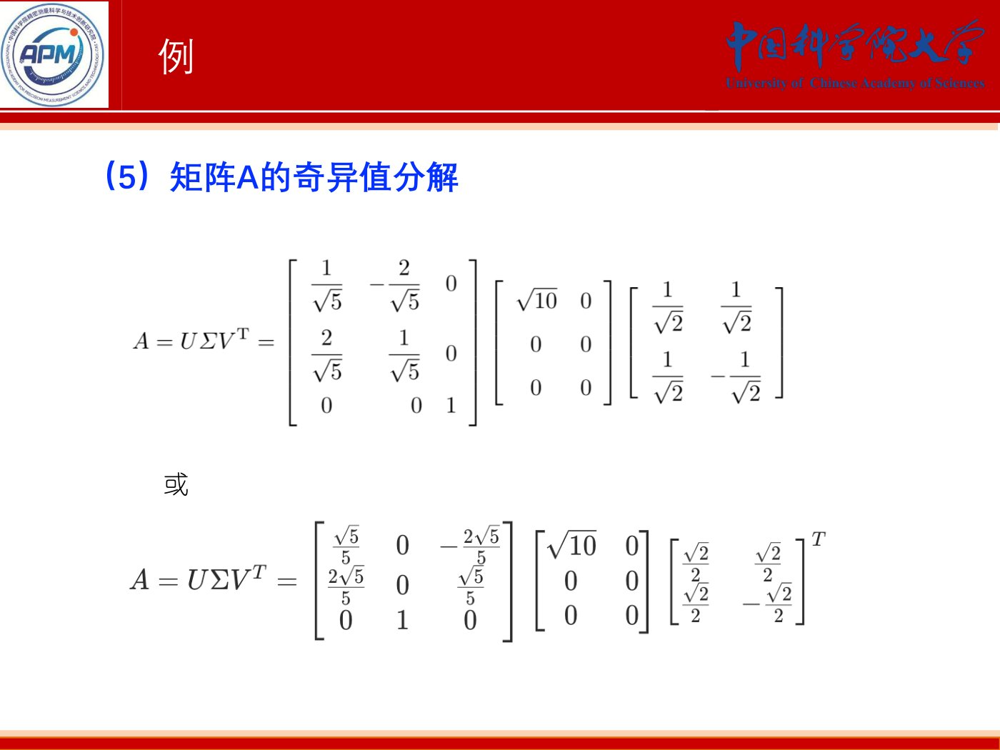
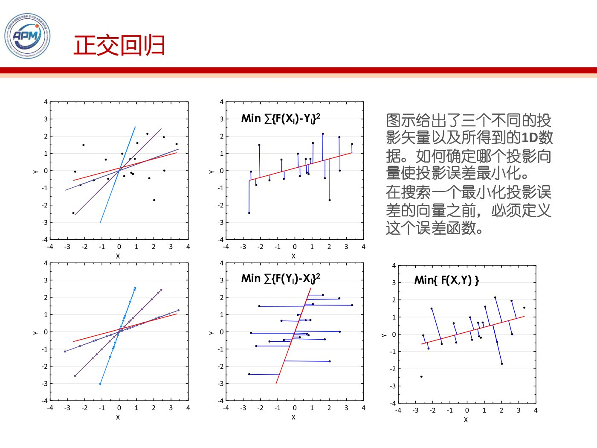
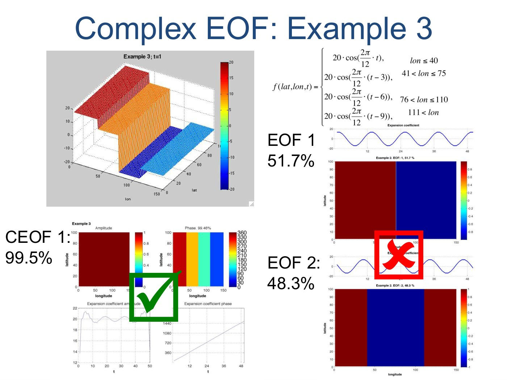
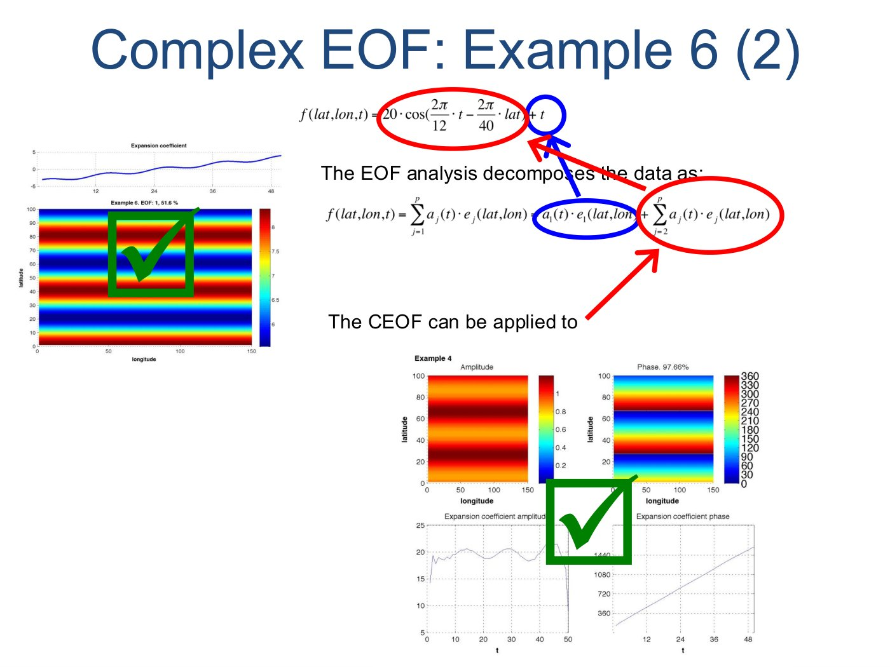

# 第10课｜SVD、EOF与CEOF：分解矩阵，提取时空模式

<strong>本课目录：从全景到知识点、作业与原页</strong>

- [第一层：本课全景](#sec-01)
- [课时大纲：按原页定位](#sec-02)
- [第二层：知识树](#sec-03)
- [第三层：SVD的定义与存在性](#sec-04)
  - [先把三个矩阵的尺寸固定](#sec-05)
  - [为什么$A^{\mathsf T}A$是入口](#sec-06)
  - [左右向量如何对应](#sec-07)
- [第三层：紧分解、截断与几何意义](#sec-08)
  - [三种分解，不要只记一个形状](#sec-09)
  - [几何读法：换输入方向、缩放、换输出方向](#sec-10)
  - [一个完整的小算例](#sec-11)
  - [低秩最优性与误差](#sec-12)
- [第三层：EOF的对象与预处理](#sec-13)
  - [一张数据表同时包含空间和时间](#sec-14)
  - [原课件“2.5 EOF预处理”](#sec-15)
- [第三层：EOF求解与重建](#sec-16)
  - [协方差特征分解路线](#sec-17)
  - [SVD路线与投影解释](#sec-18)
- [第三层：CEOF与Hilbert变换](#sec-19)
  - [为什么实EOF之外还引入复数](#sec-20)
  - [六组示例如何读](#sec-21)
- [第三层：EOF检验、时间系数分析与应用](#sec-22)
  - [模态是否稳定、能否区分](#sec-23)
  - [时间系数继续做什么](#sec-24)
- [第四层：本课串联](#sec-25)
- [课件表述与待核对事项](#sec-26)
- [课后作业：题目、数据与提交要求](#sec-27)
  - [本课的作业标注情况](#sec-28)
  - [作业原页：完整保留](#sec-29)
- [原页完整性与本课学习记录](#sec-30)

[总大纲](../00_总大纲.md) · [作业总索引](../01_作业总索引.md) · [完整原页对照](../appendices/L10_原页对照.md) · [原PDF](../sources/L10.pdf) · [上一课](./09_Markov与正则化.md) · [下一课](./11_ICA与有色噪声MLE.md)

> **范围：** Chapter 6｜3学时（按课程编排）｜原PDF 131页。
> **来源：** `10+chapter6+SVD+EOF3h-20251031.pdf`。页码均为PDF物理页码。
> **前置联系：** [第01课](./01_概述与线性变换.md)、[第08课](./08_协方差与误差椭圆.md)。
> **编排说明：** 原课件章/节编号保留；“第一至第四层”是本笔记的学习导航，不是新增授课章节。

## 第一层：本课全景

本课有两个大板块：**一、奇异值分解SVD；二、经验正交函数EOF**。后半又包含复EOF（CEOF）、Hilbert变换、模态检验及时间系数分析。开头的时空动画/图形在提出一个共同问题：怎样把许多地点、许多时刻的数据压缩成少数可读的变化模式。[原课件P1–8](../appendices/L10_原页对照.md#p001)

数学主线：$A=U\Sigma V^{\mathsf T}$把复杂线性映射拆开；数据主线：中心化数据矩阵的这种分解给出空间方向、时间系数和各模式的方差权重。**矩阵分解是工具，物理解释需要另作判断。**

## 课时大纲：按原页定位

| 本课部分 | 原页范围 |
|---|---|
| 问题引入与学习内容 | [原课件P1–8](../appendices/L10_原页对照.md#p001) |
| SVD定义、基本定理与构造证明 | [原课件P9–38](../appendices/L10_原页对照.md#p009) |
| SVD形式、性质与几何解释 | [原课件P39–54](../appendices/L10_原页对照.md#p039) |
| SVD计算例与最优低秩近似 | [原课件P55–68](../appendices/L10_原页对照.md#p055) |
| EOF/PCA概念与时空分解 | [原课件P69–77](../appendices/L10_原页对照.md#p069) |
| EOF预处理与分析对象 | [原课件P78–86](../appendices/L10_原页对照.md#p078) |
| EOF矩阵算法 | [原课件P87–91](../appendices/L10_原页对照.md#p087) |
| Hilbert、CEOF与六组算例 | [原课件P92–108](../appendices/L10_原页对照.md#p092) |
| EOF的North、Monte Carlo与合成检验 | [原课件P109–113](../appendices/L10_原页对照.md#p109) |
| 时间系数分析 | [原课件P114–118](../appendices/L10_原页对照.md#p114) |
| 投影、PCA与时空布局的联系 | [原课件P119–122](../appendices/L10_原页对照.md#p119) |
| EOF/CEOF应用与小结 | [原课件P123–130](../appendices/L10_原页对照.md#p123) |
| 结束页 | [原课件P131](../appendices/L10_原页对照.md#p131) |

## 第二层：知识树

- 一、SVD
  - 定义、正交矩阵、矩形对角矩阵、奇异值/左右奇异向量
  - 完全分解、非唯一性
  - 存在性证明
    - $A^{\mathsf T}A$对称半正定
    - 特征值非负、奇异值为平方根
    - 右向量、左向量与零空间补全
  - 范数：$1,2,\infty,p$与Frobenius
  - 紧SVD、截断SVD、秩
  - 几何意义、列/行空间、零空间
  - 计算步骤与矩阵算例
  - 低秩最优近似与截断误差
- 二、EOF
  - 定义与PCA联系；空间模式和时间系数
  - 原课件2.5：预处理、趋势/季节/滤波、区域与目标
  - 原课件2.6：散布/协方差矩阵、特征分解、PC、重建、解释方差
  - CEOF：Hilbert、解析信号、复模态、振幅/相位、传播案例
  - 原课件2.7：North、Monte Carlo、合成分析检验
  - 原课件2.8：敏感性、突变、周期、相关因子分析
  - 投影误差最小与最大方差；GNSS和冰质量应用案例

## 第三层：SVD的定义与存在性

### 先把三个矩阵的尺寸固定

对$m\times n$实矩阵$A$，完整SVD为：

$$
A=U\Sigma V^{\mathsf T},\qquad
U\in\mathbb R^{m\times m},\quad
\Sigma\in\mathbb R^{m\times n},\quad
V\in\mathbb R^{n\times n}.
$$

$U,V$正交，$\Sigma$对角线上的奇异值非负且降序。$U$的列称左奇异向量，$V$的列称右奇异向量。无需$A$是方阵；也无需它具有完整的普通特征分解。[原课件P9–15](../appendices/L10_原页对照.md#p009)

课件的$5\times4$例为：

$$
A=\begin{bmatrix}1&0&0&0\\0&0&0&4\\0&3&0&0\\0&0&0&0\\2&0&0&0\end{bmatrix}.
$$

其非零奇异值为$4,3,\sqrt5$，秩为3。第12—14页给出完整矩阵，并展示零空间基的选法不同可以得到不同$U$，但相乘仍恢复同一个$A$。[原课件P12–14](../appendices/L10_原页对照.md#p012)

### 为什么$A^{\mathsf T}A$是入口

它是对称矩阵，且对任意$v$有：

$$
v^{\mathsf T}A^{\mathsf T}Av=\|Av\|_2^2\ge0.
$$

若$A^{\mathsf T}Av_i=\lambda_i v_i$，则：

$$
\lambda_i=\frac{\|Av_i\|^2}{\|v_i\|^2}\ge0,
\qquad \sigma_i=\sqrt{\lambda_i}.
$$

这说明奇异值为什么是非负平方根，而不是把$A$的普通特征值直接拿来。课件在证明中插入向量范数与矩阵范数，正是为了读懂这个“大小”比较。[原课件P16–24](../appendices/L10_原页对照.md#p016)

### 左右向量如何对应

对正奇异值，定义：

$$
u_i=\frac{Av_i}{\sigma_i}.
$$

由右向量的正交性与$A^{\mathsf T}A$的特征关系，可验证这些$u_i$单位正交。再补齐零空间相关的正交基，形成完整$U,V$，便得到：

$$
Av_i=\sigma_i u_i,\qquad
A^{\mathsf T}u_i=\sigma_i v_i.
$$

零奇异值不能用除以$\sigma_i$的公式处理，课件单独用零空间补全；这一步也是理解完整和紧SVD差别的关键。[原课件P25–33](../appendices/L10_原页对照.md#p025)

## 第三层：紧分解、截断与几何意义

### 三种分解，不要只记一个形状

秩为$r$时，紧分解只保留$r$个非零奇异值：

$$
A=U_r\Sigma_rV_r^{\mathsf T}
=\sum_{i=1}^{r}\sigma_i u_i v_i^{\mathsf T}.
$$

它仍精确恢复$A$。若只保留$k<r$个最大奇异值：

$$
A_k=U_k\Sigma_kV_k^{\mathsf T},
$$

则是低秩近似。课件用前面的秩3矩阵展示紧形式与保留2项的截断形式；**删掉零项不损失矩阵，删掉非零项则产生近似误差**。[原课件P34–40](../appendices/L10_原页对照.md#p034)

### 几何读法：换输入方向、缩放、换输出方向

$V^{\mathsf T}$先把输入放到右奇异向量坐标；$\Sigma$按各方向伸缩，并可压掉零方向；$U$再组织输出方向。课件通过单位圆/球与椭圆/椭球说明奇异值的尺度意义。正交变换可含旋转或反射，不能把所有$U,V$都强行要求成行列式为1的纯旋转。[原课件P41–50](../appendices/L10_原页对照.md#p041)

非零奇异向量分别张成有效输入和输出子空间；其余对应零空间。把低秩结构看成“有信息的方向 + 被压掉的方向”，就能连接伪逆、最小范数解和数据压缩。

### 一个完整的小算例

课件第55页给出：

$$
A=\begin{bmatrix}1&1\\2&2\\0&0\end{bmatrix},\qquad
A^{\mathsf T}A=\begin{bmatrix}5&5\\5&5\end{bmatrix}.
$$

特征值为10和0，故非零奇异值$\sqrt{10}$。选$v_1=(1,1)^{\mathsf T}/\sqrt2$，则$u_1=(1,2,0)^{\mathsf T}/\sqrt5$。紧形式为：

$$
A=\sqrt{10}\,u_1v_1^{\mathsf T}.
$$

这一步已足够恢复原矩阵；完整分解再补齐正交向量。第56—62页逐项计算并给出不止一种完整形式。学习目标是能验证乘积与尺寸，而不是要求软件输出的每列符号与课件完全相同。[原课件P51–62](../appendices/L10_原页对照.md#p051)

*小矩阵SVD完整结果的两种等价形式。 · [原PDF第62页](../sources/L10.pdf#page=62)*

### 低秩最优性与误差

课件以Frobenius范数讨论截断SVD的最优近似：

$$
\|A\|_F^2=\sum_{i,j}a_{ij}^2=\sum_i\sigma_i^2,
\qquad \|A-A_k\|_F^2=\sum_{i>k}\sigma_i^2.
$$

在给定秩不超过$k$的矩阵类中，截断形式实现对应的最优逼近。此处“最优”有明确准则与约束，不是说它自动保留所有物理上重要、分类上重要或稀有的信号。[原课件P63–68](../appendices/L10_原页对照.md#p063)

## 第三层：EOF的对象与预处理

### 一张数据表同时包含空间和时间

课件定义$Z(t,x)$：$n$个时刻、$p$个空间点，矩阵为$n\times p$。一行是一张空间图，一列是一个地点的时间序列。EOF寻找少数空间模式及其随时间变化的系数，使其叠加重建原场。[原课件P70–77](../appendices/L10_原页对照.md#p070) [原课件P87–88](../appendices/L10_原页对照.md#p087)

它与Fourier的重要区别是：Fourier基预先指定为正弦/余弦；EOF基由当前数据估计。分析区域或时间段改变，所求方向也可能改变，不能把某次得到的EOF视为普遍不变的物理基函数。

### 原课件“2.5 EOF预处理”

课件强调EOF不会理解研究者意图。若目标是年际变化，而原数据最强的是季节周期，未经处理时前几个EOF可能主要描述季节信号。趋势、年平均、滑动平均、带通与谐波滤波，都必须围绕研究问题选择。[原课件P78–86](../appendices/L10_原页对照.md#p078)

第130页给出去趋势、去周期的经验建议，应与第78页“按照目的预处理”合读：若趋势本来就是研究目标，不可因看到建议就自动删掉。空间范围、站点分布和样本时段同样是分析设定的一部分。

## 第三层：EOF求解与重建

### 协方差特征分解路线

以下沿课件“时间为行、空间为列”的方向，设已按研究目标中心化，记$Z_c$。若采用样本协方差归一化：

$$
C=\frac1{n-1}Z_c^{\mathsf T}Z_c,
\qquad CE=E\Lambda,
\qquad P=Z_cE.
$$

$E$的每列是空间方向，$P$的每列是时间系数。全部模式重建为$Z_c=PE^{\mathsf T}$，保留前$k$个则$Z_k=P_kE_k^{\mathsf T}$。课件有的页使用未除尺度的scatter matrix，方向不变但特征值尺度不同；不能把scatter eigenvalue直接当已归一化方差。[原课件P87–91](../appendices/L10_原页对照.md#p087)

第$i$个模式的相对方差贡献：

$$
\eta_i=\frac{\lambda_i}{\sum_j\lambda_j}.
$$

解释方差与时间系数相位、正负号、物理因果不是同一类信息。空间图与时间系数一起翻号，乘积不变。

### SVD路线与投影解释

若$Z_c=U\Sigma V^{\mathsf T}$，空间EOF为$V$，时间系数为$U\Sigma$；对应样本协方差特征值$\lambda_i=\sigma_i^2/(n-1)$。本课后面的投影图说明：最大保留方差与最小平方投影损失是同一个二阶优化的两面。[原课件P119–122](../appendices/L10_原页对照.md#p119)

*不同投影方向对应不同信息保留和重建误差。 · [原PDF第120页](../sources/L10.pdf#page=120)*

## 第三层：CEOF与Hilbert变换

### 为什么实EOF之外还引入复数

传播现象会同时改变不同地点的幅度与相位。课件用Hilbert变换构造解析信号，将实序列与其正交相位分量放在一起，再对复数据做类似EOF的分解。[原课件P92–100](../appendices/L10_原页对照.md#p092)

一套与本段相符的表示为：

$$
\mathcal H[u](t)=\frac1\pi\operatorname{PV}\int_{-\infty}^{\infty}
\frac{u(\tau)}{t-\tau}\,d\tau,
\qquad z_a(t)=u(t)+i\mathcal H[u](t).
$$

积分需主值意义。频域移相要区分正、负频率；课件“延迟90度”的简述不应跨约定混用。复矩阵计算中的转置还要与共轭转置区分。[原课件P93–99](../appendices/L10_原页对照.md#p093)

### 六组示例如何读

第101—107页给六组EOF/CEOF比较。前两例两种方法都可由一个主模式充分表示；后面例子展示实EOF拆成接近成对的模式，而CEOF以幅度/相位更直接描述传播，也有需要不止一个复模式的混合场。复习时每页依次看：原场的时空公式、EOF空间图与时间系数、CEOF幅度与相位、贡献率。不要只看哪个百分比更高就宣布一种方法总更好。[原课件P101–108](../appendices/L10_原页对照.md#p101)

*EOF与CEOF比较例：观察成对实模态与复幅度/相位表达之间的联系。 · [原PDF第103页](../sources/L10.pdf#page=103)*

*第六组示例的后续说明：不同成分组合下需比较模式含义，而非只比较模态个数。 · [原PDF第107页](../sources/L10.pdf#page=107)*

## 第三层：EOF检验、时间系数分析与应用

### 模态是否稳定、能否区分

课件介绍North检验、Monte Carlo和合成分析。North路线用特征值抽样误差范围判断相邻模态是否容易混合；常见课件形式为$\delta\lambda_i\approx\lambda_i\sqrt{2/N}$，其中有效独立样本数的含义应核对，不能对明显自相关数据机械使用总点数。[原课件P109–113](../appendices/L10_原页对照.md#p109)

Monte Carlo比较模拟背景与观测分解，合成分析则检查对应样本群体的特征。它们是在评价统计模态，而不是仅凭一个显著性结果证明物理机制。

### 时间系数继续做什么

课件“2.8”依次列出敏感性、突变、周期和相关因子分析。可以检查换时段/区域后模式是否稳健，系数是否有阶段变化，是否存在周期，是否与其他变量对应。此处又回到第05—07课的回归、相关和谱工具。[原课件P114–118](../appendices/L10_原页对照.md#p114)

应用案例包括GNSS位移与陆地水储量，以及南极冰质量变化中的空间传播。案例的定量结果保留为原研究图例，不作为本笔记独立验证的新研究结论。[原课件P123–130](../appendices/L10_原页对照.md#p123)

## 第四层：本课串联

SVD提供普适矩阵分解；低秩截断提供压缩准则；EOF把它用于数据确定的时空基；CEOF增加相位结构以分析传播；预处理、模态检验和专业解释决定分解是否回答了真正的问题。

**自测（非教师作业）**：紧SVD与截断SVD哪一个丢失非零信息？$\sigma_i^2$为何不总等于协方差特征值？换区域后EOF改变是否一定是错误？一张EOF图脱离时间系数能否独立解释？

## 课件表述与待核对事项

- 本讲EOF部分“2.5—2.8”为该部分内部编号，不是前面Chapter 2的同名小节。
- SVD的正交向量不具有ICA意义上的统计独立性；“正交模式”勿改写成“独立来源”。
- scatter matrix与协方差矩阵的归一化必须明确；全SVD、紧SVD、截断SVD的尺寸不应混用。
- 第97页Hilbert统一延迟90度的说法需结合频率符号与变换定义；第108页对EOF/CEOF适用性的比较为本课案例总结。
- 第130页去趋势与去周期的建议必须服从研究目标，与第78—86页预处理原则相互约束。
- 本文件未发现单独标明的课后作业页；末尾是总结与结束页。第08课SVD验证题和第11课PCA/ICA题仍单独保留，不冒充本讲新增作业。

## 课后作业：题目、数据与提交要求

### 本课的作业标注情况

这份131页课件中**未发现单独标为课后作业的题页**。开头有“问题思考”，正文有算例与程序说明，均保留在知识笔记和原页对照中，不改标成老师正式作业。若老师口头布置其他任务，应另行补充。

可以用本课“第四层”的整理者自检来复习，但那些问题不属于课件作业。

### 作业原页：完整保留

该课件未发现专门的作业页；所有原页仍可在附录核查。

## 原页完整性与本课学习记录

本课全部131页（含图示、代码、参考文献、空白与结束页）均保留在[原页对照](../appendices/L10_原页对照.md)和[原始PDF](../sources/L10.pdf)中。笔记正文梳理知识及核心推导，不等同于逐字转录所有PPT文字。对照页用于查看更细的图表、完整代码和源内不同表述。

- [ ] 看过全景和课时大纲，能定位本课结构。
- [ ] 顺着知识树读完正文，并标出未理解的小节。
- [ ] 自己重写关键公式，分清符号、维度与假设。
- [ ] 做过课件作业或记录缺少的数据/需要问老师的条件。
- [ ] 不看笔记，用自己的话串起本课知识。
