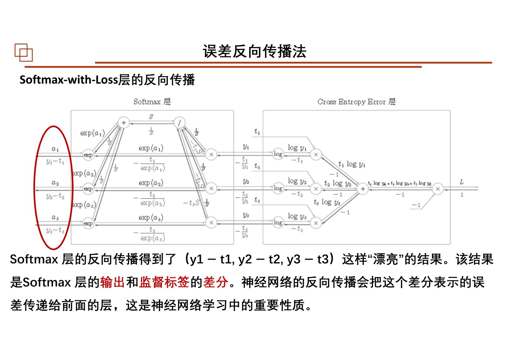
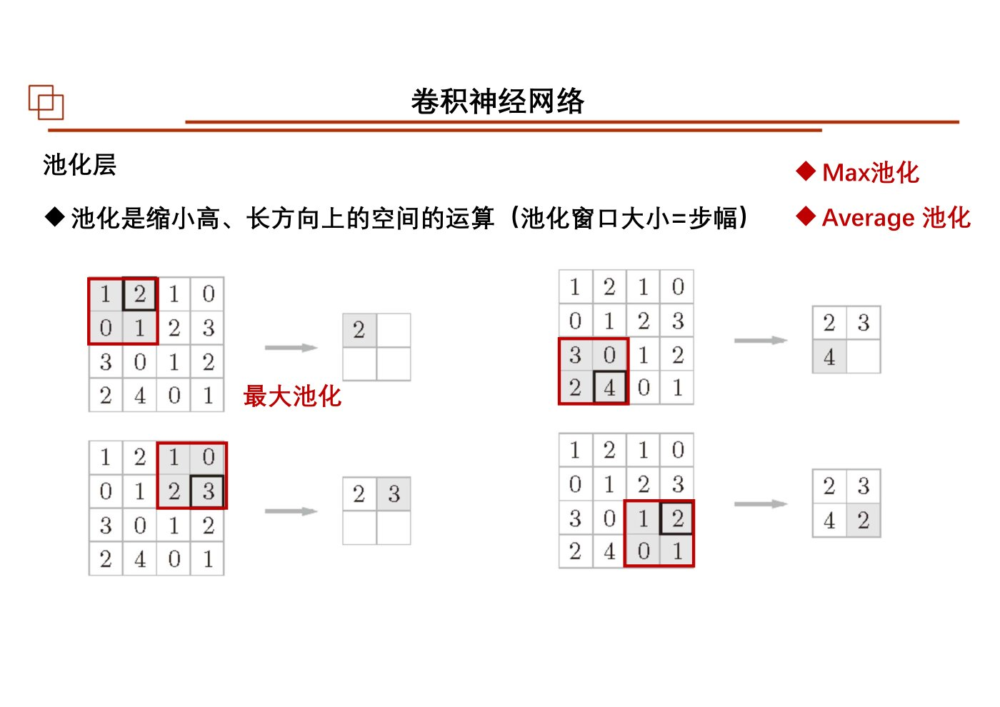
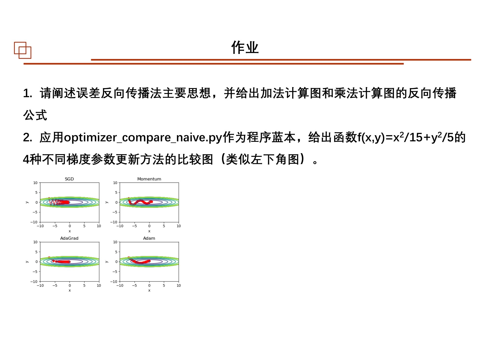
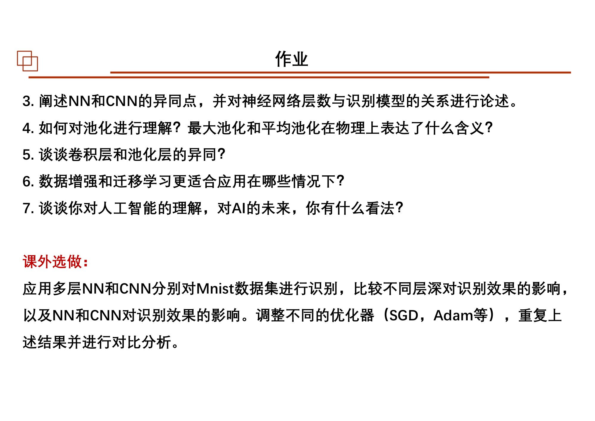

# 第13课｜人工智能与神经网络

<strong>本课目录：从全景到知识点、作业与原页</strong>

- [第一层：本课在课程中的位置](#sec-01)
- [课时大纲：按原页定位](#sec-02)
- [第二层：知识树](#sec-03)
- [第三层：感知机——最简单的可调规则](#sec-04)
  - [从输入到输出](#sec-05)
  - [为什么XOR重要](#sec-06)
- [第三层：神经网络前向计算](#sec-07)
  - [一层的共同结构](#sec-08)
  - [激活函数](#sec-09)
  - [多层前向传播](#sec-10)
  - [输出层与Softmax](#sec-11)
  - [MNIST推理流程](#sec-12)
- [第三层：网络怎样学习](#sec-13)
  - [损失函数是训练的目标](#sec-14)
  - [数值微分与梯度](#sec-15)
  - [mini-batch训练循环](#sec-16)
- [第三层：反向传播是链式法则的程序化](#sec-17)
  - [从整体函数拆成局部计算](#sec-18)
  - [两个基本节点](#sec-19)
  - [激活层与Affine层](#sec-20)
  - [Softmax与交叉熵组合](#sec-21)
- [第三层：参数更新方法](#sec-22)
  - [SGD与狭长损失曲面](#sec-23)
  - [Momentum](#sec-24)
  - [AdaGrad及RMSProp提及](#sec-25)
  - [Adam与比较](#sec-26)
- [第三层：CNN从局部结构组织计算](#sec-27)
  - [为什么不是把图像全部展平成一条向量](#sec-28)
  - [padding、stride与输出大小](#sec-29)
  - [通道与四维张量](#sec-30)
  - [池化](#sec-31)
  - [im2col与反向过程](#sec-32)
- [第三层：深度学习与泛化](#sec-33)
- [第四层：从一个训练样本到一次更新](#sec-34)
- [课件表述与待核对事项](#sec-35)
- [课后作业：题目、数据与提交要求](#sec-36)
  - [作业1—2：反向传播与优化器](#sec-37)
  - [作业3—7：NN、CNN与深度学习](#sec-38)
  - [课外选做：MNIST对照实验](#sec-39)
  - [作业原页：完整保留](#sec-40)
- [原页完整性与本课学习记录](#sec-41)

[总大纲](../00_总大纲.md) · [作业总索引](../01_作业总索引.md) · [完整原页对照](../appendices/L13_原页对照.md) · [原PDF](../sources/L13.pdf) · [上一课](./12_Kalman滤波.md) · [下一课](./14_Python综合实践.md)

> **范围：** Chapter 6｜3学时（按课程编排）｜原PDF 161页。
> **来源：** `13 神经网络-3h 20251112.pdf`。页码均为PDF物理页码。
> **前置联系：** [第03课](./03_统计特征与最优化.md)、[第04课](./04_最小二乘与Bayes.md)、[第09课](./09_Markov与正则化.md)。
> **编排说明：** 原课件章/节编号保留；“第一至第四层”是本笔记的学习导航，不是新增授课章节。

## 第一层：本课在课程中的位置

前面的LS、MLE、正则化都在做“选择模型并估计参数”。本课把模型换成可组合的神经网络，沿着**感知机 → 前向计算 → 损失与训练 → 反向传播 → 优化器 → CNN → 深度学习**展开。课件有161页，信息密度远超过课堂可逐式讲解的范围；先把七个模块定位，再逐块进入代码和推导。[原课件P11–20](../appendices/L13_原页对照.md#p011) [原课件P50](../appendices/L13_原页对照.md#p050) [原课件P83](../appendices/L13_原页对照.md#p083) [原课件P102](../appendices/L13_原页对照.md#p102) [原课件P117](../appendices/L13_原页对照.md#p117) [原课件P148](../appendices/L13_原页对照.md#p148)

第1—10页是AI的课程背景与历史材料，包括图灵测试、达特茅斯会议、AI/机器学习/深度学习关系与应用。它们反映课件编写时的介绍，不作为当前技术排名或现状报告。[原课件P1–10](../appendices/L13_原页对照.md#p001)

## 课时大纲：按原页定位

| 本课部分 | 原页范围 |
|---|---|
| AI概述与历史背景 | [原课件P1–10](../appendices/L13_原页对照.md#p001) |
| 1 感知机与逻辑门 | [原课件P11–19](../appendices/L13_原页对照.md#p011) |
| 2 神经网络与前向推理 | [原课件P20–49](../appendices/L13_原页对照.md#p020) |
| 3 损失、梯度与网络学习 | [原课件P50–82](../appendices/L13_原页对照.md#p050) |
| 4 误差反向传播 | [原课件P83–101](../appendices/L13_原页对照.md#p083) |
| 5 参数更新方法 | [原课件P102–116](../appendices/L13_原页对照.md#p102) |
| 6 CNN结构、计算与实现 | [原课件P117–147](../appendices/L13_原页对照.md#p117) |
| 7 深度学习、增强与迁移 | [原课件P148–158](../appendices/L13_原页对照.md#p148) |
| 课后作业与课外选做 | [原课件P159–160](../appendices/L13_原页对照.md#p159) |
| 结束页 | [原课件P161](../appendices/L13_原页对照.md#p161) |

## 第二层：知识树

- 1．感知机
  - 多输入、权重、偏置、阈值、阶跃输出
  - AND、NAND、OR、XOR
  - 线性可分；多层组合
- 2．神经网络：前向计算
  - 加权和、激活函数、层与参数下标
  - Sigmoid、Tanh、ReLU；非线性的作用
  - 矩阵表示、批量计算
  - 输出：恒等、Sigmoid、Softmax；数值溢出
  - MNIST、输入标准化、预训练权重、推理
- 3．神经网络学习
  - 数据驱动、训练集与测试集、泛化
  - 平方误差、交叉熵、mini-batch
  - 数值微分、偏导、梯度、梯度下降
  - 学习率、参数更新、epoch、损失与准确率
- 4．误差反向传播
  - 计算图、链式法则；加法、乘法节点
  - 激活层、Affine层、Softmax-with-Loss
  - forward缓存；backward逆序；梯度校验
- 5．参数更新方法
  - SGD、Momentum、AdaGrad、RMSProp提及、Adam
  - 学习率与不同曲率；优化路径对比
- 6．卷积神经网络CNN
  - 全连接与局部卷积；特征图、滤波器、偏置
  - padding、stride、输出尺寸
  - 输入/输出通道、batch、四维张量
  - 最大/平均池化、通道不变
  - im2col、矩阵乘法、reshape、transpose、col2im
  - 卷积层/池化层实现；CNN搭建；特征可视化
- 7．深度学习
  - 小卷积核、多层表示、Dropout
  - 集成、学习率衰减、数据增强
  - AlexNet、VGG、GoogLeNet、ResNet的课程介绍
  - 迁移学习、微调、GPU并行、应用讨论

## 第三层：感知机——最简单的可调规则

### 从输入到输出

课件将输入先做加权和，再按阈值输出0或1：

$$
s=\sum_i w_i x_i+b,
\qquad y=\begin{cases}0,&s\le0,\\1,&s>0.\end{cases}
$$

权重调节各输入的贡献，偏置调整激活门槛。这里还不是训练算法，只是规定“已知参数怎样计算输出”。[原课件P12–15](../appendices/L13_原页对照.md#p012)

课件的AND示例使用$w=(0.5,0.5)$、$b=-0.7$。把四种二元输入代入，就能检查其真值表。NAND、OR通过换参数得到，XOR则需要把它们组合成多层结构。[原课件P14–18](../appendices/L13_原页对照.md#p014)

### 为什么XOR重要

在二维平面中，单一线性分界不能将XOR两类点分开；课件先展示几何困难，再用NAND、OR和AND组合。关键不只是“层数多”，还有每层的非线性作用。后面第26页再次说明纯线性层叠加仍等价于一个线性变换。[原课件P16–19](../appendices/L13_原页对照.md#p016) [原课件P26](../appendices/L13_原页对照.md#p026)

## 第三层：神经网络前向计算

### 一层的共同结构

课件把一层拆为Affine加权求和与激活函数：

$$
a=xW+b,\qquad z=h(a).
$$

这是课件代码采用的样本按行写法：单样本$x$长度$d$，$W$为$d\times h$，输出$h$个隐藏单元；一批$B$个样本则$X$为$B\times d$。看图中的$w_{ji}$下标时，不要未经检查就认定代码矩阵也按同一行列命名。[原课件P21–33](../appendices/L13_原页对照.md#p021)

### 激活函数

课件列出的核心形式包括：

$$
\operatorname{sigmoid}(a)=\frac1{1+e^{-a}},\qquad
\operatorname{ReLU}(a)=\max(0,a),
$$

以及Tanh。它们让层之间的组合具备非线性表达能力；若把激活全去掉，两层$W_1,W_2$可合并成一个矩阵乘积，深度并未产生新的非线性。[原课件P23–27](../appendices/L13_原页对照.md#p023)

### 多层前向传播

按课件示例，可把一层输出作为下一层输入：

$$
a_1=xW_1+b_1,\quad z_1=h(a_1),
\quad a_2=z_1W_2+b_2,\quad z_2=h(a_2).
$$

最后通过适合任务的输出函数得到$y$。读第30—39页程序时，先写每一步的形状，再看`dot`和偏置广播，这比背变量名更有效。[原课件P30–39](../appendices/L13_原页对照.md#p030)

### 输出层与Softmax

回归任务的课件示例使用恒等输出；分类使用Softmax等输出形式。多分类Softmax为：

$$
y_k=\frac{e^{a_k}}{\sum_j e^{a_j}}.
$$

指数可能溢出，所以课件用$c=\max_j a_j$减去共同最大值：

$$
y_k=\frac{e^{a_k-c}}{\sum_j e^{a_j-c}}.
$$

它不改变比值。只做最大类别决策时，Softmax前后的最大位置一致；但概率值和后续交叉熵仍需要相应计算，不能据此把训练中的Softmax随意删除。[原课件P34–40](../appendices/L13_原页对照.md#p034)

### MNIST推理流程

课件将图像转为输入数组，载入已有权重，前向计算类别分数，取最大分数的位置，再与标签比较。第41—47页包括`load_mnist`、`sample_weight.pkl`、归一化/展平与batch。这里展示的首先是**使用已有权重推理**，不是已经完成学习过程。[原课件P41–49](../appendices/L13_原页对照.md#p041)

## 第三层：网络怎样学习

### 损失函数是训练的目标

课件先区分训练数据和测试数据，再提出通过损失评价参数。平方误差的单样本形式为：

$$
E=\frac12\sum_k(y_k-t_k)^2.
$$

使用one-hot标签的交叉熵为：

$$
E=-\sum_k t_k\log y_k.
$$

当损失对一批样本取平均，还要除以批大小。无论采用哪种损失，都必须明确$y$是输出、$t$是标签，$W,b$才是待优化参数。[原课件P50–60](../appendices/L13_原页对照.md#p050)

### 数值微分与梯度

课件用中心差分近似一元导数：

$$
f'(x)\approx\frac{f(x+h)-f(x-h)}{2h}.
$$

多参数逐个改变得到偏导和梯度$\nabla_\theta E$。随后沿负梯度更新：

$$
\theta\leftarrow\theta-\eta\nabla_\theta E.
$$

$\eta$为学习率。差分步长$h$与学习率$\eta$角色不同：前者服务于导数近似，后者控制参数更新距离。[原课件P61–74](../appendices/L13_原页对照.md#p061)

### mini-batch训练循环

课件的循环是：选一小批数据 → 计算损失与梯度 → 更新权重 → 重复；每经过一定次数评估训练和测试准确率。`iteration`是一次更新，`epoch`与遍历训练数据规模相关。损失曲线下降不自动证明泛化改善，需要对照测试表现与过拟合问题。[原课件P75–82](../appendices/L13_原页对照.md#p075)

数值微分按参数逐个重算，参数多时成本大；下一部分利用计算图一次反向获得各参数梯度。这是从“有训练准则”到“高效求导”的转折。

## 第三层：反向传播是链式法则的程序化

### 从整体函数拆成局部计算

课件用苹果购买与税费等算式构建计算图。前向传播计算数值，反向传播从损失开始，将上游梯度乘局部导数，按图倒序传递。这里的“误差反向传播”主要是在传播损失对各中间量的导数，并非把每个观测误差原样传回。[原课件P83–89](../appendices/L13_原页对照.md#p083)

### 两个基本节点

对于$z=x+y$，若上游梯度为$g=\partial E/\partial z$：

$$
\frac{\partial E}{\partial x}=g,\qquad
\frac{\partial E}{\partial y}=g.
$$

对于$z=xy$：

$$
\frac{\partial E}{\partial x}=gy,\qquad
\frac{\partial E}{\partial y}=gx.
$$

因此乘法层反向需要缓存另一输入；加法层直接把梯度传给两边。分支汇合时，相同变量受到的导数贡献要相加。[原课件P90–93](../appendices/L13_原页对照.md#p090)

### 激活层与Affine层

Sigmoid若输出为$y$，局部导数为$y(1-y)$。ReLU对正输入通过梯度，对负输入阻断；0处的实现约定按代码处理。[原课件P94–97](../appendices/L13_原页对照.md#p094)

对批量Affine层$Y=XW+b$，令$G=\partial E/\partial Y$，课件的反向结果按对应矩阵布局为：

$$
\frac{\partial E}{\partial X}=GW^{\mathsf T},\qquad
\frac{\partial E}{\partial W}=X^{\mathsf T}G,\qquad
\frac{\partial E}{\partial b}=\sum_{i\in\text{batch}}G_i.
$$

先检查形状，再检查是否把batch上的偏置梯度求和。[原课件P98–99](../appendices/L13_原页对照.md#p098)

### Softmax与交叉熵组合

课件将二者合并后，对输入logit$a_k$的导数成为：

$$
\frac{\partial E}{\partial a_k}=y_k-t_k.
$$

这是单样本形式；批量平均损失还须按相同平均约定缩放。此导数再逐层传回各权重。第101页用有序层集合组织前向与逆序反向计算。[原课件P100–101](../appendices/L13_原页对照.md#p100)

*Softmax-with-Loss的计算图与反向结果 · [原PDF第100页](../sources/L13.pdf#page=100)*

## 第三层：参数更新方法

### SGD与狭长损失曲面

最基础的SGD按当前梯度更新。课件用不同方向曲率不同的二次函数展示来回摆动，说明一个固定学习率未必同时适合所有参数方向。[原课件P102–106](../appendices/L13_原页对照.md#p102)

### Momentum

课件加入速度变量$v$，把以往更新方向与本次梯度结合：

$$
v\leftarrow\alpha v-\eta\nabla E,\qquad W\leftarrow W+v.
$$

它不是改变损失，而是改变在损失曲面上的移动方式。[原课件P107–109](../appendices/L13_原页对照.md#p107)

### AdaGrad及RMSProp提及

AdaGrad累计各参数梯度的平方，并据此缩放步长：

$$
h\leftarrow h+(\nabla E)\odot(\nabla E),\qquad
W\leftarrow W-\eta\frac{\nabla E}{\sqrt h+\epsilon}.
$$

课件随后提及RMSProp用衰减累计避免历史平方和只增不减。这里是优化器延伸，不同于本课已完整实现的四组对比。[原课件P110–113](../appendices/L13_原页对照.md#p110)

### Adam与比较

Adam结合梯度的一阶、二阶指数移动统计与初期偏差修正。课件程序涉及$\beta_1,\beta_2$、累计步数和学习率修正。第116页把SGD、Momentum、AdaGrad、Adam画在同一测试目标上，比较的是该算例的收敛路径，不是证明其中一个永远最好。[原课件P114–116](../appendices/L13_原页对照.md#p114)

## 第三层：CNN从局部结构组织计算

### 为什么不是把图像全部展平成一条向量

课件以全连接层与卷积层对比说明空间相邻关系的重要性。卷积滤波器在图像不同位置重复应用同一组权重，每个位置先做局部乘积求和，再加入偏置，形成特征图。[原课件P117–122](../appendices/L13_原页对照.md#p117)

### padding、stride与输出大小

输入高$H$、宽$W$，核大小$F_H,F_W$，padding为$P$，stride为$S$时，按实际可取窗口数计算：

$$
O_H=\left\lfloor\frac{H+2P-F_H}{S}\right\rfloor+1,
\qquad
O_W=\left\lfloor\frac{W+2P-F_W}{S}\right\rfloor+1.
$$

课件示例多选能整除的尺寸，写程序前要检查不足一个步幅的边界处理；不能只记一串输出数字。[原课件P123–124](../appendices/L13_原页对照.md#p123)

### 通道与四维张量

课件卷积层代码采用输入$(N,C,H,W)$，滤波器$(F_N,C,F_H,F_W)$，输出$(N,F_N,O_H,O_W)$。一个输出通道会将输入各通道的卷积贡献相加；多个输出滤波器生成多张特征图。偏置按输出通道添加。[原课件P125–128](../appendices/L13_原页对照.md#p125)

### 池化

最大池化取窗口内最大值，平均池化取平均值；课件强调普通池化没有训练参数，通道数不变，主要缩小空间尺寸，并对微小位置变化有一定稳定性。这与卷积层的跨通道加权求和不同。[原课件P129–131](../appendices/L13_原页对照.md#p129)

*课件池化窗口、最大池化与平均池化示意 · [原PDF第129页](../sources/L13.pdf#page=129)*

### im2col与反向过程

课件将每个局部窗口展成矩阵的一行，再把滤波器展平，利用矩阵乘法完成大量窗口计算。之后reshape并transpose回目标张量布局。卷积反向通过`col2im`把各窗口梯度归回输入；重叠窗口的贡献需要累加。池化实现也用窗口展开，但按通道独立，最大池化还需保存最大位置。[原课件P132–141](../appendices/L13_原页对照.md#p132)

本课基础CNN顺序是：**Convolution → ReLU → Pooling → Affine → ReLU → Affine → Softmax**。学习到的首层滤波器在课件可视化中表现为边缘、斑块等响应，多层结果逐渐变得抽象。[原课件P142–147](../appendices/L13_原页对照.md#p142)

## 第三层：深度学习与泛化

课件最后讨论更深的CNN、小型卷积核、Dropout、集成学习、学习率衰减、数据增强、迁移学习和GPU计算。网络名称用于对比结构思想：VGG的层堆叠、GoogLeNet的模块、ResNet的快捷连接等；课件没有展开这些网络的完整训练教程。[原课件P148–158](../appendices/L13_原页对照.md#p148)

**数据增强**改变训练样本表现形式以扩展可见变化；**迁移学习/微调**利用已有权重作为新任务的起点。它们分别改变学习数据与参数初始化/复用策略，不能相互等同。[原课件P151](../appendices/L13_原页对照.md#p151) [原课件P156](../appendices/L13_原页对照.md#p156)

## 第四层：从一个训练样本到一次更新

**样本和标签 → 前向计算 → 损失 → 反向链式求导 → 优化器更新参数 → 多批次重复 → 在独立测试数据上评价。** CNN主要改变前向计算与参数结构，反向传播与损失优化的主逻辑仍在。

整理者自检（不是新增作业）：前向传播能输出类别是否等于网络已经会训练？反向传播与SGD是否同一算法？为什么只有线性层的深网络不能解决XOR？卷积层与池化层哪些参数需要学习？

## 课件表述与待核对事项

- 第19页关于“两层表示任意函数/构建计算机”的话是高度概括，不能据此得出任意有限网络能精确表示任意函数。课件未展开适用条件。[原课件P19](../appendices/L13_原页对照.md#p019)
- 梯度方向与更新方向需要分开：本课实际更新式是减梯度，正文的方向判断以公式为准；出现“梯度指向最小值”等文字时应核对。[原课件P62–72](../appendices/L13_原页对照.md#p062)
- 课件卷积实现采用深度学习中的窗口乘加操作；与第07课经典离散卷积定义的核翻转约定需要单独比较，不能只因名称相同就认定索引完全一样。[原课件P121–122](../appendices/L13_原页对照.md#p121)
- “层越深性能越高”是课件讨论动机时的概括，不是所有数据和训练设置下的保证；课件也讨论过拟合和泛化工具。[原课件P54](../appendices/L13_原页对照.md#p054) [原课件P152](../appendices/L13_原页对照.md#p152)
- MNIST排名、运行耗时、识别率与历史架构介绍是源课件示例，不是当前基准或本次运行结果。[原课件P143](../appendices/L13_原页对照.md#p143) [原课件P150–157](../appendices/L13_原页对照.md#p150)
- 本笔记整理课件程序计算流程，但未获取`common`、`dataset`等外部包与权重文件来逐程序复现。依赖见全课程数据清单。

## 课后作业：题目、数据与提交要求

### 作业1—2：反向传播与优化器

来源：[原课件P159](../appendices/L13_原页对照.md#p159)。

1. 阐述误差反向传播的主要思想，给出加法计算图和乘法计算图的反向传播公式。
2. 以`optimizer_compare_naive.py`为程序蓝本，对

$$
f(x,y)=\frac{x^2}{15}+\frac{y^2}{5}
$$

比较4种梯度参数更新方法，绘出类似题页示意的优化路径图。四种方法对应课件的SGD、Momentum、AdaGrad、Adam。

### 作业3—7：NN、CNN与深度学习

来源：[原课件P160](../appendices/L13_原页对照.md#p160)。

3. 说明NN与CNN的异同，讨论网络层数与识别模型之间的关系。
4. 怎样理解池化？最大池化和平均池化在物理上表示什么？
5. 比较卷积层与池化层。
6. 数据增强和迁移学习分别适合哪些情况？
7. 谈对人工智能及AI未来的理解。

### 课外选做：MNIST对照实验

来源：[原课件P160](../appendices/L13_原页对照.md#p160)。用多层NN与CNN分别识别MNIST，比较不同深度的效果和NN/CNN差异；更换SGD、Adam等优化器重复，并进行对比分析。

题目所需蓝本程序、`common`与`dataset`模块、MNIST及相关权重没有作为独立文件随本次PDF附件提供，不能将截图里的程序当成已验证的完整运行环境。

### 作业原页：完整保留

展开第159页作业原图

*第13课第159页作业原页 · [原PDF第159页](../sources/L13.pdf#page=159)*

展开第160页作业原图

*第13课第160页作业原页 · [原PDF第160页](../sources/L13.pdf#page=160)*

## 原页完整性与本课学习记录

本课全部161页（含图示、代码、参考文献、空白与结束页）均保留在[原页对照](../appendices/L13_原页对照.md)和[原始PDF](../sources/L13.pdf)中。笔记正文梳理知识及核心推导，不等同于逐字转录所有PPT文字。对照页用于查看更细的图表、完整代码和源内不同表述。

- [ ] 看过全景和课时大纲，能定位本课结构。
- [ ] 顺着知识树读完正文，并标出未理解的小节。
- [ ] 自己重写关键公式，分清符号、维度与假设。
- [ ] 做过课件作业或记录缺少的数据/需要问老师的条件。
- [ ] 不看笔记，用自己的话串起本课知识。
